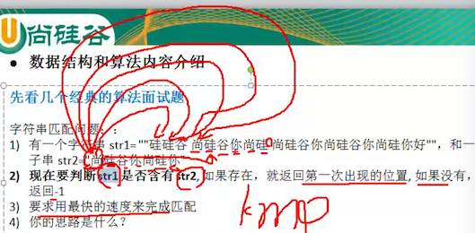
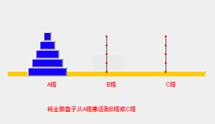
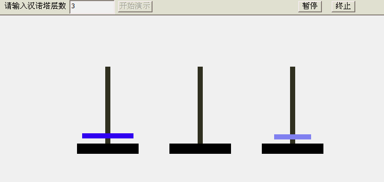

# 内容介绍

先来看几个经典的算法面试题，了解下算法大概是个什么东西

## 字符串匹配问题

有如下字符串 ，判定 str1 中是否包含 str2，如果出现则返回第一次出现的位置，如果没有则返回 -1

```bash
str1 = "硅硅谷 尚硅谷你尚硅 尚硅谷你尚硅谷你尚硅你好"
str2 = "尚硅谷你尚硅你"
```

要求用最快的速度来完成匹配，你的思路是什么？

### 暴力匹配

没有学过算法的一般会想到：**暴力匹配**



如上图：

1. 先拿第一个「尚」去挨个匹配
2. 匹配成功，则拿第 2 个字去匹配
3. 如果不匹配，则从头开始

暴力匹配法优缺点：

- 优点：简单，容易理解

- 缺点：效率低下

  可以看到上图的描述，只要有一个不匹配，就从头开始再来，「回溯」次数太多。

### KMP 算法

这里不深入讲解。会建立一个「部分匹配表」，然后通过表里的搜索词，大大提高效率

## 汉诺塔游戏



汉诺塔游戏目标：将 A 塔的所有圆盘移动到 C 塔

汉诺塔游戏规则：

- A 塔有 5 个圆盘，（最多的时候可有 64 个）
- 小圆盘上不能放大圆盘
- 三根柱子之间一次只能移动一个圆盘

看一个简单的 3 个盘子的移动演示



知道咋玩了吧？

- 三个的时候还是比较简单，只要了 5 步就移动完成了
- 4 个盘子的时候，就需要 15 步了
- 5 个盘子的时候，需要 31 步了
- 如果是 20 个盘子呢？

如果用算法来解决，就要用到 **分治法**

## 八皇后问题

八皇后问题，是一个古老而著名的问题，是 **回溯算法** 的典型案例。

该问题是国际西洋棋棋手马克斯·贝瑟尔于1848年提出：在 8×8 格的国际象棋上摆放八个皇后，使其不能互相攻击，即：任意两个皇后都不能处于同一行、同一列或同一斜线上，问有多少种摆法。


使用回溯算法，高斯认为有 **76 种方案**。1854年在柏林的象棋杂志上不同的作者发表了40种不同的解，后来有人用图论的方法解出 **92 种结果**。计算机发明后，有多种计算机语言可以解决此问题

可以去百度搜索下这个小游戏，自己玩几下感受下，还是很难的

## 马踏棋盘算法


**马踏棋盘算法** 也被称为骑士周游问题，将马随机放在国际象棋的 8×8 棋盘 `Board[0～7][0～7]`的某个方格中，马按走棋规则（马走日字）进行移动。要求每个方格只进入一次，走遍棋盘上全部 64 个方格，如果没有日字可走，那么游戏结束

可玩下这个 [小游戏](http://www.4399.com/flash/146267_2.htm)

会使用到 **图的深度优化遍历算法（DFS）** + **贪心算法优化**，如果只是图算法，效率很低下，可能需要 30 秒才能走一步

可见算法在不同场景下发挥着不同的作用，**算法的基础又是数据结构**

这里展示的 4 个算法面试题是为了告诉你：

- 算法的重要性
- 算法很有趣
- 有一定的难度

但是：不会算法的程序员，会被逐渐淘汰。

