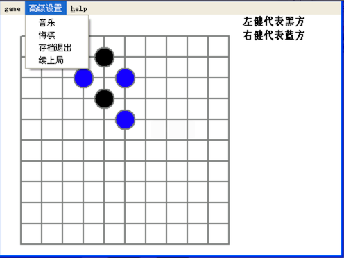
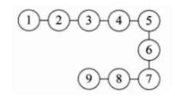

# 数据结构和算法概述

## 数据结构和算法的关系

- 数据（data）结构（structure）是一门研究 **组织数据方式** 的学科

  有了编程语言也就有了数据结构，学好数据结构可以编写出更加漂亮，更加有效率的代码。

  学好数据结构，只是为学习算法打好一个基础，并不代表你就能写出一个好的算法。

- 学以致用

  要学习好数据结构，就要多多考虑如何将生活中遇到的问题，用程序去实现解决

- 程序 = 数据结构 + 算法

- 数据结构是算法的基础

  想要学好算法，就必须要把数据结构学到位。

## 看几个实际编程中遇到的问题

### 字符串替换问题

```java
public static void main(String[] args) {
  String str = "Java,Java, hello,world!";
  String newStr = str.replaceAll("Java", "尚硅谷~"); //算法
  System.out.println("newStr=" + newStr);
}
```

上述代码使用了 JDK 的 `replaceAll` 方法来替换字符串，我们需要了解他的原理，它肯定是有一个算法来支撑这个功能的，只有看懂了这个算法，我们才能在一些场景上的优化。

那么这里有一个面试题：用 **单链表** 实现一些字符串的功能

具体题目：试写出用 **单链表** 表示的字符串类及字符串结点类的定义，并依次实现它的构造函数、以及计算串长度、串赋值、判断两串相等、求子串、两串连接、求子串在串中位置等 7 个成员函数。 

## 实现一个五子棋程序



实现上图的几个功能，如：

- 如何判断游戏的输赢？
- 实现存档退出
- 实现继续上局的功能

其实这些功能就涉及到了需要一些数据结构和算法来实现需求。比如：

- 存档功能：

  棋盘用 **二维组** 实现，然后写入文件

- 继续上局

  读取文件，还原成二维数组，再渲染成棋盘

功能实现了，那么是不是可以进一步优化呢？在使用数组存文件时，就可以转成 **稀疏数组**，达到 **数据压缩 **的目的，读取文件时，先解析成稀疏数组，再解压成二维数组。

 如果上面提到的一些数据结构你不知道，那么就无法完成这个功能。

## 约瑟夫问题（丢手帕问题）


约瑟夫（Josephu）问题，也就是丢手帕问题，他的规则如下

- 有编号为 1 ~ n 的 n 个人围坐在一起

- 约定编号为 K( 1 <= k <=n)  的人从 1 开始报数
- 数到 m 的那个人出列，它的下一位又从 1 开始报数

循环以上过程，直到所有人都出列，并列出出列人的编号。

该问题其实可以使用 **单循环链表（单向环形链表）**来解决，思路如下：

1. 先构成一个有 n 个节点的单循环链表
2. 然后由 k 节点起从 1 开始计数
3. 计数到 m 时，对应节点从链表中删除，然后从下一个节点又从 1 开始计数

循环以上过程，直到最后一个节点从链表中删除，算法结束

如果没有学过单循环链表，使用数组也是可以实现的，只是在性能上不是那么如意。

## 其他常见算法问题

比如有：磁盘问题、公交车、画图、矩阵中查找单词路径数、球和篮子、扔石头 等。

这里来看看几个问题需要用到的算法：

- 修路问题：
  - 数据结构：最小生成树（加权值）
  - 算法：普利姆算法
- 最短路径问题
  - 数据结构：图
  - 算法：弗洛伊德算法
- 汉诺塔：分治算法
- 八皇后问题：回溯法

可以看到问题有难易程度，简单的可能一个数据结构就搞定了，难的需要一起用。

## 线性/非线性结构

数据结构主要包括：**线性结构** 和 **非线性结构**

### 线性结构

如下图所示



最常用的数据结构，其特点是：数据元素之间存在 **1 对 1 的线性关系**

```
比如数组  a[0] = 30，一个下标只对应一个值
```

线性结构有两种不同的存储结构：

- 顺序存储结构

  顺序存储的 **线性表** 称为 **顺序表**，顺序表中的存储元素 **都是连续** 的

- 链式存储结构

  链式存储的 **线性表** 称为 **链表**，链表中的存储元素 **不一定是连续** 的，元素节点中存放 **数据元素** 以及 **相邻元素的地址信息**

线性结构常见的有：

- 数组
- 队列
- 链表
- 栈

不同的结构又有不同的实现方式，后面会详细讲解。

### 非线性结构

它的元素之间至少不是  1 对 1 的关系了，有可能如下图所示


非线性结构包括：

- 二维数组
- 多维数组
- 广义表 
- 树结构
- 图结构

在非线性结构中，树结构和图结构用的最多的，他们又引申出来很多的相关算法。

