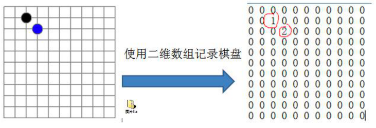
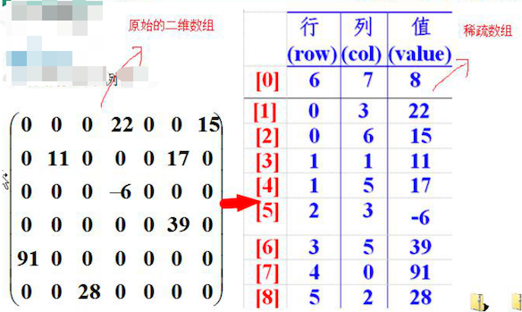

# 稀疏数组

Sparse Array 稀疏数组。

## 实际需求

先来看一个实际需求，比较好思考

编写五子棋程序中的 **存盘退出** 和 **续上盘** 功能



我们首先能想到的就是使用一个 **二维数组**，如上图所示：

- 0：表示没有棋子
- 1：表示黑棋
- 2：表示白棋

## 分析问题

可以看到二维数组中很多值都是 0，因此记录了很多没有意义的数据。

## 基本介绍

定义：当一个数组中 **大部分元素为 0（或是同一个值）** 时，可以使用 **稀疏数组** 来保存该数组

处理方法：

1. 记录数组一共有 **几行几列**，**有多少个不同的值**
2. 把具有 **不同值的元素** 的 **行列及值** 记录在一个 **小规模的数组** 中，从而缩小程序的规模

这个小规模的数组就称为 **稀疏数组**，举个例子，如下图



左侧是原始的二维数组 `6x7 = 42 个格子`，右侧是稀疏数组 `9 x 3 = 27 个格子`

- `[0]`：记录了棋盘的大小，6 行 7 列，棋盘上有 8 个不为 0 的值

- 其他行：分别记录每一个非 0 值的所在行、所在列、值

  比如 `[1]`：在第 0 行第 3 列上有一个 22（这里的行列都是下标）

可以看到原始 42 个数据，压缩成 27 个数据。一定程度上压缩了数据。

## 应用实例

使用 **稀疏数组** 保留类似前面的 **二维数组**（如棋盘、地图等等的场景），把 **稀疏数组存盘**，并且可以从新 **恢复原来的二维数组**

### 稀疏数组与二维数组互转思路

以前面的棋盘数据来讲解


如上图，总结出来稀疏数组为右侧那样。那么他们互转思路如下：

二维数组转稀疏数组思路：

1. 遍历原始的二维数组，得到有效个数 sum
2. 根据 sum 创建 **稀疏数组** `sparseArr = int[sum + 1][3]`
3.  将二维数据的有效数据存入到稀疏数组中（从第 2 行开始存储）
4. 最后将棋盘大小和有效个数写入第一行

稀疏数组转原始二维数组思路：

1. 读取第一行数据，根据棋盘大小，创建原始的二维数组 `chessArr  = int [11][11]`
2. 从第二行开始，将有效数据还原到原始数组中

### 代码实现

```java
package cn.mrcode.study.dsalgtutorialdemo.datastructure.sparsearray;

/**
 * <pre>
 *  稀疏数组：
 *      1. 二维数组转稀疏数组
 *      2. 稀疏数组转二维数组
 * </pre>
 */
public class SparseArray {
    public static void main(String[] args) {
        // 创建原始二维数组
        // 0：没有棋子，1：黑棋，2：白棋
        // 棋盘大小 11 x 11
        int chessArr[][] = new int[11][11];
        chessArr[1][2] = 1;
        chessArr[2][3] = 2;
      
        // 预览棋盘上的棋子位置
        System.out.println("预览原始数组");
        printChessArray(chessArr);
      
        // 二维数组转稀疏数组
        int[][] sparseArr = chessToSparse(chessArr);
				// int[][] sparseArr = chessToSparse2(chessArr); // 紧凑版本可以参考笔记配套项目
        System.out.println("二维数组转稀疏数组");
        printChessArray(sparseArr);
      
        // 稀疏数组转二维数组
        int[][] chessArr2 = sparseToChess(sparseArr);
        System.out.println("稀疏数组转二维数组");
        printChessArray(chessArr2);
    }

    /**
     * 二维数组转稀疏数组
     *
     * @param chessArr
     */
    private static int[][] chessToSparse(int[][] chessArr) {
        // 1. 遍历数组得到有效棋子个数
        int sum = 0;
        for (int[] row : chessArr) {
            for (int chess : row) {
                if (chess != 0) {
                    sum++;
                }
            }
        }
        // 2. 创建稀疏数组
        int[][] sparseArr = new int[sum + 1][3];
        // 3. 将二维数据的有效数据存入到稀疏数组中（从第 2 行开始存储）
        int chessRow = chessArr.length;  // 行： 棋盘大小
        int chessCol = 0;  // 列： 棋盘大小
        int count = 0; // 记录当前是第几个非 0 的数据
        for (int i = 0; i < chessArr.length; i++) {
            int[] rows = chessArr[i];
            if (chessCol == 0) {
                chessCol = rows.length;
            }
            for (int j = 0; j < rows.length; j++) {
                int chess = rows[j];
                if (chess == 0) {
                    continue;
                }
                count++;  // 第一行是棋盘信息，所以先自增
                sparseArr[count][0] = i;
                sparseArr[count][1] = j;
                sparseArr[count][2] = chess;
            }
        }
        // 4. 补全第一行的棋盘大小和有效数据
        sparseArr[0][0] = chessRow;
        sparseArr[0][1] = chessCol;
        sparseArr[0][2] = sum;
        return sparseArr;
    }

    /**
     * 稀疏数组转二维数组
     *
     * @param sparseArr
     * @return
     */
    private static int[][] sparseToChess(int[][] sparseArr) {
        // 1. 创建二维数组
        int[][] chessArr = new int[sparseArr[0][0]][sparseArr[0][1]];
        // 2. 恢复有效数据到二维数组
        for (int i = 1; i < sparseArr.length; i++) {
            int[] rows = sparseArr[i];
            chessArr[rows[0]][rows[1]] = rows[2];
        }
        return chessArr;
    }
  
    /**
     * 打印棋盘上的棋子布局
     *
     * @param chessArr
     */
    public static void printChessArray(int[][] chessArr) {
        for (int[] row : chessArr) {
            for (int data : row) {
                // 左对齐，使用两个空格补齐 2 位数
                System.out.printf("%-2d\t", data);
            }
            System.out.println("");
        }
    }
}
```

输出信息如下

```java
预览原始数组
0 	0 	0 	0 	0 	0 	0 	0 	0 	0 	0 	
0 	0 	1 	0 	0 	0 	0 	0 	0 	0 	0 	
0 	0 	0 	2 	0 	0 	0 	0 	0 	0 	0 	
0 	0 	0 	0 	0 	0 	0 	0 	0 	0 	0 	
0 	0 	0 	0 	0 	0 	0 	0 	0 	0 	0 	
0 	0 	0 	0 	0 	0 	0 	0 	0 	0 	0 	
0 	0 	0 	0 	0 	0 	0 	0 	0 	0 	0 	
0 	0 	0 	0 	0 	0 	0 	0 	0 	0 	0 	
0 	0 	0 	0 	0 	0 	0 	0 	0 	0 	0 	
0 	0 	0 	0 	0 	0 	0 	0 	0 	0 	0 	
0 	0 	0 	0 	0 	0 	0 	0 	0 	0 	0 	
二维数组转稀疏数组
11	11	2 	
1 	2 	1 	
2 	3 	2 	
稀疏数组转二维数组
0 	0 	0 	0 	0 	0 	0 	0 	0 	0 	0 	
0 	0 	1 	0 	0 	0 	0 	0 	0 	0 	0 	
0 	0 	0 	2 	0 	0 	0 	0 	0 	0 	0 	
0 	0 	0 	0 	0 	0 	0 	0 	0 	0 	0 	
0 	0 	0 	0 	0 	0 	0 	0 	0 	0 	0 	
0 	0 	0 	0 	0 	0 	0 	0 	0 	0 	0 	
0 	0 	0 	0 	0 	0 	0 	0 	0 	0 	0 	
0 	0 	0 	0 	0 	0 	0 	0 	0 	0 	0 	
0 	0 	0 	0 	0 	0 	0 	0 	0 	0 	0 	
0 	0 	0 	0 	0 	0 	0 	0 	0 	0 	0 	
0 	0 	0 	0 	0 	0 	0 	0 	0 	0 	0 	
```

## 课后练习题

在前面的代码基础上，将稀疏数组存盘为  map.data 文件，然后再从文件中恢复成二维数组。

该题是 IO 知识点，使用常规读写方式很简单，笔者这里不做了。

