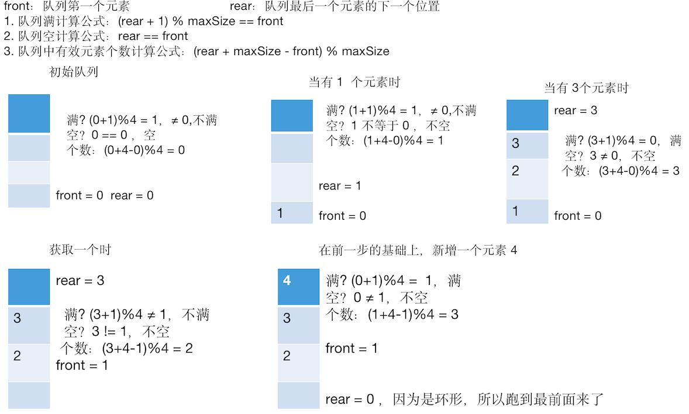

# 队列 

## 一个使用场景

银行办理业务的排队叫号


办理业务的人先拿号，然后窗口叫号处理，没有叫到的，则排队等待。

## 基本介绍

队列：是一个 **有序列表**，可以用 **数组** 或 **链表** 实现。

特点：遵循 **先入先出** 原则。即：先存入的数据，先取出。

示意图：


- front：队首，队列头部
- rear：队尾，队列尾部
- 左 1 图：队列初始化的两个变量值
- 中图：存入数据后，的首位变化
- 右图：取数据时，从队首取，队首的变量指向也在发生变化

## 数组模拟队列

队列本身是 **有序列表**，使用数组结构来存储队列的数据，则如前面基本介绍中的示意图一样。

声明  4 个变量：

- arr：用来存储数据的数组
- maxSize：该队列的最大容量
- front：队首下标，随着数据输出而改变
- rear：队尾下标，睡着数据输入而改变

队列中常用操作分析，以 add，把数据存入队列为例，思路分析：

1. 将尾指针往后移：rear + 1，前提是当 front == rear 时，队列是空的
2. 若尾指针  rear < maxSize -1：
   - 则将数据存入 rear 所指的数组元素中，
   - 否则无法存入数据。rear = maxSize -1 表示队列满了

以上思路是一个最基本的实现（不是完美的，看完代码就明白了）。代码实现如下

```java
package cn.mrcode.study.dsalgtutorialdemo.datastructure.queue;

/**
 * 数组模拟队列
 */
public class ArrayQueueDemo {
    public static void main(String[] args) {
        ArrayQueue queue = new ArrayQueue(3);
        queue.add(1);
        queue.add(2);
        queue.add(3);
        System.out.println("查看队列中的数据");
        queue.show();
        System.out.println("查看队列头数据：" + queue.head());
        System.out.println("查看队列尾数据：" + queue.tail());
//        queue.add(4);
        System.out.println("获取队列数据：" + queue.get());
        System.out.println("查看队列中的数据");
        queue.show();

    }
}

class ArrayQueue {
    private int maxSize; // 队列最大容量
    private int front; // 队列头,指向队列头的前一个位置
    private int rear; // 队列尾，指向队列尾的数据（及最后一个数据）
    private int arr[]; // 用于存储数据，模拟队列

    public ArrayQueue(int arrMaxSize) {
        maxSize = arrMaxSize;
        arr = new int[maxSize];
        front = -1;
        rear = -1;
    }

    /**
     * 取出队列数据
     */
    public int get() {
        if (isEmpty()) {
            throw new RuntimeException("队列空");
        }
        return arr[++front];
    }

    /**
     * 往队列存储数据
     */
    public void add(int n) {
        if (isFull()) {
            System.out.println("队列已满");
            return;
        }
        arr[++rear] = n;
    }

    /**
     * 显示队列中的数据
     */
    public void show() {
        if (isEmpty()) {
            System.out.println("队列为空");
            return;
        }
        for (int i = 0; i < arr.length; i++) {
            System.out.printf("arr[%d] = %d \n", i, arr[i]);
        }
    }

    /**
     * 查看队列的头部数据，注意：不是取出数据，只是查看
     *
     * @return
     */
    public int head() {
        if (isEmpty()) {
            throw new RuntimeException("队列空");
        }
        return arr[front + 1]; // front 指向队列头前一个元素，取头要 +1
    }

    /**
     * 查看队尾数据
     *
     * @return
     */
    public int tail() {
        if (isEmpty()) {
            throw new RuntimeException("队列空");
        }
        return arr[rear];
    }

    // 队列是否已满
    private boolean isFull() {
        return rear == maxSize - 1;
    }

    // 队列是否为空
    private boolean isEmpty() {
        return rear == front;
    }
}

```

运行测试

```java
查看队列中的数据
arr[0] = 1 
arr[1] = 2 
arr[2] = 3 
查看队列头数据：1
查看队列尾数据：3
获取队列数据：1
查看队列中的数据
arr[0] = 1 
arr[1] = 2 
arr[2] = 3 
```

## 问题分析

目前实现了一个 **一次性的队列（不能复用）**，因为可以往队列中添加数据，基本功能也是可以的，当队列满之后，再添加就加不进去了，获取数据也不能清空原队列中的数据。

优化方向：使用算法将这个数组改进成一个环形队列。

## 数组模拟环形队列

### 思路分析


1. front：含义调整

    表示：**队列的第一个元素**，也就是说 `arr[front]` 就是队列的第一个元素
    
    初始值：0

2. rear：含义调整

   表示：**队列的最后一个元素的下一个位置**

   初始值：0
   
   这个很重要，是一个小算法，能更方便的实现我们的环形队列。
   
3. 队列 **满** 计算公式：`(rear + 1) % maxSize == front`

4. 队列 **空** 计算公式：`rear == front`

5. 队列中 **有效元素个数** 计算公式：`(rear + maxSize - front) % maxSize`

为了能更清晰这个算法，下面画图来演示队列中元素个数，关键变量的值



该算法取巧的地方在于 **rear 的位置**，注意看上图，rear 所在的位置 **永远是空的**，实现环形队列的算法也有多种，这里空出来一个位置，是这里算法的核心。

### 代码实现

```java
package cn.mrcode.study.dsalgtutorialdemo.datastructure.queue;

import java.util.Scanner;

/**
 * 数组拟环形队列
 */
public class CircleQueueDemo {
    public static void main(String[] args) {
        CircleQueue queue = new CircleQueue(3);

        // 为了测试方便，写一个控制台输入的小程序
        Scanner scanner = new Scanner(System.in);
        boolean loop = true;
        char key = ' '; // 接受用户输入指令
        System.out.println("s(show): 显示队列");
        System.out.println("e(exit): 退出程序");
        System.out.println("a(add): 添加数据到队列");
        System.out.println("g(get): 从队列取出数据");
        System.out.println("h(head): 查看队列头的数据");
        System.out.println("t(tail): 查看队列尾的数据");
        System.out.println("p(isEmpty): 队列是否为空");
        while (loop) {
            key = scanner.next().charAt(0);
            switch (key) {
                case 's':
                    queue.show();
                    break;
                case 'e':
                    loop = false;
                    break;
                case 'a':
                    System.out.println("请输入要添加到队列的整数：");
                    int value = scanner.nextInt();
                    queue.add(value);
                    break;
                case 'g':
                    try {
                        int res = queue.get();
                        System.out.printf("取出的数据是：%d\n", res);
                    } catch (Exception e) {
                        System.out.println(e.getMessage());
                    }
                    break;
                case 'h':
                    try {
                        int res = queue.head();
                        System.out.printf("队首数据：%d\n", res);
                    } catch (Exception e) {
                        System.out.println(e.getMessage());
                    }
                    break;
                case 't':
                    try {
                        int res = queue.tail();
                        System.out.printf("队尾数据：%d\n", res);
                    } catch (Exception e) {
                        System.out.println(e.getMessage());
                    }
                    break;
                case 'p':
                    System.out.printf("队列是否为空：%s", queue.isEmpty());
                    break;
            }
        }
    }
}

class CircleQueue {
    private int maxSize; // 队列最大容量
    private int front; // 队列头,指向 队头 的元素
    private int rear; // 队列尾，指向 队尾 的下一个元素
    private int arr[]; // 用于存储数据，模拟队列

    public CircleQueue(int arrMaxSize) {
        maxSize = arrMaxSize + 1;
        arr = new int[maxSize];
        front = 0;
        rear = 0;
    }

    /**
     * 取出队列数据
     */
    public int get() {
        if (isEmpty()) {
            throw new RuntimeException("队列空");
        }
        // front 指向的是队首的位置
        int value = arr[front];
        // 需要向后移动，但是由于是环形，同样需要使用取模的方式来计算
        front = (front + 1) % maxSize;
        return value;
    }

    /**
     * 往队列存储数据
     */
    public void add(int n) {
        if (isFull()) {
            System.out.println("队列已满");
            return;
        }
        arr[rear] = n;
        // rear 指向的是下一个位置
        // 由于是环形队列,需要使用取模的形式来唤醒他的下一个位置
        rear = (rear + 1) % maxSize;
    }

    /**
     * 显示队列中的数据
     */
    public void show() {
        if (isEmpty()) {
            System.out.println("队列为空");
            return;
        }
        // 打印的时候，需要从队首开始打印
        // 打印的次数则是：有效的元素个数
        // 获取数据的下标：由于是环形的，需要使用取模的方式来获取
        for (int i = front; i < front + size(); i++) {
            int index = i % maxSize;
            System.out.printf("arr[%d] = %d \n", index, arr[index]);
        }
    }

    /**
     * 查看队列的头部数据，注意：不是取出数据，只是查看
     *
     * @return
     */
    public int head() {
        if (isEmpty()) {
            throw new RuntimeException("队列空");
        }
        return arr[front];
    }

    /**
     * 查看队尾数据
     *
     * @return
     */
    public int tail() {
        if (isEmpty()) {
            throw new RuntimeException("队列空");
        }
        // rear - 1 是队尾数据，但是如果是环形收尾相接的时候
        // 那么 0 -1 就是 -1 了，负数时，则是数组的最后一个元素
        return rear - 1 < 0 ? arr[maxSize - 1] : arr[rear - 1];
    }

    // 队列是否已满
    private boolean isFull() {
        return (rear + 1) % maxSize == front;
    }

    // 队列是否为空
    public boolean isEmpty() {
        return rear == front;
    }

    // 有效个数
    public int size() {
        return (rear + maxSize - front) % maxSize;
    }
}
```

运行测试功能输出

```bash
s(show): 显示队列
e(exit): 退出程序
a(add): 添加数据到队列
g(get): 从队列取出数据
h(head): 查看队列头的数据
t(tail): 查看队列尾的数据
p(isEmpty): 队列是否为空
a
请输入要添加到队列的整数：
10
a
请输入要添加到队列的整数：
20
a
请输入要添加到队列的整数：
30
s
arr[0] = 10 
arr[1] = 20 
arr[2] = 30 
a
请输入要添加到队列的整数：
40
队列已满
h
队首数据：10
t
队尾数据：30
g
取出的数据是：10
s
arr[1] = 20 
arr[2] = 30 
a
请输入要添加到队列的整数：
40
s
arr[1] = 20 
arr[2] = 30 
arr[3] = 40 
h
队首数据：20
t
队尾数据：40
g
取出的数据是：20
s
arr[2] = 30 
arr[3] = 40 
a
请输入要添加到队列的整数：
50
s
arr[2] = 30 
arr[3] = 40 
arr[0] = 50 
h
队首数据：30
t
队尾数据：50
```

可以看到上面的表现，和那个图解分析是一致的， real 所在的位置没有元素，是动态的