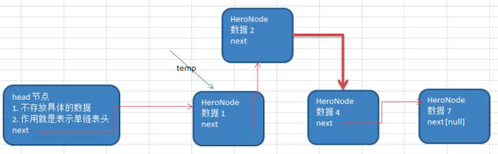

# 单链表

单链表（带头节点）**逻辑结构** 示意图如下，当下一个节点为 **空** 的时候，该链表就结束了


注意：是逻辑结构，前面说过，在内存中节点不是一个接一个的。

## 单链表的应用实例

考虑这样一个场景：使用带 **head 头**的 **单向链表** 实现水浒英雄排行榜管理

1. 完成对英雄人物的 **增删改查** 操作

2. 第一种方法：在添加英雄时，直接添加到链表的尾部

3. 第二种方法：在添加英雄时，根据排名将英雄插入到指定位置

   如果有这个排名，则添加失败，并给出提示


如上图所示，添加流程。有一个 HeroNode 节点，他的定义如下

```java
class HeroNode {
  int no;
  String name;
  String nickName;
  HeroNode next;
}
```

next 指向下一个节点，为空则代表该链表结束。其他的字段则是上面所说的数据了。

## 单链表-无排序实现

```java
package cn.mrcode.study.dsalgtutorialdemo.datastructure.linkedlist;

/**
 * 单向链表测试
 */
public class SingleLinkedListDemo {
    public static void main(String[] args) {
        HeroNode hero1 = new HeroNode(1, "宋江", "及时雨");
        HeroNode hero2 = new HeroNode(2, "卢俊义", "玉麒麟");
        HeroNode hero3 = new HeroNode(3, "吴用", "智多星");
        HeroNode hero4 = new HeroNode(4, "林冲", "豹子头");

        SingleLinkedList singleLinkedList = new SingleLinkedList();
        singleLinkedList.add(hero1);
        singleLinkedList.add(hero2);
        singleLinkedList.add(hero3);
        singleLinkedList.add(hero4);

        singleLinkedList.list();
    }
}

/**
 * 单向链表
 */
class SingleLinkedList {
    // 头节点，不保存任何数据，只是用来作为一个起始点
    private HeroNode head = new HeroNode(0, "", "");

    /**
     * 添加节点
     * <pre>
     *     不考虑编号顺序时：
     *      1. 找到当前链表的最后节点
     *      2. 将最后整个节点的 next 指向新的节点
     * </pre>
     *
     * @param node
     */
    public void add(HeroNode node) {
        // 要遍历到 next 为 null 的时候，才能进行添加
        HeroNode temp = head;
        while (true) {
            // 找到链表的最后,就退出循环
            if (temp.next == null) {
                break;
            }
            temp = temp.next;
        }
        temp.next = node;
    }

    /**
     * 打印链表中的数据
     */
    public void list() {
        if (head.next == null) {
            System.out.println("链表为空");
            return;
        }
        HeroNode temp = head.next;
        while (true) {
            // 如果是链表的最后
            if (temp == null) {
                break;
            }
            System.out.println(temp);
            temp = temp.next;
        }
    }
}

/**
 * 链表中的一个节点：英雄节点
 */
class HeroNode {
    public int no;
    public String name;
    public String nickName;
    public HeroNode next;

    public HeroNode(int no, String name, String nickName) {
        this.no = no;
        this.name = name;
        this.nickName = nickName;
    }

    /**
     * 为了显示方便，重写
     *
     * @return
     */
    @Override
    public String toString() {
        return "HeroNode{" +
                "no=" + no +
                ", name='" + name + '\'' +
                ", nickName='" + nickName + '\'' +
                '}';
    }
}
```

测试输出

```
HeroNode{no=1, name='宋江', nickName='及时雨'}
HeroNode{no=2, name='卢俊义', nickName='玉麒麟'}
HeroNode{no=3, name='吴用', nickName='智多星'}
HeroNode{no=4, name='林冲', nickName='豹子头'}
```

可以看到，已经实现了，如果将  no=4 提前加入

```java
SingleLinkedList singleLinkedList = new SingleLinkedList();
singleLinkedList.add(hero1);
singleLinkedList.add(hero4);  // 提升到这里加入
singleLinkedList.add(hero2);
singleLinkedList.add(hero3);
```

测试数据如下

```
HeroNode{no=1, name='宋江', nickName='及时雨'}
HeroNode{no=4, name='林冲', nickName='豹子头'}
HeroNode{no=2, name='卢俊义', nickName='玉麒麟'}
HeroNode{no=3, name='吴用', nickName='智多星'}
```

编号就是无序的了。下面来实现有序的

## 单链表-有序实现



添加思路如下：

1. 首先 **找到** 新添加节点的位置，通过辅助变量 temp，然后循环遍历查找
2. 新的节点.next = temp.next
3. 将 temp.next = 新的节点

简单一点就是：通过遍历找到要插入的位置，然后改变 next 的指向到.

代码实现，在原有的基础上新增了一个添加方法，如下

```java
    /**
     * <pre>
     * 添加节点，考虑排序
     *  1. 先找到该节点要添加的位置
     *  2. 改变前一个和该节点的 next 指向
     * </pre>
     *
     * @param node
     */
    public void addByOrder(HeroNode node) {
        // 由于 head 变量不能动，动了就无法从头遍历了，使用辅助变量来完成我们的添加
        HeroNode temp = head;
        boolean exist = false;  // 添加的节点是否已经在链表中存在
        while (true) {
            if (temp.next == null) {
                // 如果是链表尾，则跳出循环
                break;
            }
            // 如果当前节点的 next 编号，大于目标节点编号，则找到
            // 应该将目标节点添加到  temp 与 next 之间
            if (temp.next.no > node.no) {
                break;
            }
            // 如果他们相等，则表示链表中已经存在目标节点了
            if (temp.next.no == node.no) {
                exist = true;
                break;
            }
            // 没找到，则后移 temp ，继续寻找
            temp = temp.next;
        }

        if (exist) {
            System.out.printf("准备插入的英雄编号 %d 已经存在，不能加入 \n", node.no);
            return;
        }
        // 把节点插入到 temp 和 temp.next 之间
        // temp  ->  node  -> temp.next
        node.next = temp.next;
        temp.next = node;
    }
```

测试用例如下

```java
    /**
     * 考虑顺序的添加
     */
    public static void test2() {
        HeroNode hero1 = new HeroNode(1, "宋江", "及时雨");
        HeroNode hero2 = new HeroNode(2, "卢俊义", "玉麒麟");
        HeroNode hero3 = new HeroNode(3, "吴用", "智多星");
        HeroNode hero4 = new HeroNode(4, "林冲", "豹子头");

        SingleLinkedList singleLinkedList = new SingleLinkedList();
        singleLinkedList.addByOrder(hero1);
        singleLinkedList.addByOrder(hero4);  // 添加顺序提前
        singleLinkedList.addByOrder(hero2);
        singleLinkedList.addByOrder(hero3);

        singleLinkedList.list();
    }
```

输出信息

```
HeroNode{no=1, name='宋江', nickName='及时雨'}
HeroNode{no=2, name='卢俊义', nickName='玉麒麟'}
HeroNode{no=3, name='吴用', nickName='智多星'}
HeroNode{no=4, name='林冲', nickName='豹子头'}
```

如果重复添加的话，会输出如下类似的信息

```
准备插入的英雄编号 4 已经存在，不能加入 
```

## 单链表的修改

在原来的基础上新增 update 方法

```java
    /**
     * 根据 no 属性找到匹配的节点，进行修改，但是不修改 next 节点。
     *
     * @param newNode
     */
    public void update(HeroNode newNode) {
        if (head.next == null) {
            System.out.println("链表为空");
            return;
        }

        HeroNode temp = head.next;
        boolean exist = false;  // 是否找到要修改的节点
        while (true) {
            // 如果是链表尾部
            if (temp == null) {
                break;
            }
            // 如果已找到
            if (temp.no == newNode.no) {
                exist = true;
                break;
            }
            temp = temp.next;
        }
        // 如果已找到，则修改信息
        if (exist) {
            temp.name = newNode.name;
            temp.nickName = newNode.nickName;
        } else {
            System.out.printf("未找到编号为 %d 的英雄", newNode.no);
        }
    }
```

测试用例

```java
singleLinkedList.addByOrder(hero1);
singleLinkedList.addByOrder(hero4);
singleLinkedList.addByOrder(hero2);
singleLinkedList.addByOrder(hero3);

// 测试修改
System.out.println("修改前");
singleLinkedList.list();
HeroNode hero4New = new HeroNode(4, "林冲-修改测试", "豹子头-修改测试");
singleLinkedList.update(hero4New);

System.out.println("修改后");
singleLinkedList.list();
```

测试输出

```
修改前
HeroNode{no=1, name='宋江', nickName='及时雨'}
HeroNode{no=2, name='卢俊义', nickName='玉麒麟'}
HeroNode{no=3, name='吴用', nickName='智多星'}
HeroNode{no=4, name='林冲', nickName='豹子头'}
修改后
HeroNode{no=1, name='宋江', nickName='及时雨'}
HeroNode{no=2, name='卢俊义', nickName='玉麒麟'}
HeroNode{no=3, name='吴用', nickName='智多星'}
HeroNode{no=4, name='林冲-修改测试', nickName='豹子头-修改测试'}
```

## 单链表的删除


如上图所示，思路如下：

1. 先找到需要删除的这个节点的 **前一个节点** temp

   为什么要找到前一个？因为是单向链表，找目标节点就无法完成删除了。

2. `temp.next =  temp.next.next`

3. 被删除的节点，如果没有其他的引用的话，会被垃圾回收机制回收

```java
    /**
     * <pre>
     *   按编号删除节点
     *   1. 找到要删除的前一个节点
     *   2. 然后将这个前一个节点的 next 指向变更到要删除节点的 next 节点
     * </pre>
     *
     * @param no
     */
    public void delete(int no) {
        if (head.next == null) {
            System.out.println("链表为空");
            return;
        }
        HeroNode temp = head;
        boolean exist = false;  // 是否找到要删除的节点
        while (true) {
            if (temp.next == null) {
                break;
            }
            if (temp.next.no == no) {
                exist = true;
                break;
            }
            temp = temp.next;
        }
        if (!exist) {
            System.out.printf("未找到匹配的编号 %d \n", no);
            return;
        }
        // 删除操作
        temp.next = temp.next.next;
    }
```

测试代码

```java
System.out.println("删除前");
singleLinkedList.list();
singleLinkedList.delete(1);
singleLinkedList.delete(4);
System.out.println("删除后");
singleLinkedList.list();
```

输出信息

```
删除前
HeroNode{no=1, name='宋江', nickName='及时雨'}
HeroNode{no=2, name='卢俊义', nickName='玉麒麟'}
HeroNode{no=3, name='吴用', nickName='智多星'}
HeroNode{no=4, name='林冲', nickName='豹子头'}
删除后
HeroNode{no=2, name='卢俊义', nickName='玉麒麟'}
HeroNode{no=3, name='吴用', nickName='智多星'}
```


::: tip

后续对应项目代码结构调整说明：

可以看到上述的测试代码都在 main 方法中，通过不断的注释来搞定，后续查看项目源码时，就会很混乱。

这里将时候 junit 来组织测试代码，所以要添加依赖

```
dependencies {
    testCompile group: 'junit', name: 'junit', version: '4.12'
    compile group: 'junit', name: 'junit', version: '4.12'
}
```

:::

