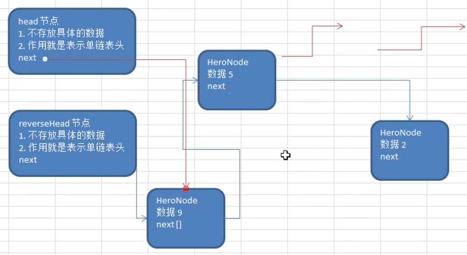

# 单链表面试题

为了加深理解，来看几个面试题

## 求单链表中有效节点的个数

思路：直接循环统计就行

```java
    /**
     * 获取链表长度
     * @return
     */
    public int length() {
        if (head.next == null) {
            return 0;
        }
        HeroNode temp = head.next;
        int num = 0;
        while (temp != null) {
            num++;
            temp = temp.next;
        }
        return num;
    }
```

测试用例

```java
@Test
public void lengthTest() {
  System.out.println(singleLinkedList.length());
  singleLinkedList.delete(1);
  System.out.println(singleLinkedList.length());
}
```

输出

```
4
3
```

## 查找单链表中的倒数第 k 个结点 

新浪面试题

```java
    /**
     * <pre>
     *  查找单链表中的倒数第 k 个结点
     *
     *  思路：
     *   1. 获得该链表节点的个数 size
     *   2. 从第一个节点循环开始，到 size-index 结束
     * <pre/>
     * @param index 倒数第几个节点
     * @return
     */
    public HeroNode findLastIndexNode(int index) {
        int size = length();
        if (size == 0) {
            return null;  // 空链表
        }

        // 校验 index
        if (index <= 0 || index > size) {
            return null;
        }

        // 循环查找
        HeroNode cur = head.next;
        for (int i = 0; i < size - index; i++) {
            cur = cur.next;
        }
        return cur;
    }
```

测试用例

```java
@Test
public void findLastIndexNodeTest() {
  singleLinkedList.list();
  System.out.println("查找测试");
  HeroNode lastIndexNode = singleLinkedList.findLastIndexNode(1);
  System.out.println("查找倒数第 1 个 " + lastIndexNode);
  lastIndexNode = singleLinkedList.findLastIndexNode(4);
  System.out.println("查找倒数第 4 个 " + lastIndexNode);
  lastIndexNode = singleLinkedList.findLastIndexNode(2);
  System.out.println("查找倒数第 2 个 " + lastIndexNode);
  lastIndexNode = singleLinkedList.findLastIndexNode(5);
  System.out.println("查找倒数第 5 个 " + lastIndexNode);
}
```

输出信息

```
查找测试
查找倒数第 1 个 HeroNode{no=3, name='吴用', nickName='智多星'}
查找倒数第 4 个 HeroNode{no=1, name='宋江', nickName='及时雨'}
查找倒数第 2 个 HeroNode{no=2, name='卢俊义', nickName='玉麒麟'}
查找倒数第 5 个 null
```

## 单链表的反转

腾讯面试题，有点难度。


思路：

1. 定义一个新的 reverseHead 节点
2. 从原链表中依次取出节点，并 **始终添加到 reverseHead 的第一个节点**
3. 将原 head 节点的 next 指向 reverseHead.next

如下图所示：



```java
public void reverse() {
  if (head.next == null) {
    return;
  }

  HeroNode cur = head.next; // 保存从原链表中取出来的节点
  HeroNode next = null;
  HeroNode reverseHead = new HeroNode(0, "", "");
  while (cur != null) {
    next = cur.next;
    // 取出来的话，就要清空下一个节点: cur.next = null;
    // 但是这里由于要添加到 reverseHead 的 下一个节点（永远添加到最前面）
    //      那么，就需要一个将已有的 reverseHead 后面的链表添加到这个节点的 next，达到在最前面插入的效果
    cur.next = reverseHead.next;
    reverseHead.next = cur;

    // cur 后移，完成原节点的遍历
    cur = next;
  }
  // 将翻转后的链表挂到现有的 head.next 上
  head.next = reverseHead.next;
}
```

测试用例

```java
@Test
public void reverseTest() {
  System.out.println("翻转前");
  singleLinkedList.list();

  singleLinkedList.reverse();

  System.out.println("翻转后");
  singleLinkedList.list();
}
```

输出信息

```
翻转前
HeroNode{no=1, name='宋江', nickName='及时雨'}
HeroNode{no=4, name='林冲', nickName='豹子头'}
HeroNode{no=2, name='卢俊义', nickName='玉麒麟'}
HeroNode{no=3, name='吴用', nickName='智多星'}
翻转后
HeroNode{no=3, name='吴用', nickName='智多星'}
HeroNode{no=2, name='卢俊义', nickName='玉麒麟'}
HeroNode{no=4, name='林冲', nickName='豹子头'}
HeroNode{no=1, name='宋江', nickName='及时雨'}
```

## 从尾到头打印单链表 

百度面试题，要求方式：

1. 反向遍历
2. Stack 栈

思路：

1. 反向遍历 ：使用前面翻转操作后，再打印

   有一个问题：会破坏原链表的结构

2. Stack 栈：利用栈先进后出的特点

   该数据结构后续讲解，这里做个简单的介绍

   

   如上图所示：

   1. 入栈操作：数据往 **栈底** 压入
   2. 出栈操作：数据从 **栈顶** 弹出

   将原链表遍历，以此将每个节点压入栈中，然后遍历栈打印即可

```java
/**
* <pre>
* 逆序打印链表：使用栈先进后出的特点达到
* </pre>
*/
public void reversePrint() {
  if (head.next == null) {
    System.out.println("链表为空");
    return;
  }

  Stack<HeroNode> stack = new Stack<>();
  HeroNode cur = head.next;
  // 遍历原链表，入栈
  while (cur != null) {
    stack.push(cur);
    cur = cur.next;
  }
  // 打印栈
  while (!stack.empty()) {
    System.out.println(stack.pop());
  }
}
```

测试用例

```java
@Test
public void reversePrintTest(){
  System.out.println("链表数据");
  singleLinkedList.list();
  System.out.println("逆序打印");
  singleLinkedList.reversePrint();
}
```

输出信息

```
链表数据
HeroNode{no=1, name='宋江', nickName='及时雨'}
HeroNode{no=4, name='林冲', nickName='豹子头'}
HeroNode{no=2, name='卢俊义', nickName='玉麒麟'}
HeroNode{no=3, name='吴用', nickName='智多星'}
逆序打印
HeroNode{no=3, name='吴用', nickName='智多星'}
HeroNode{no=2, name='卢俊义', nickName='玉麒麟'}
HeroNode{no=4, name='林冲', nickName='豹子头'}
HeroNode{no=1, name='宋江', nickName='及时雨'}
```

## 合并两个有序的单链表

要求：合并两个有序的单链表，合并之后的链表依然有序

思路：其实已经实现过了，前面添加的时候，保持链表的有序

