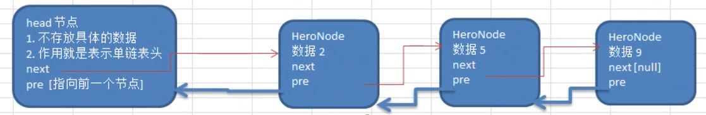
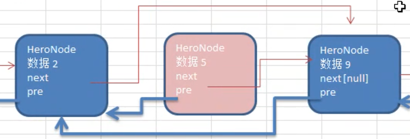

# 双向链表

## 单向链表的缺点

从前面的练习题，包括实现单向链表中会发现 **单向链表** 的以下问题：

- 查找方向 **只能是单向**

- 不能自我删除

  需要靠辅助节点，要找到删除节点的上一个节点和删除节点，才能完成删除

而以上问题，双向链表：

- 可以双向查找
- 可以自我删除

## 双向链表分析



双向链表的结构如上图所示，每个节点都有 pre 和 next 变量，所以它可以往前查找或则往后查找。

那么下面先分析下双向链表的：遍历、添加、删除 操作思路，之后再去实现：

- 遍历：和单向链表类似，只是可以双向遍历了

- 修改：和单向链表一样的方式

- 添加：默认添加到双向链表的最后一个节点

  1. temp.next = newNode
  2. newNode.pre = temp

- 删除

  

  如上图所示，双向链表可以自我删除：

  1. 遍历找到要删除的那个节点 temp
  2. `temp.next.pre = temp.pre`
  3. `temp.pre.next = temp.next`

## 代码实现

> 本代码实现包路径：cn.mrcode.study.dsalgtutorialdemo.datastructure.linkedlist.doublelist

可以基于单向链表上的部分代码进行修改。

HeroNode

```java
package cn.mrcode.study.dsalgtutorialdemo.datastructure.linkedlist.doublelist;

/**
 * 链表中的一个节点：英雄节点
 */
class HeroNode {
    public int no;
    public String name;
    public String nickName;
    public HeroNode next;
    public HeroNode pre;

    public HeroNode(int no, String name, String nickName) {
        this.no = no;
        this.name = name;
        this.nickName = nickName;
    }

    /**
     * 为了显示方便，重写
     *
     * @return
     */
    @Override
    public String toString() {
        return "HeroNode{" +
                "no=" + no +
                ", name='" + name + '\'' +
                ", nickName='" + nickName + '\'' +
                '}';
    }
}

```

DoubleLinkedList

```java
package cn.mrcode.study.dsalgtutorialdemo.datastructure.linkedlist.doublelist;

/**
 * 双向链表的操作实现
 */
public class DoubleLinkedList {
    private HeroNode head = new HeroNode(0, "", "");

    /**
     * 添加：将节点添加到链表尾部
     *
     * @param node
     */
    public void add(HeroNode node) {
        HeroNode temp = head;
        // 找到链表的末尾
        while (temp.next != null) {
            temp = temp.next;
        }
        // 将新节点添加到末尾的节点上
        temp.next = node;
        node.pre = temp;
    }

    /**
     * 更新：以 id 匹配，更新链表中找到的节点；与单向链表的逻辑一样
     *
     * @param newNode
     */
    public void update(HeroNode newNode) {
        if (head.next == null) {
            System.out.println("链表为空");
            return;
        }

        HeroNode temp = head.next;
        boolean exist = false;  // 是否找到要修改的节点
        while (true) {
            // 如果是链表尾部
            if (temp == null) {
                break;
            }
            // 如果已找到
            if (temp.no == newNode.no) {
                exist = true;
                break;
            }
            temp = temp.next;
        }
        // 如果已找到，则修改信息
        if (exist) {
            temp.name = newNode.name;
            temp.nickName = newNode.nickName;
        } else {
            System.out.printf("未找到编号为 %d 的英雄", newNode.no);
        }
    }

    /**
     * <pre>
     * 删除：按编号匹配，将其删除；
     *  思路：直接找到该节点，然后自我删除
     * </pre>
     *
     * @param no
     */
    public void delete(int no) {
        if (head.next == null) {
            System.out.println("链表为空");
            return;
        }
        HeroNode cur = head.next;
        boolean exist = false;  // 是否找到要删除的节点
        while (true) {
            if (cur == null) {
                break;
            }
            // 找到与自己相同的 id
            if (cur.no == no) {
                exist = true;
                break;
            }
            cur = cur.next;
        }
        if (!exist) {
            System.out.printf("未找到匹配的编号 %d \n", no);
            return;
        }

        // 完成自我删除
        // 这里有一个边界问题：当 cur 是末尾节点的时候，next 为空，不处理
        if (cur.next != null) {
            cur.next.pre = cur.pre;
        }
        cur.pre.next = cur.next;
    }

    /**
     * 打印链表
     */
    public void print() {
        if (head.next == null) {
            System.out.println("链表为空");
            return;
        }
        HeroNode cur = head.next;
        while (cur != null) {
            System.out.println(cur);
            cur = cur.next;
        }
    }
}

```

测试用例

```java
package cn.mrcode.study.dsalgtutorialdemo.datastructure.linkedlist.doublelist;

import org.junit.Before;
import org.junit.Test;

/**
 * 双向链表测试
 */
public class DoubleLinkedListTest {
    DoubleLinkedList doubleLinkedList;

    @Before
    public void before() {
        HeroNode hero1 = new HeroNode(1, "宋江", "及时雨");
        HeroNode hero2 = new HeroNode(2, "卢俊义", "玉麒麟");
        HeroNode hero3 = new HeroNode(3, "吴用", "智多星");
        HeroNode hero4 = new HeroNode(4, "林冲", "豹子头");

        // 测试新增
        doubleLinkedList = new DoubleLinkedList();
        doubleLinkedList.add(hero1);
        doubleLinkedList.add(hero4);
        doubleLinkedList.add(hero2);
        doubleLinkedList.add(hero3);
    }

    @Test
    public void addTest() {
        // before 中已测试
    }

    /**
     * 更新测试
     */
    @Test
    public void updateTest() {
        System.out.println("更新前");
        doubleLinkedList.print();
        HeroNode hero4New = new HeroNode(4, "林冲-修改测试", "豹子头-修改测试");
        doubleLinkedList.update(hero4New);
        System.out.println("更新后");
        doubleLinkedList.print();
    }

    /**
     * 删除测试
     */
    @Test
    public void deleteTest() {
        System.out.println("删除前");
        doubleLinkedList.print();
        doubleLinkedList.delete(1);
        doubleLinkedList.delete(4);
        doubleLinkedList.delete(3);
        System.out.println("删除后");
        doubleLinkedList.print();
    }
}
```

测试输出

```
更新前
HeroNode{no=1, name='宋江', nickName='及时雨'}
HeroNode{no=4, name='林冲', nickName='豹子头'}
HeroNode{no=2, name='卢俊义', nickName='玉麒麟'}
HeroNode{no=3, name='吴用', nickName='智多星'}
更新后
HeroNode{no=1, name='宋江', nickName='及时雨'}
HeroNode{no=4, name='林冲-修改测试', nickName='豹子头-修改测试'}
HeroNode{no=2, name='卢俊义', nickName='玉麒麟'}
HeroNode{no=3, name='吴用', nickName='智多星'}


删除前
HeroNode{no=1, name='宋江', nickName='及时雨'}
HeroNode{no=4, name='林冲', nickName='豹子头'}
HeroNode{no=2, name='卢俊义', nickName='玉麒麟'}
HeroNode{no=3, name='吴用', nickName='智多星'}
删除后
HeroNode{no=2, name='卢俊义', nickName='玉麒麟'}
```

## 课程作业

实现：双向链表的第二种添加方式，按照编号顺序添加

实现和单向添加是一样的

```java
/**
* <pre>
*  按编号顺序添加
*  思路：
*     1. 从头遍历节点，
*     2. 找到比目标大的节点：插入到该节点之前（升序）
*     2. 如果已经存在相同编号的节点，则提示不允许添加
*
* </pre>
*
* @param node
*/
public void addByOrder(HeroNode node) {
  HeroNode temp = head;
  boolean exist = false;  // 添加的节点是否已经在链表中存在

  while (true) {
    // 已到列表尾部
    if (temp.next == null) {
      break;
    }
    // 已找到
    if (temp.next.no > node.no) {
      break;
    }

    // 已存在该编号
    if (temp.next.no == node.no) {
      exist = true;
      break;
    }
    temp = temp.next;
  }
  if (exist) {
    System.out.printf("准备插入的英雄编号 %d 已经存在，不能加入 \n", node.no);
    return;
  }

  // 把节点插入到 temp 和 temp.next 之间
  // temp  ->  node  -> temp.next
  node.next = temp.next;
  temp.next = node;
}
```

测试用例

```java
@Test
public void addByOrderTest() {
  HeroNode hero1 = new HeroNode(1, "宋江", "及时雨");
  HeroNode hero2 = new HeroNode(2, "卢俊义", "玉麒麟");
  HeroNode hero3 = new HeroNode(3, "吴用", "智多星");
  HeroNode hero4 = new HeroNode(4, "林冲", "豹子头");

  // 测试新增
  doubleLinkedList = new DoubleLinkedList();
  doubleLinkedList.addByOrder(hero1);
  doubleLinkedList.addByOrder(hero4);
  doubleLinkedList.addByOrder(hero2);
  doubleLinkedList.addByOrder(hero3);
  doubleLinkedList.addByOrder(hero3);
  doubleLinkedList.print();
}
```

测试输出

```
准备插入的英雄编号 3 已经存在，不能加入 
HeroNode{no=1, name='宋江', nickName='及时雨'}
HeroNode{no=2, name='卢俊义', nickName='玉麒麟'}
HeroNode{no=3, name='吴用', nickName='智多星'}
HeroNode{no=4, name='林冲', nickName='豹子头'}
```

