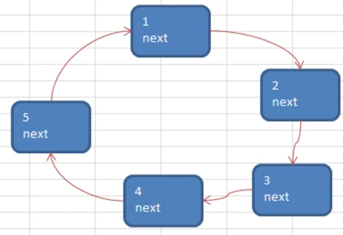
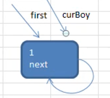
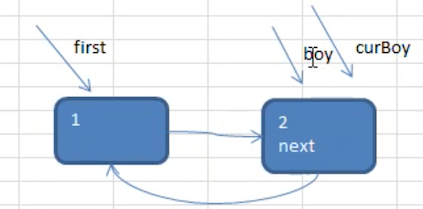

# 单向环形链表-Josephu 问题

## 应用场景-约瑟夫问题


约瑟夫（Josephu）问题，也就是丢手帕问题，他的规则如下

- 有编号为 1 ~ n 的 n 个人围坐在一起

- 约定编号为 K( 1 <= k <=n)  的人从 1 开始报数
- 数到 m 的那个人出列，它的下一位又从 1 开始报数

循环以上过程，直到所有人都出列，并列出出列人的编号。

该问题其实可以使用 **单循环链表（单向环形链表）**来解决，思路如下：

1. 先构成一个有 n 个节点的单循环链表
2. 然后由 k 节点起从 1 开始计数
3. 计数到 m 时，对应节点从链表中删除，然后从下一个节点又从 1 开始计数

循环以上过程，直到最后一个节点从链表中删除，算法结束

## 单向环形链表介绍

它的逻辑结构就如下图，形成了一个环状。


## 约瑟夫问题示意图

需求如下：

- `n=5`：有 5 个人
- `k=1`：从第一个人开始数
- `m=2`：数两次



没有动图，那么使用下面的描述来讲解：

1. 第一轮：2  出队列，1.next = 3

   还剩下：1、3、4、5

2. 第二轮：4 出队列，3.next = 5；（从 3 开始报数，第 2 个的出队列，也就是 4）

   还剩下：1、3、5

3. 第三轮：1 出队列，5.next = 3

   还剩下：3、5

4. 第四轮：5 出队列，3.next = 3

   还剩下：3，自己的 next 就是自己

5. 第五轮：3 出队列，队列中无元素，结束

那么最终的出队列顺序就是：2、4、1、5、3

约舍夫问题可以使用数组来解决，这里使用单向环形链表，比较好理解

## 创建环形链表的思路图解

### 环形链表添加思路

1. 第 1 个节点被添加进来时

   
   
   使用一个 **first 变量来表示这是第一个节点**，和带头节点的链表类似，第一个节点不能去改变他，使用 curBody 变量来辅助我们解决添加的过程，**并让 first 指向自己，形成一个环形**
   
2. 第 2 个节点被添加进来时

   

   将该节点加入到已有的环形变量表

3. 第 3 个节点被添加进来时

   

### 遍历环形链表

1. 先让一个辅助变量 cur，指向 first 节点
2. 通过一个 while 循环遍历该，当 cur.next = first 时，就遍历完了

## 添加和列表打印代码实现

```java
package cn.mrcode.study.dsalgtutorialdemo.datastructure.linkedlist.josepfu;

/**
 * 小孩节点
 */
public class Boy {
    int no;
    Boy next;

    public Boy(int no) {
        this.no = no;
    }
}
```

```java
package cn.mrcode.study.dsalgtutorialdemo.datastructure.linkedlist.josepfu;

/**
 * 单向环形链表实现
 */
public class CircleSingleLinkedList {
    Boy first = null;

    /**
     * 添加几个小孩：这里的添加至少用于初始化时，构建一个约舍夫丢手帕的 n 个孩子，与传统的入队列还不一样
     *
     * @param nums
     */
    public void add(int nums) {
        if (nums < 1) {
            System.out.println("至少要添加一个");
            return;
        }
        Boy cur = null;
        for (int i = 1; i <= nums; i++) {
            Boy boy = new Boy(i);
            // 初始化 first 节点
            if (first == null) {
                first = boy;
                boy.next = first;  // 自己和自己构成环状
                cur = first;
                continue;
            }
            cur.next = boy;
            boy.next = first;
            cur = boy;
        }
    }

    /**
     * 打印队列
     */
    public void print() {
        if (first == null) {
            System.out.println("队列为空");
            return;
        }
        Boy cur = first;
        while (true) {
            System.out.printf("小孩编号 %d \n", cur.no);
            cur = cur.next;
            // 如果和 first 一致，则标识已经走了一圈了
            if (cur == first) {
                return;
            }
        }
    }
}
```

测试用例

```java
package cn.mrcode.study.dsalgtutorialdemo.datastructure.linkedlist.josepfu;

import org.junit.Test;

/**
 * 约瑟夫问题测试
 */
public class JosepfuTest {
    /**
     * 添加测试
     */
    @Test
    public void addTest() {
        CircleSingleLinkedList circleSingleLinkedList = new CircleSingleLinkedList();
        circleSingleLinkedList.add(5);
        circleSingleLinkedList.print();
    }
}
```

测试输出：为了验证前面 5 个小孩的说明是否正确，这里也添加 5 个小孩

## 出圈思路分析

还是以这个需求来分析：

用户输入如下：

- `n=5`：有 5 个人
- `k=1`：从第一个人开始数
- `m=2`：数两次


1. 初始化时，需要一个 helper 来保存链表的默认节点，如下图所示
	
	

2. 将 first 和 helper 定位到 k （从第几个小孩开始报数）

   将 first 和 helper 移动 k-1 次

3. 小孩报数时：移动 first 到出圈的节点上，hepler 始终在 first 后面

  

  让 **first 和 helper 同时移动  m-1 次**，是因为 **开始数数的人** 也要占用一个位置：比如上图，从 first 开始，在编号 2 时，就数了 2 下了，它该出圈

4. 小孩出圈

   

   先将 `first = first.next`，然后将 `helper.next = first`，那么就如上图所示了，出圈的 first 被孤立出圈了，别人没有引用它了

注意：只有 **小孩报数和出圈是重复** 的，其他的只是这个游戏开始前的一些设置。

## 出圈代码实现

在原来的环形队列上添加游戏开始方法（计算出圈顺序）

`cn.mrcode.study.dsalgtutorialdemo.datastructure.linkedlist.josepfu.CircleSingleLinkedList#countBoy`

```java
/**
* 游戏开始，计算出圈顺序
*
* @param startNo  从第几个小孩开始数
* @param countNum 数几下
* @param nums     参与该游戏的小孩有多少个
*/
public void countBoy(int startNo, int countNum, int nums) {
  // 进行一个数据校验
  if (first == null ||  // 环形队列没有构建
      countNum < 1 ||  // 每次至少数 1 下
      startNo > nums  // 开始小孩不能大于参与游戏的人数
     ) {
    System.out.println("参数有误，请重新输入");
  }
  // 1. 初始化辅助变量到  first 的后面
  Boy helper = first;
  // 当 helper.next = first 时，就说明已经定位了
  while (helper.next != first) {
    helper = helper.next;
  }

  // 2. 定位 first 和 helper 在 startNo 位置
  // first 初始在最开始，移动到 startNo 位置
  for (int i = 0; i < startNo - 1; i++) {
    helper = first;
    first = first.next;
  }

  // 为了测试方便，这里添加一个日志输出
  System.out.printf("定位到位置： %d \n", startNo);
  print();

  // 3. 开始报数 和 出圈
  while (true) {
    // 当队列中只剩下一个人的时候，跳出循环，因为最后一个必然是他自己出队列
    if (helper == first) {
      break;
    }
    // 报数：每次报数 m-1
    for (int i = 0; i < countNum - 1; i++) {
      // 因为 helper 永远在 first 后面，只要在 first 移动时，指向 first 原来所在的位置即可
      helper = first;
      first = first.next;
    }
    // 出圈
    System.out.printf("出圈小孩编号 %d \n", first.no);
    first = first.next;  // first 重置为下一次报数的小孩节点上
    helper.next = first; // helper 重置为下一次报数的小孩节点上
  }
  System.out.printf("最后剩下小孩编号 %d \n", first.no);
}
```

测试用例

```java
@Test
public void countBoy() {
  CircleSingleLinkedList circleSingleLinkedList = new CircleSingleLinkedList();
  circleSingleLinkedList.add(5);
  System.out.println("构建环形队列");
  circleSingleLinkedList.print();

  // 开始玩游戏
  // 正确的输出顺序为：2、4、1、5、3
  circleSingleLinkedList.countBoy(1, 2, 5);
}
```

测试输出

```
构建环形队列
小孩编号 1 
小孩编号 2 
小孩编号 3 
小孩编号 4 
小孩编号 5 
定位到位置： 1 
小孩编号 1 
小孩编号 2 
小孩编号 3 
小孩编号 4 
小孩编号 5 
出圈小孩编号 2 
出圈小孩编号 4 
出圈小孩编号 1 
出圈小孩编号 5 
最后剩下小孩编号 3 
```

可以尝试修改下从第 3 个小孩开始报数

```
定位到位置： 3 
小孩编号 3 
小孩编号 4 
小孩编号 5 
小孩编号 1 
小孩编号 2 
出圈小孩编号 4 
出圈小孩编号 1 
出圈小孩编号 3 
出圈小孩编号 2 
最后剩下小孩编号 5 
```

## 小结

其实一开始笔者会认为是会实现单向环形链表这个数据结构，学完才发现，其实使用 **单向环形链表** 这个概念来解决一些问题。

其实以现在学到的知识点来看：单纯的实现一个环形链表队列？然后就不是很好的能解决这个约瑟夫问题，这里是 **使用环形链表的思路，来解决问题**

另外需要正视的一个点：现在在学习数据结构，比如数组可以模拟 **队列**，数组可以模拟 **环形队列**，队列也是一个数据结构，主要是思路。

