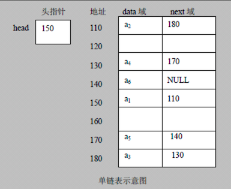

# 链表 Linked List

链表是有序的列表，但是在内存中存储图下图所示

1. 链表是以 **节点** 的方式来存储，是 **链式存储**
2. 每个节点包含 **data 域**、**next 域，指向下一个节点**
3. 链表的各个节点 **不一定是连续存储**，如上图所示
4. 链表还分：带头节点、不带头节点，根据实际需求来确定

上面进行了一个简单的介绍，下面分几部分来讲解

- [单链表](./01.md)
- [单链表面试题（新浪、百度、腾讯）](./02.md)
- [双向链表]()
- [单向环形链表]()
- [Josephu 问题]()