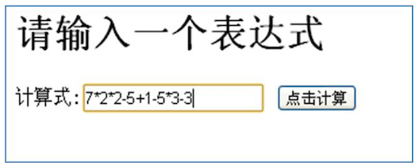
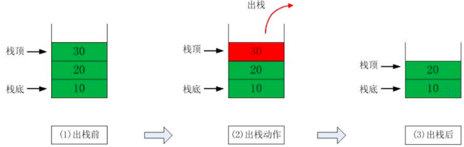

# 栈快速入门

## 计算器需求



如上图：输入一个表达式 `7*2*2-5+1-5+3-3`，然后计算出他的结果。

问：计算机底层是如何运算得到结果的？对于计算机而言他接受到的是一个 **字符串**，怎么计算出来的？

针对这个问题，我们讨论的就是 **栈**

## 栈介绍

stack 栈，是一个 **先入后出**（FILO，First In Last Out）的 **有序列表**。

是限制 **线性表** 中元素的插入和删除只能在线性表的 **同一端 **进行的一种特殊线性表：

- 栈顶（Top）：允许插入和删除的一端，为 **变化的一端**。称为栈顶
- 栈底（Bottom）：另一端为 **固定的一端**，称为栈底

根据上述定义，可知：

- **最先** 放入栈中元素在 **栈底**
- **最后 **放入栈中元素在 **栈顶**

而删除元素则刚好相反：

- **最先** 放入栈中元素，**最后** 删除
- **最后** 放入栈中元素，**最先** 删除

可以参考下图的，入栈和出栈图示：




## 栈的应用场景

- 子程序的调用

  在跳往子程序前，会先将 **下个指令的地址** 存到堆栈中，直到子程序执行完后再 **将地址取出**，以 **回到原来的程序中**。

  如方法中调用方法。

- 处理递归调用

  和子程序调用类似，只是除了存储下一个指令的地址外，也将参数、区域变量等数据存入堆栈中。

- 表达式的转换（中缀表达式转后缀表达式）与求值（实际解决）

- 二叉树的遍历

- 图形的深度优先（depth-first）搜索法

## 数组模拟栈

参考前面的入栈和出栈的图，思路如下：

- 定义一个数组，来模拟栈
- 定义一个 top 变量表示栈顶，初始化为 `-1`
- 入栈：`stack[++top]=data`
- 出栈：`return stack[top--]`

```java
package cn.mrcode.study.dsalgtutorialdemo.datastructure.stack.array;

/**
 * 数组模拟栈
 */
public class ArrayStack {
    int[] stack; // 数据存储
    int maxSize; // 栈最大数量
    int top = -1; // 栈顶位置

    public ArrayStack(int maxSize) {
        this.maxSize = maxSize;
        stack = new int[maxSize];
    }

    /**
     * 是否已满
     *
     * @return
     */
    public boolean isFull() {
        return maxSize - 1 == top;
    }

    /**
     * 是否为空
     *
     * @return
     */
    public boolean isEmpty() {
        return top == -1;
    }

    /**
     * 入栈
     *
     * @param value
     */
    public void push(int value) {
        if (isFull()) {
            System.out.println("栈已满");
            return;
        }
        stack[++top] = value;
    }

    /**
     * 出栈
     *
     * @return
     */
    public int pop() {
        if (isEmpty()) {
            throw new RuntimeException("栈中无数据");
        }
        return stack[top--];
    }

    /**
     * 显示栈中数据，从栈顶开始显示，也就是按出栈的顺序显示
     */
    public void print() {
        if (isEmpty()) {
            System.out.println("栈中无数据");
            return;
        }
        for (int i = top; i >= 0; i--) {
            System.out.printf("index=%d, value=%d \n", i, stack[i]);
        }
    }
}
```

测试用例

```java
package cn.mrcode.study.dsalgtutorialdemo.datastructure.stack.array;

import org.junit.Test;

public class ArrayStackTest {
    @Test
    public void pushTest() {
        ArrayStack stack = new ArrayStack(4);
        stack.push(1);
        stack.push(2);
        stack.push(3);
        stack.push(4);
        stack.print();
        stack.push(5);
    }

    @Test
    public void popTest() {
        ArrayStack stack = new ArrayStack(4);
        stack.push(1);
        stack.push(2);
        stack.print();
        System.out.println("pop 数据：" + stack.pop());
        stack.print();
        System.out.println("pop 数据：" + stack.pop());
        stack.print();
    }
}
```

输出信息

```
====== pushTest
index=1, value=2 
index=0, value=1 
pop 数据：2
index=0, value=1 
pop 数据：1
栈中无数据

====== popTest
index=3, value=4 
index=2, value=3 
index=1, value=2 
index=0, value=1 
栈已满
```

## 链表模拟栈

课堂作业：使用链表模拟栈，加深印象。

```java
package cn.mrcode.study.dsalgtutorialdemo.datastructure.stack.linkedlist;

/**
 * 链表实现栈; 单向链表
 */
public class LinkedListStack {
    int maxSize; // 最大支持数
    int size; // 当前栈中元素个数
    // 用来记录栈顶的元素
    Node top;

    public LinkedListStack(int maxSize) {
        this.maxSize = maxSize;
    }

    /**
     * 是否已满
     *
     * @return
     */
    public boolean isFull() {
        return size == maxSize;
    }

    /**
     * 是否为空
     *
     * @return
     */
    public boolean isEmpty() {
        return size == 0;
    }

    /**
     * 入栈
     *
     * @param value
     */
    public void push(int value) {
        if (isFull()) {
            System.out.println("栈已满");
            return;
        }
        // 要保证 top 是最后进来的
        Node temp = top;
        top = new Node(value);
        top.next = temp;
        size++;
    }


    /**
     * 出栈
     *
     * @return
     */
    public int pop() {
        if (isEmpty()) {
            throw new RuntimeException("栈已空");
        }
        // top 保存的是最后入栈的元素，直接从 top 取出即可
        Node temp = top;
        top = temp.next;
        size--;
        return temp.value;
    }

    /**
     * 显示栈中数据，从栈顶开始显示，也就是按出栈的顺序显示
     */
    public void print() {
        if (isEmpty()) {
            System.out.println("栈已空");
            return;
        }
        Node cur = top;
        while (cur != null) {
            System.out.println(cur);
            cur = cur.next;
        }
    }
}

class Node {
    int value;
    Node next;

    public Node(int value) {
        this.value = value;
    }

    @Override
    public String toString() {
        return "Node{" +
                "value=" + value +
                '}';
    }
}

```

测试用例，和数组测试用例一模一样，只是更换了栈

```java
package cn.mrcode.study.dsalgtutorialdemo.datastructure.stack.linkedlist;

import org.junit.Test;

/**
 * 链表实现栈
 */
public class LinkedListStackTest {
    @Test
    public void pushTest() {
        LinkedListStack stack = new LinkedListStack(4);
        stack.push(1);
        stack.push(2);
        stack.push(3);
        stack.push(4);
        stack.print();
        stack.push(5);
    }

    @Test
    public void popTest() {
        LinkedListStack stack = new LinkedListStack(4);
        stack.push(1);
        stack.push(2);
        stack.print();
        System.out.println("pop 数据：" + stack.pop());
        stack.print();
        System.out.println("pop 数据：" + stack.pop());
        stack.print();
    }
}

```

测试输出

```
====== pushTest
Node{value=4}
Node{value=3}
Node{value=2}
Node{value=1}
栈已满

====== popTest
Node{value=2}
Node{value=1}
pop 数据：2
Node{value=1}
pop 数据：1
栈已空
```