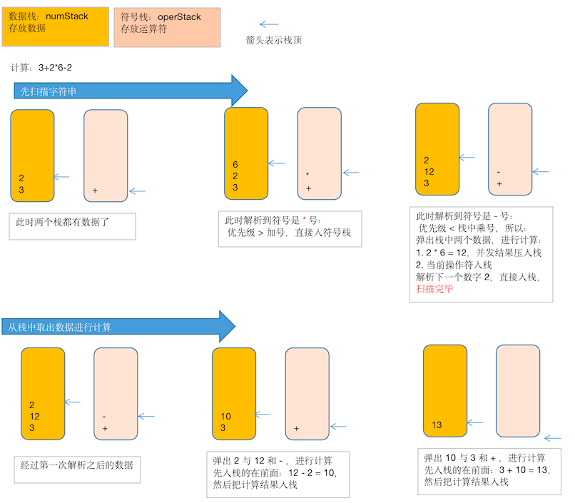

# 综合计算器-中缀表达式

使用栈来实现综合计算器，比如，输入一个表达式：`7*2*2-5+1-5+3-3` ，计算出这个表达式的结果

## 什么是中缀表达式

中缀表达式是一个通用的 **算术** 或 **逻辑公式表示方法**。 **操作符** 是以 **中缀形式** 处于操作数的 **中间**（例：3 + 4），中缀表达式是人们常用的算术表示方法。

## 思路分析



如上图：

1. 需要先扫描字符串，可以通过一个 index 变量来辅助扫描

2. 如果 **发现是一个数字**，**直接入数栈**

3. 如果 **发现是一个操作符**，分以下情况：

   1. 当 **当前操作符** 的优先级 **大于** **栈顶符号**：将 **当前操作符** 入符号栈
   2. 当 **当前操作符** 的优先级 **小于 栈顶符号栈**：
      1. 弹出数栈中的 2 个数值
      2. 弹出符号栈顶的符号
      3. 2 个数字和这个符号进行计算
      4. 将计算结果压入数栈
      5. 将当前操作符压入符号栈

4. 当扫描完毕时：

   1. 顺序的从数栈中弹出 2 个数，
   2. 从符号栈中弹出 1 个操作符
   3. 将他们进行计算，然后把计算结果压入数栈中

   然后重复上面的三个步骤

5. 最后在数栈中只会存在一个数值，它就是结果。

上图经过一个简化的计算表达式，描述了每个重要步骤栈中数据的分布。可以跟着推敲下。

## 第一版代码实现

使用前面实现的栈来做我们的容器，只增加了一个  peek 方法，查看栈顶元素

```java
package cn.mrcode.study.dsalgtutorialdemo.datastructure.stack.calculator;

/**
 * 数组模拟栈
 */
public class ArrayStack {
    int[] stack; // 数据存储
    int maxSize; // 栈最大数量
    int top = -1; // 栈顶位置

    public ArrayStack(int maxSize) {
        this.maxSize = maxSize;
        stack = new int[maxSize];
    }

    /**
     * 是否已满
     *
     * @return
     */
    public boolean isFull() {
        return maxSize - 1 == top;
    }

    /**
     * 是否为空
     *
     * @return
     */
    public boolean isEmpty() {
        return top == -1;
    }

    /**
     * 入栈
     *
     * @param value
     */
    public void push(int value) {
        if (isFull()) {
            System.out.println("栈已满");
            return;
        }
        stack[++top] = value;
    }

    /**
     * 出栈
     *
     * @return
     */
    public int pop() {
        if (isEmpty()) {
            throw new RuntimeException("栈中无数据");
        }
        return stack[top--];
    }

    /**
     * 显示栈中数据，从栈顶开始显示，也就是按出栈的顺序显示
     */
    public void print() {
        if (isEmpty()) {
            System.out.println("栈中无数据");
            return;
        }
        for (int i = top; i >= 0; i--) {
            System.out.printf("index=%d, value=%d \n", i, stack[i]);
        }
    }

    /**
     * 偷看栈顶元素，不测试出队列
     *
     * @return
     */
    public int peek() {
        if (isEmpty()) {
            throw new RuntimeException("栈为空");
        }
        return stack[top];
    }
}

```

计算器代码实现

```java
package cn.mrcode.study.dsalgtutorialdemo.datastructure.stack.calculator;

/**
 * 计算器代码实现
 */
public class Calculator {
    // 使用前面章节实现过的 数组模拟栈，来当我们 计算器中用来存储数据和符号的 容器
    private ArrayStack numStack = new ArrayStack(10); // 数组栈
    private ArrayStack operStack = new ArrayStack(10); // 符号栈

    public static void main(String[] args) {
        String expression = "3+2*6-2";

        Calculator calculator = new Calculator();
        // 扫描表达式
        calculator.scan(expression);
        // 剩余数据进行计算
        int res = calculator.nextCal();
        System.out.printf("%s = %d \n", expression, res);
    }


    /**
     * 第一步：扫描表达式
     */
    public void scan(String expression) {
        int index = 0;
        while (true) {
            if (index == expression.length()) {
                break;
            }
            // 每次只截取一个数字
            // 要注意这里的 ch，使用 ch 做运算的时候要小心
            char ch = expression.substring(index, ++index).charAt(0);
            if (isOper(ch)) {
                // 符号栈为空，则直接入符号
                if (operStack.isEmpty()) {
                    operStack.push(ch);
                    continue;
                }
                // 当 当前操作符 的优先级 大于 栈顶符号：将 当前操作符入符号栈
                // 一定要大于，如果是同级的话，有可能前面一个也是 * 号，需要先在第一步进行计算
                if (priority(ch) > priority((char) operStack.peek())) {
                    operStack.push(ch);
                    continue;
                }
                // 小于栈顶操作符，则将栈顶符号取出，进行计算
                int num1 = numStack.pop();
                int num2 = numStack.pop();
                int oper = operStack.pop();
                int res = cal(num1, num2, oper);
                // 将结果入数栈
                numStack.push(res);
                // 将当期操作符入符号栈
                operStack.push(ch);
            } else {
                // 是数字，直接入数栈
                // ch 被当成 int 的使用的话，需要特别注意
                // ASCII 码表中数字是从 48 开始的，这里的 ch 对应的数字是 ASCII 码表，所以要减掉 48
                // 当然也可以使用字符串解析的方式 Integer.valueOf(字符串) 来得到数字
                numStack.push(ch - 48);
            }
        }
    }

    /**
     * 第 2 步：从栈中取出来数据和符号，然后计算
     *
     * @return
     */
    private int nextCal() {
        System.out.println("符号栈中符号情况：");
        operStack.print();
        while (true) {
            // 当符号栈为空时，表示已经计算完了
            if (operStack.isEmpty()) {
                break;
            }
            int num1 = numStack.pop();
            int num2 = numStack.pop();
            int oper = operStack.pop();
            int res = cal(num1, num2, oper);
            // 将结果入数栈
            numStack.push(res);
        }
        // 计算完成之后，数栈中只有一个数据了，就是结果
        System.out.println("栈中数据是否只有一个结果数字：");
        numStack.print();
        return numStack.pop();
    }

    /**
     * 计算
     *
     * @param num1 依次从栈顶弹出来的数据
     * @param num2
     * @param oper 操作符
     * @return
     */
    private int cal(int num1, int num2, int oper) {
        switch (oper) {
            case '+':
                return num1 + num2;
            case '-':
                // 注意顺序，在栈底的数据，是先进去的，如果是减法，则是前面的数字减后面的数字
                return num2 - num1;
            case '*':
                return num1 * num2;
            case '/':
                return num2 / num1;
        }
        // 由于前面校验过操作符，不会走到这里来的
        return 0;
    }

    /**
     * 计算操作符号优先级，暂时只支持 + - * /
     *
     * @param ch
     * @return 优先级越高，数值越大
     */
    private int priority(char ch) {
        switch (ch) {
            case '+':
            case '-':
                return 0;
            case '*':
            case '/':
                return 1;
            default:
                return -1;
        }
    }

    /**
     * 是否是操作符
     *
     * @param ch
     * @return
     */
    private boolean isOper(char ch) {
        switch (ch) {
            case '+':
            case '-':
            case '*':
            case '/':
                return true;
        }
        return false;
    }
}
```

测试输出

```
符号栈中符号情况：
index=1, value=45  // char = -
index=0, value=43  // char = +
// 在做第二步的时候，符号栈中其实只有 + - 操作符了

栈中数据是否只有一个结果数字：
index=0, value=13 

3+2*6-2 = 13 
```

从结果来看是正确的。但是这里有一个问题就是，表达式解析时，数字只考虑了一位数，大于一位数的数字参与计算时结果就不正常了

##解决不支持多位数

不支持多位数的原因就在于：在扫描表达式时，没有考虑多位数的解析。那么思路是：扫描时，要往后多解析一位数，发现不是符号时，则不能立即将该数入数栈。

在扫描表达式这一步进行修改支持多位数

```java
    /**
     * 第一步：扫描表达式
     */
    public void scan(String expression) {
        int index = 0;
        String keepNum = "";  // 用来保存数字，有可能是 = "1" 或则 "123" 的多位数
        while (true) {
            if (index == expression.length()) {
                break;
            }
            // 每次只截取一个数字
            // 要注意这里的 ch，使用 ch 做运算的时候要小心
            char ch = expression.substring(index, ++index).charAt(0);
            if (isOper(ch)) {
                // 符号栈为空，则直接入符号
                if (operStack.isEmpty()) {
                    operStack.push(ch);
                    continue;
                }
                // 当 当前操作符 的优先级 大于 栈顶符号：将 当前操作符入符号栈
                // 一定要大于，如果是同级的话，有可能前面一个也是 * 号，需要先在第一步进行计算
                if (priority(ch) > priority((char) operStack.peek())) {
                    operStack.push(ch);
                    continue;
                }
                // 小于栈顶操作符，则将栈顶符号取出，进行计算
                int num1 = numStack.pop();
                int num2 = numStack.pop();
                int oper = operStack.pop();
                int res = cal(num1, num2, oper);
                // 将结果入数栈
                numStack.push(res);
                // 将当期操作符入符号栈
                operStack.push(ch);
            } else {
                // 是数字，直接入数栈
                // ch 被当成 int 的使用的话，需要特别注意
                // ASCII 码表中数字是从 48 开始的，这里的 ch 对应的数字是 ASCII 码表，所以要减掉 48
                // 当然也可以使用字符串解析的方式 Integer.valueOf(字符串) 来得到数字
//                numStack.push(ch - 48);
                keepNum += ch;
                // 已经是末尾了，则直接入栈
                if (index == expression.length()) {
                    numStack.push(Integer.parseInt(keepNum));
                    continue;
                }
                // 需要往后多看一位,如果是符号，才能将当前的数入栈
                char tempCh = expression.substring(index, index + 1).charAt(0);
                if (isOper(tempCh)) {
                    numStack.push(Integer.parseInt(keepNum));
                    keepNum = "";
                }
            }
        }
    }
```

然后多测试几个多位数的计算

```
符号栈中符号情况：
index=1, value=45 
index=0, value=43 
栈中数据是否只有一个结果数字：
index=0, value=40 
30+2*6-2 = 40 

栈中数据是否只有一个结果数字：
index=0, value=-8 
7*2*2-5+1-5+3-30 = -8 
```

## 小括号问题

在中缀表达式中，小括号优先级问题也是必须的，这里不考虑，可以自行思考，下一章，后缀表达式中将支持小括号问题。

笔者没有思路来实现小括号。