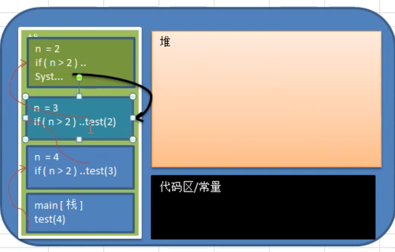

# 递归入门

## 递归的应用场景


迷宫问题（回溯），上图说明：

- 红色的方块是围墙，是小球不能够走的
- 白色的方块是小球可以活动的范围
- 左上角是小球的起点，移动到右下角，就算走出了迷宫

那么在这个场景中，就用到了递归（Recursion）

## 递归的概念

简单说：递归就算方法自己调用自己，每次调用时 **传入不同的变量**

递归有助于编程者解决复杂的问题，同时可以让代码变简单。

## 递归调用机制

使用两个小案例，来帮助理解递归的调用机制：

- 打印问题
- 阶乘问题

### 打印问题

有下面一段代码，请问打印出什么信息？

```java
public static void main(String[] args) {
  test(4);
}

public static void test(int n) {
  if (n > 2) {
    test(n - 1);
  }
  System.out.println("n=" + n);
}
```

下图是一个虚拟机内存区域简单划分



如上图所示：

- 当程序执行到一个方法时，就会开辟一个独立的空间（可以看成是栈）
- man 方法先执行，执行到 `test(4)`，就开辟可一个空间
- 由于有判定 `n > 2` 时，再次调用 `test` 方法，所以会不断开辟空间，直到不再调用 `test` 方法
- 到了最顶端的空间区域，不满足条件，就会开始打印信息
- 一个区域执行完代码后，会回到上一个空间，继续执行剩下的代码

那么直到所有代码运行完成，就如下图所示了


从最顶端开始返回执行剩余代码，也就是打印信息，直到退出程序。那么结果就是上图所示的控制台中国的信息。

运行上面的程序，也会输出一样的结果

```
n=2
n=3
n=4
```

### 阶乘问题

```java
public static void main(String[] args) {
	System.out.println(factorial(5));
}
/**
* <pre>
* 阶乘问题：传递一个数值, 从 1 开始乘以 2，再乘以 3，一直到 N，的结果，
* 比如从 1 阶乘到 5，也就是计算 1 * 2 * 3 * 4 * 5 的结果，如下所示
* 1 * 2 = 2
* 2 * 3 = 6
* 6 * 4 = 24
* 24 * 5 = 120
* 结果是 120
* </pre>
*
* @return
*/
public static int factorial(int n) {
  if (n == 1) {
    return 1;
  } else {
    return factorial(n - 1) * n;
  }
}
```

那么这里的输出结果就是 120。想要复原这个计算过程，可以使用如下代码

```java
public static int factorial2(int n) {
  if (n == 1) {
    return 1;
  } else {
    int factorial = factorial2(n - 1);
    // 按照递归调用原则，这里我们使用的是 n-1,返回条件是 n==1
    // 所以，当 n = 1 时，也就是 factorial = 1 时，这里的语句最最先开始执行
    // 然后把执行结果返回到上一个独立空间，并继续执行计算
    System.out.printf("%d * %d = %d \n", factorial, n, factorial * n);
    return factorial * n;
  }
}
```

这里输出信息是

```
1 * 2 = 2 
2 * 3 = 6 
6 * 4 = 24 
24 * 5 = 120
```

## 递归能解决什么样的问题

- 各种数学问题，如：汉诺塔、阶乘问题、迷宫问题、球和篮子的问题（google 编程大赛里面的题目）
- 各种算法中也会使用到递归，比如：快排、归并、二分查找、分治算法等
- 将用栈解决的问题，可以用递归代码实现，比较简洁

## 递归需要遵守的规则

1. 执行一个方法时，就创建一个新的受保护的独立空间（栈空间）

2. 方法的局部变量是独立的，不会相互影响，比如 n 变量

   但是如果是引用类型变量（比如数组），就会共享该引用类型的数据

3. 递归 **必须向退出递归的条件逼近**，否则就是无限递归，出现 `StackOverflowError` 

4. 当一个方法执行完毕，或则遇到 return，就会返回，**遵守谁调用，就将结果返回给谁**，同时当方法执行完毕或者返回时，该方法也就执行完毕

