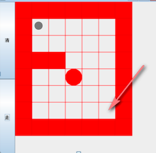

# 递归-迷宫问题



迷宫问题（回溯），上图说明：

- 红色的方块是围墙，是小球不能够走的
- 白色的方块是小球可以活动的范围
- 左上角是小球的起点，移动到右下角，就算走出了迷宫

那么在这个场景中，就用到了递归（Recursion），下面使用代码来实现小球走出迷宫的路径，学习数据结构，没有必要写界面。

```java
package cn.mrcode.study.dsalgtutorialdemo.datastructure.recursion.maze;

import org.junit.Test;

/**
 * <pre>
 * 迷宫问题求解
 * </pre>
 */
public class Maze {
    @Test
    public void demo() {
        // 构建一个 8 行 7 列的地图
        int[][] map = initMap(8, 7);
        printMap(map);
        // 一次性没有回溯的路线
        setWay(map, 1, 1, 6, 5);
//         这个点，是有回溯的路线
//        setWay(map, 1, 1, 4, 1);
        System.out.println("路线查找完毕");
        printMap(map);
    }

    /**
     * <pre>
     *  思路说明：
     *  1. 从 startX,startY 开始走，到 endX,endY 结束
     *  2. 当走到 endX,endY 时，表示已经找到了路线
     *  3. 约定：map 中的含义：
     *      0：表示该点没有走过
     *      1：表示围墙，不能走
     *      2：表示改点已走过，并且可以走
     *      3：表示改点已走过，但是走不通
     *
     *  4. 走迷宫，约定一个寻找路线的策略，也就是当你站在一个点的时候，你从哪一个方向开始探索？
     *     这里规定探索的方向为：下 -> 右 -> 上 -> 左，如果该点走不通，再回溯
     * </pre>
     *
     * @param map    代表一张地图
     * @param startX 从哪一个点开始走
     * @param startY
     * @param endX   到哪一个点结束
     * @param endY
     * @return true: 表示该点可以走，false：表示改点不能走
     */
    public boolean setWay(int[][] map, int startX, int startY, int endX, int endY) {
        // 如果当结束点已经走过，表示已经到达了出口
//        System.out.println();
//        printMap(map); // 打开这个可以看到每一步的探索路径
        if (map[endX][endY] == 2) {
            return true;
        }
        // 那么开始我们的策略探索

        // 如果该点还没有走过，则可以尝试探索
        if (map[startX][startY] == 0) {
            // 先假定该点标可以通过，因为要去探索四周的点是否可以走
            map[startX][startY] = 2;
            // 下 -> 右 -> 上 -> 左
            // 根据策略：先往下走，如果可以走则返回 true
            if (setWay(map, startX + 1, startY, endX, endY)) {
                return true;
            }
            // 如果走不通，则继续往右边探索
            else if (setWay(map, startX, startY + 1, endX, endY)) {
                return true;
            }
            // 如果走不通，则继续往上边探索
            else if (setWay(map, startX - 1, startY, endX, endY)) {
                return true;
            }
            // 如果走不通，则继续往左边探索
            else if (setWay(map, startX, startY - 1, endX, endY)) {
                return true;
            }
            // 都走不通，表示改点是一个死点，四周都无法出去
            else {
                map[startX][startY] = 3;
                return false;
            }
        } else {
            // 如果不为 0，可能的情况是：1，2，3，这三种表示都表示不可以走
            return false;
        }
    }

    /**
     * 构建一个有挡板的地图
     * <pre>
     * 数字 1：表示挡板围墙，小球不可以经过
     * 数字 0：表示是路，小球可以经过
     * 起点：可以自定义起点
     * 出口：其实也可以自定义出口，但是本题规定，出口就是右下角的 0
     * 1 1 1 1 1 1 1
     * 1 0 0 0 0 0 1
     * 1 0 0 0 0 0 1
     * 1 1 1 0 0 0 1
     * 1 0 0 0 0 0 1
     * 1 0 0 0 0 0 1
     * 1 0 0 0 0 0 1
     * 1 1 1 1 1 1 1
     * </pre>
     *
     * @return
     */
    private int[][] initMap(int row, int cloum) {
        // 构建一个 8 行 7 列的地图
        int[][] map = new int[row][cloum];
        // 数字 1 表示挡板，构建一个有挡板的地图

        for (int i = 0; i < map[0].length; i++) {
            map[0][i] = 1;  // 顶部增加挡板
            map[map.length - 1][i] = 1;  // 底部增加挡板
        }

        for (int i = 0; i < map.length; i++) {
            map[i][0] = 1;  // 左侧增加挡板
            map[i][map[0].length - 1] = 1; // 右侧增加挡板
        }

        // 中间的其他固定挡板
        map[3][1] = 1;
        map[3][2] = 1;
        return map;
    }

    public void printMap(int[][] map) {
        for (int i = 0; i < map.length; i++) {
            for (int j = 0; j < map[0].length; j++) {
                System.out.print(map[i][j] + " ");
            }
            System.out.println();
        }
    }
}

```

我们先来看这个测试用例 `setWay(map, 1, 1, 6, 5);`，就是从左上角开始走，到右下角结束，输出的信息如下

```
1 1 1 1 1 1 1 
1 0 0 0 0 0 1 
1 0 0 0 0 0 1 
1 1 1 0 0 0 1 
1 0 0 0 0 0 1 
1 0 0 0 0 0 1 
1 0 0 0 0 0 1 
1 1 1 1 1 1 1 
路线查找完毕
1 1 1 1 1 1 1 
1 2 0 0 0 0 1 
1 2 2 2 0 0 1 
1 1 1 2 0 0 1 
1 0 0 2 0 0 1 
1 0 0 2 0 0 1 
1 0 0 2 2 2 1 
1 1 1 1 1 1 1 
```

这里看不出来有回溯的痕迹，其实根据我们的这个策略 `下 -> 右 -> 上 -> 左`，进入方法就打印 map 分布图，你就会发现，他去判断了墙壁的时候，回溯了一小步。但是还是不明显。

下面看一个回溯明显的路线

`setWay(map, 1, 1, 4, 1);`，从左上角，走到中间那个挡板的下面一个格子

````
1 0 0 0 0 0 1 
1 0 0 0 0 0 1 
1 1 1 0 0 0 1 
1 0 0 0 0 0 1 
1 0 0 0 0 0 1 
1 0 0 0 0 0 1 
1 1 1 1 1 1 1 
路线查找完毕
1 1 1 1 1 1 1 
1 2 3 3 3 3 1 
1 2 2 2 3 3 1 
1 1 1 2 3 3 1 
1 2 2 2 3 3 1 
1 0 2 2 3 3 1 
1 0 2 2 3 3 1 
1 1 1 1 1 1 1 
````

可以看到，很多路线都被标识为了 3 ，走不通，按照我们手动来走，其实这些是能走通的，但是根据我们的策略来看，`下 -> 右 -> 上 -> 左`，先走下，再右，再上：

1. 那么右侧区域全部都会走通，全部会被标识为 2 
2. 因为还没有走到出口，所以还会继续探索，当根据策略走到下一个点时，发现已经是 2 了，算法返回了 false，那么就会标记这个点不能走通，由 2 改成 3
3. 上面的回溯会一直进行，由于是递归，最后会回到最底部的 2，然后根据策略会往左边走，才找到正确的路线

这个流程，打开每个步骤的路线分布图，就看的很明白了。

## 最短路径

上面实现的算法有一个问题，最短路径问题，经过上面的代码实现和测试之后，就会发现，怎么走，是根据我们的测量来走的，目前没有学习其他寻找最短路径的算法时，我们能做的也只有修改策略，比如出口在左下，那么我们就先往左下走。