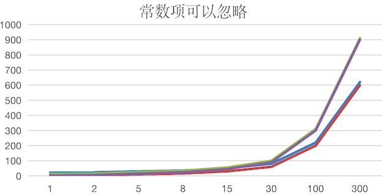
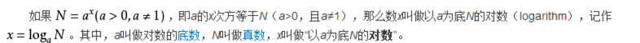
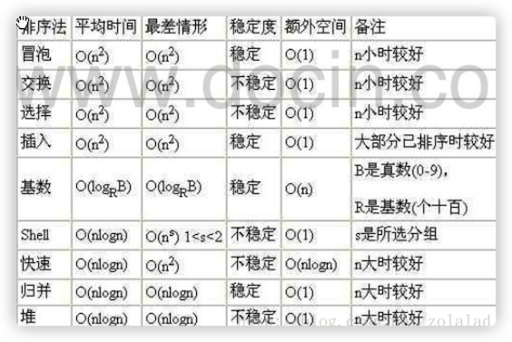

# 算法时间复杂度

衡量算法的性能的好坏，可以使用时间时间复杂度

**度量** 一个程序（算法）执行时间的两种方法：

- 事后统计法

  简单说：就是把程序运行起来，然后查看运行完成的总时间。

  但是有一个问题：所统计的时间，依赖于计算机的硬件、软件等环境因素。如果要使用这种方式，需要在同一台计算机相同状态下运行程序，才能比较哪个算法速度更快

- 事前估算法

  通过分析某个 **算法的时间复杂度** 来判断哪个算法更优

## 时间频度

一个算法 **花费的时间** 与算法中 **语句的执行次数** 成正比，哪个算法中语句执行次数多，它花费时间就多。一个算法中的 **语句执行次数称为语句频度或时间频度**。**记为 `T(n)`**

### 举例-基本案例

计算 1-100 所有数字之和，下面有两种算法：

- 算法 1：循环累加

  ```java
  int total = 0;
  int end = 100;
  // 使用 for 循环计算
  for(int i = 1; i<= end; i++){
    total += i
  }
  ```

  `T(n) = n + 1`，这里的 `n=100`，因为要循环 100 次，还有一次，是跳出循环的判断

- 算法 2：直接计算

  ```java
  total = (1+end) * end/2;
  ```

  `T(n) = 1`

对于时间频度，有如下几个方面可以忽略

### 忽略常数项

| n    | `T(n)=2*n+20` | `T(n)=2*n` | `T(3*n+10)` | T(3*n) |
| ---- | ------------- | ---------- | ----------- | ------ |
| 1    | 22            | 2          | 13          | 3      |
| 2    | 24            | 4          | 16          | 6      |
| 5    | 30            | 10         | 25          | 15     |
| 8    | 36            | 16         | 34          | 24     |
| 15   | 50            | 30         | 55          | 45     |
| 30   | 80            | 60         | 100         | 90     |
| 100  | 220           | 200        | 310         | 300    |
| 300  | 620           | 600        | 910         | 900    |

上表对应的曲线图如下



结论：

- `2n+20` 和 2n 随着 n 变大，执行曲线无限接近， 20 可以忽略
- `3n+10` 和 3n 随着 n 变大，执行曲线无限接近，10 可以忽略

### 忽略低次项

| n    | `T(n)=2n²+3n+10` | `T(2n²)` | `T(n²+5n+20)` | T(n²) |
| ---- | ---------------- | -------- | ------------- | ----- |
| 1    | 15               | 2        | 26            | 1     |
| 2    | 24               | 8        | 34            | 4     |
| 5    | 75               | 50       | 70            | 25    |
| 8    | 162              | 128      | 124           | 64    |
| 15   | 505              | 450      | 320           | 225   |
| 30   | 1900             | 1800     | 1070          | 900   |
| 100  | 20310            | 20000    | 10520         | 10000 |


- `2n²+3n+10` 和 `2n²` 随着 n 变大，执行曲线无限接近，可以忽略 `3n+10`

-  `n²+5n+20` 和 `n²` 随着 n 变大，执行曲线无限接近，可以忽略 `5n+20`

### 忽略系数

| n    | `T(3n²+2n)` | `T(5n²+7n)` | `T(n^3+5n)` | `T(6n^3+4n)` |
| ---- | ----------- | ----------- | ----------- | ------------ |
| 1    | 5           | 12          | 6           | 10           |
| 2    | 16          | 34          | 18          | 56           |
| 5    | 85          | 160         | 150         | 770          |
| 8    | 208         | 376         | 552         | 3104         |
| 15   | 705         | 1230        | 3450        | 20310        |
| 30   | 2760        | 4710        | 27150       | 162120       |
| 100  | 30200       | 50700       | 1000500     | 6000400      |


结论：

- 随着 n 值变大，`5n²+7n` 和 `3n² + 2n` ，执行曲线重合, 说明：这种情况下， 5 和 3 可以忽略

  对于 2 次方来说，数量级很大的情况下，系数不是很重要（笔者怎么觉得相差也挺多的？是在对于后面更大的来说，看起来重合了而已）

- 而 `n^3+5n` 和 `6n^3+4n`  ，执行曲线分离，说明 **多少次方是关键**

  对于 3 次方来说，系数就不能省略了，这里笔者还是觉得，系数并不能忽略把。

### 小节

时间频度计算还与以下三个统计注意事项：

- 忽略常数项

  - `2n+20` 和 2n 随着 n 变大，执行曲线无限接近， 20 可以忽略
  - `3n+10` 和 3n 随着 n 变大，执行曲线无限接近，10 可以忽略

- 忽略低次项

  - `2n²+3n+10` 和 `2n²` 随着 n 变大，执行曲线无限接近，可以忽略 `3n+10`

  - `n²+5n+20` 和 `n²` 随着 n 变大，执行曲线无限接近，可以忽略 `5n+20`

- 忽略系数

  - 随着 n 值变大，`5n²+7n` 和 `3n² + 2n` ，执行曲线重合, 说明：这种情况下， 5 和 3 可以忽略

    对于 2 次方来说，数量级很大的情况下，系数不是很重要（笔者怎么觉得相差也挺多的？是在对于后面更大的来说，看起来重合了而已）

  - 而 `n^3+5n` 和 `6n^3+4n`  ，执行曲线分离，说明 **多少次方是关键**

    对于 3 次方来说，系数就不能省略了，次方越大，系数也越大的时候，相差其实是很大的

## 时间复杂度

1. 一般情况下：

   算法中的 **基本操作语句的重复执行次数是问题规模 n 的某个函数**，用 `T(n)` 表示（就是前面的时间频度）

   若有某个辅助函数 `f(n)`，使得当 n 趋近于无穷大时，`T（n）/f(n)` 的极限值为不等于零的常数。（前面的频度分好几种，比如 `T(n) = n+1`，那么 `f(n) = n`，他们相除的话，就差不多是 1），则称 `f(n)是 T(n)` 的同数量级函数，记作 `T(n)=O(f(n))`，**简称 `O(f(n))` 为算法的渐进时间复杂度，简称时间复杂度**

    理解起来就差不多是，将时间频度的计算找到一个可以简写的函数 `f(n)`，然后计算它的世界复杂度

2. `T(n)` 不同，但时间复杂度可能相同。

   如：`T(n) = n²+7n+6` 与 `T(n) = n²+2n+2`，他们的 `T(n)` 不同，但时间复杂度相同，都为 `O(n²)`。 过程是这样： 

   ```
   f(n) = n² ; // 去掉了常数和系数，转换为 f(n) 函数
   O(f(n)) = O(n²)
   ```

   时间频度中说过，当 n 变大，系数和常数可以忽略

3. 计算时间复杂度的方法

   用常数 1 代替运行时间中的所有加法常数  `T(n)=n²+7n+6  => T(n)=n²+7n+1`

   修改后的运行次数函数中，只保留最高阶项  `T(n)=n²+7n+1 => T(n) = n²`

   去除最高阶项的系数 `T(n) = n² => T(n) = n² => O(n²)` （  `n2` 的系数是 1，`1n² = n²`）

## 常见的复杂度

- 常数阶  `O(1)`

- 对数阶  O(log<sub>2</sub>n)

- 线性阶 `O(n)`

- 线性对数阶 O(nlog<sub>2</sub>n)

- 平方阶 `O(n²)`

  比如：双层嵌套 for 循环

- 立方阶 O(n<sup>3</sup>)

  比如：3 层嵌套 for 循环

- k 次方阶 `O(n^k)`

  比如：嵌套了 k 次的 for 循环

- 指数阶 `O(2^n)`

以上常见的复杂度排列顺序是由小较大排列的，随着问题规模 n 的不断增大，上述时间复杂度不断增大，算法的执行效率越低


上图的 **指数阶**，就是 2 <sup>n</sup>，当 n 不是很大的时候，就猛的往上走了，可见当出现了指数阶的时候，这个算法基本上是最慢的。上图在 n 为 10 的时候，就已经远远高于其他的复杂度了

###  常数阶  `O(1)`

无论代码执行了多少行，只要是没有循环等复杂结构，那么这个代码的时间复杂度就都是 `O(1)`

```java
int i = 1;
int j = 2;
++i;
j++; 
int m = i + j;
```

上述代码在执行的时候，它消耗的时间并不随着某个变量的增长而增长（比如 i 和 j 的数值变大或变小，它的执行时间都是差不多的，不像循环次数那样，增大就多执行一次）。那么物理这类代码有多长，即使有几万几十万行，都可以用 `O(1)` 来表示它的时间复杂度。

### 对数阶  O(log<sub>2</sub>n)

读法：log 以 2 为底的 n 次方

```java
int i = 1;
while(i < n){
  i = i * 2;   // 以 2 为底，这里的算法恰好是 * 2
}
```

在 while 循环里面，每次都将 i 乘以 2，乘完之后，i 距离 n 就越来越近了。假设循环 x 次之后，i  就大于 n 了，此时这个循环就退出了，也就是说 2 的 x 次方等于 n，那么 x = log<sub>2</sub>n 也就是说当循环 log<sub>2</sub>n 次以后，这个代码就结束了。因此这个代码的时间复杂度为：O(log<sub>2</sub>n)  。 O(log<sub>2</sub>n) 的这个 2 时间上是根据代码变化的，i = i * 3 ，则是 O(log<sub>3</sub>n) .



继续说明，假设上面的 `n = 1024`，这个是规模问题 n，它执行几次结束？使用这里的对数阶则为 log<sub>2</sub>1024 = 10 （2<sup>10</sup> = 1024），所以规模问题虽然很大，但是对于对数阶来说说，执行次数并没有那么大

### 线性阶 `O(n)`

```java
for(i = 1; i <= n ; ++i){
  j = i;
  j++
}
```

for 循环里的代码会执行 n 遍，因此它消耗的时间是随着 n 的变化而变化的，因此这类代码都可以用 `O(n)` 来表示它的时间复杂度

### 线性对数阶 O(nlog<sub>2</sub>n)

```java
for(m = 1; m < n; m++){
  i = 1;
  while(i < n){
    i = i * 2
  }
}
```

线性对数阶 O(nlog<sub>2</sub>n) 其实非常容易理解，将实际复杂度 线性对数阶 O(log<sub>2</sub>n) 的代码循环 N 遍，那么它的时间复杂度就是 n *  O(log<sub>2</sub>n)，也就是 O(nlog<sub>2</sub>n)

### 平方阶 `O(n²)`

```java
for(x = 1; i <=n; x++){
  for (i = 1; i <= n; i++){
    j = i;
    j++;
  }
}
```

平方阶 O(n²) 就更容易理解了，如果把 O(n)  的代码再嵌套循环一遍，它的时间复杂度就是  O(n²)，这段代码其实就是嵌套了 2 层 n 循环，它的时间复杂度就是 O(n x n)，即  O(n²)  如果将其中一层循环的 n 改成 m，那它的时间复杂度就变成了 O(m x n)

## 平均时间复杂度和最坏时间复杂度

1. 平均时间复杂度

   指所有可能的输入实例 **均以等概率出现** 的情况下，该算法的运行时间

2. 最坏时间复杂度

   最坏情况下的世界复杂度称为最坏时间复杂度。

   一般讨论的时间复杂度均是最坏情况下的世界复杂度，因为：最坏情况下的时间复杂度是算法在 **任何输入实例上运行时间的界限**，这就保证了算法的运行时间不会比最坏情况更长

平均时间复杂度和最坏时间复杂度是否一致，和算法有关，如下图：



   

