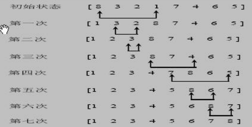

# 选择排序

## 基本介绍

选择排序也属于内部排序法，是从欲排序的数据中，按指定的规则选出来某个元素，再依规定交换位置后达到排序的目的。

## 基本思想

选择排序（select sorting）也是一种简单的排序方法。

基本思想为：

- 第一次从 `arr[0]~arr[n-1]` 中选取最小值，与 arr[0] 交换
- 第二次从  `arr[1]~arr[n-1]` 中选取最小值，与 arr[1] 交换
- 第 i 次从  `arr[i-1]~arr[n-1]` 中选取最小值，与 arr[i-1] 交换
- 依次类图，总共通过 `n - 1`  次，得到一个按排序码从小到大排列的有序序列

## 思路分析



如上图，每一次找到一个最小值，然后与那一次所在的下标处交换位置。

下面使用：101,34,119,1 这个简单的序列来图解，便于容易理解


说明：

1. 选择排序一共有数组大小 - 1 轮排序
2. 每 1 轮排序，又是一个循环，循环的规则
   1. 先假定当前这个数是最小数
   2. 然后和后面每个数进行比较，如果发现有比当前数更小的数，则重新确定最小数，并得到下标
   3. 当遍历到数组的最后时，就得到本轮最小的数
   4. 交换

## 代码实现

要求：有一群牛，颜值分别是 101,34,119,1 ，请使用选中排序从低到高进行排序

### 演变过程

使用逐步推导的方式，进行讲解排序，容易理解。

```java
/**
     * 推导每一步的演变过程，便于理解
     * <pre>
     *   这是一个很重要的思想：
     *      一个算法：先简单  -->  做复杂：
     *      就是可以把一个复杂的算法，拆分成简单的问题  -> 逐步解决
     * </pre>
     */
    @Test
    public void processDemo() {
        int arr[] = {101, 34, 119, 1};
        System.out.println("原始数组：" + Arrays.toString(arr));
        processSelectSort(arr);
    }

    public void processSelectSort(int[] arr) {
        // 第 1 轮：
        // 原始数组：101, 34, 119, 1
        // 排序后：  1, 34, 119, 101
        int min = arr[0]; // 先假定第一个数为最小值
        int minIndex = 0;
        for (int j = 0 + 1; j < arr.length; j++) {
            // 挨个与最小值对比，如果小于，则进行交换
            if (min > arr[j]) {
                // 如果后面的值比当前的 min 小，则重置为这个数
                min = arr[j];
                minIndex = j;
            }
        }
        // 第 1 轮结束后，得到了最小值
        // 将这个最小值与 arr[0] 交换
        arr[minIndex] = arr[0];
        arr[0] = min;
        System.out.println("第 1 轮排序后：" + Arrays.toString(arr));

        // 第 2 轮
        // 当前数组：1, 34, 119, 101
        // 排序后：  1, 34, 119, 101
        min = arr[1];
        minIndex = 1;
        // 第二轮，与第 3 个数开始比起
        for (int j = 0 + 2; j < arr.length; j++) {
            // 挨个与最小值对比，如果小于，则进行交换
            if (min > arr[j]) {
                // 如果后面的值比当前的 min 小，则重置为这个数
                min = arr[j];
                minIndex = j;
            }
        }
        // 第 2 轮结束后，得到了最小值
        // 将这个最小值与 arr[1] 交换
        arr[minIndex] = arr[1];
        arr[1] = min;
        System.out.println("第 2 轮排序后：" + Arrays.toString(arr));

        // 第 3 轮
        // 当前数组：1, 34, 119, 101
        // 排序后：  1, 34, 101, 119
        min = arr[2];
        minIndex = 2;
        // 第二轮，与第 4 个数开始比起
        for (int j = 0 + 3; j < arr.length; j++) {
            // 挨个与最小值对比，如果小于，则进行交换
            if (min > arr[j]) {
                // 如果后面的值比当前的 min 小，则重置为这个数
                min = arr[j];
                minIndex = j;
            }
        }
        // 第 3 轮结束后，得到了最小值
        // 将这个最小值与 arr[2] 交换
        arr[minIndex] = arr[2];
        arr[2] = min;
        System.out.println("第 3 轮排序后：" + Arrays.toString(arr));
    }

```

测试输出

```
原始数组：[101, 34, 119, 1]
第 1 轮排序后：[1, 34, 119, 101]
第 2 轮排序后：[1, 34, 119, 101]
第 3 轮排序后：[1, 34, 101, 119]
```

从上述的演变过程来看，发现了规律：**循环体都是相同的，只是每次比较假定的最小值顺序在递增**。因此可以改写成如下方式

```java
	  @Test
    public void processDemo2() {
        int arr[] = {101, 34, 119, 1};
        System.out.println("原始数组：" + Arrays.toString(arr));
        processSelectSort2(arr);
    }

    public void processSelectSort2(int[] arr) {
        // 把之前假定当前最小值的地方，使用变量 i 代替了
        // 由于需要 arr.length -1 轮，所以使用外层一个循环，就完美的解决了这个需求
        for (int i = 0; i < arr.length - 1; i++) {
            int min = arr[i]; // 先假定第一个数为最小值
            int minIndex = i;
            for (int j = i + 1; j < arr.length; j++) {
                // 挨个与最小值对比，如果小于，则进行交换
                if (min > arr[j]) {
                    // 如果后面的值比当前的 min 小，则重置为这个数
                    min = arr[j];
                    minIndex = j;
                }
            }
            // 第 i 轮结束后，得到了最小值
            // 将这个最小值与 arr[i] 交换
            arr[minIndex] = arr[i];
            arr[i] = min;
            System.out.println("第 " + (i + 1) + " 轮排序后：" + Arrays.toString(arr));
        }
    }
```

测试输出

```
原始数组：[101, 34, 119, 1]
第 1 轮排序后：[1, 34, 119, 101]
第 2 轮排序后：[1, 34, 119, 101]
第 3 轮排序后：[1, 34, 101, 119]
```

由此可以得到，选择排序的时间复杂度是 `o(n^2)`，因为是一个嵌套 for 循环

结果是一样的，但是你会发现，在第 1 轮和第 2 轮的序列是一样的，但是代码中目前也进行了交换，可以优化掉这一个点

### 优化

```java
    public void processSelectSort2(int[] arr) {
        // 把之前假定当前最小值的地方，使用变量 i 代替了
        // 由于需要 arr.length -1 轮，所以使用外层一个循环，就完美的解决了这个需求
        for (int i = 0; i < arr.length - 1; i++) {
            int min = arr[i]; // 先假定第一个数为最小值
            int minIndex = i;
            for (int j = i + 1; j < arr.length; j++) {
                // 挨个与最小值对比，如果小于，则进行交换
                if (min > arr[j]) {
                    // 如果后面的值比当前的 min 小，则重置为这个数
                    min = arr[j];
                    minIndex = j;
                }
            }
            // 第 i 轮结束后，得到了最小值
            // 将这个最小值与 arr[i] 交换
            if (minIndex == i) {
                // 如果最小值未发生改变，则不需要执行后面的交换了
                continue;
            }
            arr[minIndex] = arr[i];
            arr[i] = min;
            System.out.println("第 " + (i + 1) + " 轮排序后：" + Arrays.toString(arr));
        }
    }
```

测试输出

```java
原始数组：[101, 34, 119, 1]
第 1 轮排序后：[1, 34, 119, 101]
第 3 轮排序后：[1, 34, 101, 119]
```

则可以看到，第二轮就跳过了交换这一个步骤

### 算法函数封装

```java
@Test
public void selectSortTest() {
    int arr[] = {101, 34, 119, 1};
    System.out.println("升序");
    System.out.println("原始数组：" + Arrays.toString(arr));
    selectSort(arr, true);
    System.out.println("排序后：" + Arrays.toString(arr));
    System.out.println("降序");
    System.out.println("原始数组：" + Arrays.toString(arr));
    selectSort(arr, false);
    System.out.println("排序后：" + Arrays.toString(arr));
}

/**
 * 选择排序算法封装
 *
 * @param arr 要排序的数组
 * @param asc 升序排列，否则降序
 */
public void selectSort(int[] arr, boolean asc) {

    // 把之前假定当前最小值的地方，使用变量 i 代替了
    // 由于需要 arr.length -1 轮，所以使用外层一个循环，就完美的解决了这个需求
    for (int i = 0; i < arr.length - 1; i++) {
        int current = arr[i]; // 先假定第一个数为最小值
        int currentIndex = i;
        for (int j = i + 1; j < arr.length; j++) {
            // 挨个与最小值对比，如果小于，则进行交换
            if (asc) {
                if (current > arr[j]) {
                    // 如果后面的值比当前的 min 小，则重置为这个数
                    current = arr[j];
                    currentIndex = j;
                }
            } else {
                if (current < arr[j]) {
                    // 如果后面的值比当前的 min 大，则重置为这个数
                    current = arr[j];
                    currentIndex = j;
                }
            }
        }
        // 第 i 轮结束后，得到了最小/大值
        // 将这个值与 arr[i] 交换
        if (currentIndex == i) {
            // 如果最小值未发生改变，则不需要执行后面的交换了
            continue;
        }
        arr[currentIndex] = arr[i];
        arr[i] = current;
    }
}
```

测试输出

```
升序
原始数组：[101, 34, 119, 1]
排序后：[1, 34, 101, 119]
降序
原始数组：[1, 34, 101, 119]
排序后：[119, 101, 34, 1]
```

### 大量数据耗时测试

排序随机生成的 8 万个数据

```java
 @Test
    public void bulkDataSort() {
        int max = 80_000;
        int[] arr = new int[max];
        for (int i = 0; i < max; i++) {
            arr[i] = (int) (Math.random() * 80_000);
        }

        Instant startTime = Instant.now();
        selectSort(arr, true);
//        System.out.println(Arrays.toString(arr));
        Instant endTime = Instant.now();
        System.out.println("共耗时：" + Duration.between(startTime, endTime).toMillis() + " 毫秒");
    }
```

多次运行测试输出

```
共耗时：2983 毫秒
共耗时：3022 毫秒
```

冒泡排序和选择排序的时间复杂度虽然都是 `o(n^2)`，由于冒泡排序每一步有变化都要交换位置，导致了消耗了大量的世界