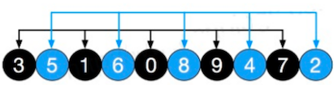

# 希尔排序

## 简单插入排序存在的问题

简单的插入排序可能存在的问题。

如数组 `arr = {2,3,4,5,6,1}`  这时需要插入的数 1（最小），过程是：

```
展示的是要移动 1 这个数，的过程，由于在最后，需要前面的所有数都往后移动一位
{2,3,4,5,6,6}
{2,3,4,5,5,6}
{2,3,4,4,5,6}
{2,3,3,4,5,6}
{2,2,3,4,5,6}
{1,2,3,4,5,6}
```

结论：当需要插入的数是较小的数时，后移的次数明显增多，对效率有影响。

## 简单介绍

希尔排序是希尔（Donald Shell）于 1959 年提出的一种排序算法。

希尔排序也是一种 **插入排序**，它是简单插入排序经过改进后的一个 **更高效的版本**，也称为 **缩小增量排序**。

## 基本思想

希尔排序把记录按 **下标的一定增量分组**，对每组使用 **直接插入排序算法** 排序，随着 **增量逐渐减少**，每组包含的关键词越来越多（要排序的数），当增量减至 1 时，整个文件被分成一组，算法遍终止。

光看上面的描述，对于首次接触的人来说，不知道是啥意思，认真思考下面的说明：

- 原始数组：以下数据元素颜色相同为一组

	
	
- 初始增量为：`gap = length/2` 这里为 `gap = 10 / 2 = 5`

  那么意味着整个数组被分为 5 组。分别为 `[8,3][9,5][1,4][7,6][2,0]`

  先看明白这里的增量为 5 ，就会分成 5 组。`[8,3]` 这一组来说，对比看下图，它的意思是：从 8 开始，下标增加 5 既对应的数是 3，所以他们分为一组

  

- 对上面的这 5 组分别进行 **直接插入排序**

  结果如下图：可以看到，像 3、5、6 这些小元素被调整到了前面。

  

  然后缩小增量 `gap = 5 / 2 = 2`，则数组被分为 2 组 `[3,1,0,9,7]` 和 `5,6,8,4,2`

- 对以上 2 组再分别进行直接插入排序

  结果如下图：可以看到，此时整个组数的有序程度更进一步。

  

  然后再缩小增量 `gap = 2 / 2 = 1`，则整个数组被当成一组，再进行一次直接插入排序。由于基本上是有序的了，所以少了很多次的调整

## 代码实现

场景：有一群小牛，考试成绩分布是 `{8,9,1,7,2,3,5,4,6,0}`，请从小到大排序。

对于希尔排序时，对有序序列在 **插入** 时，有以下两种方式：

- 交换法：容易理解，速度相对较慢
- 移动法：不太容易理解，速度相对较快

先实现交换法，然后再优化成移动法。比较容易

::: tip 特别注意

1. 希尔排序，是一种插入排序，前面讲解的插入排序算法使用了 移动法（这里先讲解交换法）
2. 希尔排序，对插入排序的改进，先分组，这里分组是通过增量步长和相关算法，来达到在循环中直接获取到这一个组的元素
3. 直接排序的基本思想一定要记得，最重要的两个变量：无序列表中的第一个值，与有序列表中的最后一个值开始比较

:::

```java
    /**
     * 推到的方式来演示每一步怎么做，然后找规律
     */
    @Test
    public void processDemo() {
        int arr[] = {8, 9, 1, 7, 2, 3, 5, 4, 6, 0};
        System.out.println("原始数组：" + Arrays.toString(arr));
        processShellSort(arr);
    }

    public void processShellSort(int[] arr) {
        // 按照笔记中的基本思想，一共三轮
        // 第 1 轮：初始数组 [8, 9, 1, 7, 2, 3, 5, 4, 6, 0]
        // 将 10 个数字分成了 5 组( length / 2)，增量也是 5，需要对 5 组进行排序
        // 外层循环，并不是循环 5 次，只是这里巧合了。
        // 一定要记得，希尔排序：先分组，在对组进行插入排序
        for (int i = 5; i < arr.length; i++) {
            // 第 1 组：[8,3] , 分别对应原始数组的下标 0,5
            // 第 2 组：[9,5] , 分别对应原始数组的下标 1,6
            // ...
            // 内层循环对 每一组 进行直接排序操作
            // i = 5 ：j = 0, j-=5 = 0 - 5 = -5,跳出循环，这是对第 1 组进行插入排序
            // i = 6 ：j = 1, j-=5 = 0 - 1 = -1,跳出循环，这是对第 2 组进行插入排序
            // i = 9 ：j = 4, j-=5 = 0 - 4 = -4,跳出循环，这是对第 3 组进行插入排序
            for (int j = i - 5; j >= 0; j -= 5) {
                if (arr[j] > arr[j + 5]) {
                    int temp = arr[j];
                    arr[j] = arr[j + 5];
                    arr[j + 5] = temp;
                }
            }
        }
        System.out.println("第 1 轮排序后：" + Arrays.toString(arr));

        // 第 2 轮：上一轮排序后的数组：[3, 5, 1, 6, 0, 8, 9, 4, 7, 2]
        // 将 10 个数字分成了 2 组（上一次的增量 5 / 2），增量也为 2，需要对 2 组进行排序
        for (int i = 2; i < arr.length; i++) {
            // 第 1 组：[3,1,0,9,7] , 分别对应原始数组的下标 0,2,4,6,8
            // 第 2 组：[5,6,8,4,2] , 分别对应原始数组的下标 1,3,5,7,9
            // ...
            // 内层循环对 每一组 进行直接排序操作
            // i = 2 ：j = 0, j-=2 = 0 - 2 = -2，跳出循环，
            //      这是对第 1 组中的 3,1 进行比较，1 为无序列表中的比较元素，3 为有序列表中的最后一个元素，3 > 1，进行交换
            //      交换后的数组：[1, 5, 3, 6, 0, 8, 9, 4, 7, 2]
            //      第 1 组：[1,3,0,9,7]
            // i = 3 ：j = 1, j-=2 = 1 - 2 = -1,跳出循环
            //      这是对第 2 组中的 5,6 进行比较，6 为无序列表中的比较元素，5 为有序列表中的最后一个元素，5 < 6，不进行交换
            //      交换后的数组：[1, 5, 3, 6, 0, 8, 9, 4, 7, 2] , 没有交换
            //      第 2 组：[5,6,8,4,2]
            // i = 4 ：j = 2, j-=2 = 2 - 2 = 0，
            //      这是对第 1 组中的 3,0 进行比较，0 为无序列表中的比较元素，3 为有序列表中的最后一个元素，3 > 0，进行交换
            //      交换后的数组：[1, 5, 0, 6, 3, 8, 9, 4, 7, 2]，
            //           第 1 组：[1,0,3,9,7]
            //      由于 2 - 2 = 0，此时 j = 0，满足条件，继续循环 i = 4 ：j = 0, j-=2 = 0 - 2 = -2，
            //      这是对第 1 组中的有序列表中的剩余数据进行交换，1,0, 1>0 ，他们进行交换
            //           第 2 组：[0,1,3,9,7]
            for (int j = i - 2; j >= 0; j -= 2) {
                if (arr[j] > arr[j + 2]) {
                    int temp = arr[j];
                    arr[j] = arr[j + 2];
                    arr[j + 2] = temp;
                }
            }
        }
        System.out.println("第 2 轮排序后：" + Arrays.toString(arr));

        // 第 3 轮：上一轮排序后的数组：[0, 2, 1, 4, 3, 5, 7, 6, 9, 8]
        // 将 10 个数字分成了 1 组（上一次的增量 2 / 2），增量也为 1，需要对 1 组进行排序
        for (int i = 1; i < arr.length; i++) {
            // 第 1 组：[0, 2, 1, 4, 3, 5, 7, 6, 9, 8]
            // i = 1 ：j = 0, j-=1 = 0 - 1 = -1，跳出循环
            //      0 为有序列表中的最后一个元素，2 为无须列表中要比较的元素。 0 < 2,不交换
            //      [0, 2    有序 <-> 无序, 1, 4, 3, 5, 7, 6, 9, 8]
            // i = 2 ：j = 1, j-=1 = 1 - 1 = o
            //      2 为有序列表中的最后一个元素，1 为无序列表中要比较的元素， 2 > 1,交换
            //      交换后：[0, 1, 2,     4, 3, 5, 7, 6, 9, 8]
            //      由于不退出循环，还要比较有序列表中的数据，0 与 1
            for (int j = i - 1; j >= 0; j -= 1) {
                if (arr[j] > arr[j + 1]) {
                    int temp = arr[j];
                    arr[j] = arr[j + 1];
                    arr[j + 1] = temp;
                }
            }
        }
        System.out.println("第 3 轮排序后：" + Arrays.toString(arr));
    }
```

测试输出信息

```
原始数组：[8, 9, 1, 7, 2, 3, 5, 4, 6, 0]
第 1 轮排序后：[3, 5, 1, 6, 0, 8, 9, 4, 7, 2]
第 2 轮排序后：[0, 2, 1, 4, 3, 5, 7, 6, 9, 8]
第 3 轮排序后：[0, 1, 2, 3, 4, 5, 6, 7, 8, 9]
```

这里的两层循环一定明白是在做什么：

- 外层循环：**不是控制组数**，是为了内层循环 **每一轮开始**，都能 **拿到某一组的无序列表第一个元素**

  难点：结束条件是数组长度，是为了能拿到数组中的所有元素，每增长一次，由于步长的因素，可能这一的元素就不是上一次的同一组了。

- 内层循环：拿到了这一组无序列表中第一个元素，只要减掉增量步长，就是有序列表中中的最后一个元素

细品这里的含义，这就是上一小节讲解的直接插入排序法的两个变量，不过之前讲解的算法是使用 **移动法**，这里使用了 **交换法**，每一轮开始，都从有序列表最后一个开始交换，直到这个有序列表的第一个元素，就退出循环。