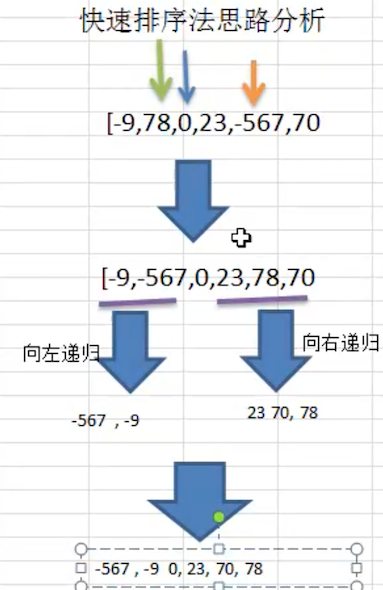

# 快速排序

## 简单介绍

Quicksort **快速排序** 是对 **冒泡排序**的一种改进。

## 基本思想

通过一趟排序将要排序的数据 **分割成独立的两个部分**，一部分的所有数据都比另外一部分的所有数据都要小。

然后再按如上的方法对这两部分数据分别进行快速排序，排序过程可以递归进行，以此达到整个数据变成有序序列。

比如如下的示意图：


- 上图以 **最后一个元素的值** 作为基准
- 比基准值小的，排在左侧，比基准值大的排在右侧
- 然后再以分好的部分重复以上操作，直到每个部分中只有一个数据时，就排好序了

## 思路分析

基本思想如上，但是实现思路有多种，这里不以上图那样用数组元素最后一个为基准值，这里使用 **数组中间** 的作为基准值，进行讲解

如下图



1. 挑选的基准值为数组中间的值
2. 中间值就把数组分成了两组
3. 左边一组，从左到右，挨个与 基准值 比较，找出比基准值大的值
4. 右边一组，从右到左，挨个与 基准值 比较，找出比基准值小的值
5. 左右两边各找到一个值，那么就让这两个值进行交换
6. 然后继续找，直到左右两边碰到，这一轮就结束。这一轮就称为快速排序
7. 继续对分出来的小组，进行上述的快速排序操作，直到组内只剩下一个数时，则排序完成

```
l ------------ pivot --------------- r
一组从左往右找               一组从右往左找
```

可以看到，分组后，可以使用递归，对这一组继续分组，然后对他们进行快速排序。

## 代码实现

### 推导实现

推导法先实现第一轮

```java
    @Test
    public void processDemo() {
        int arr[] = {-9, 78, 0, 23, -567, 70};
        System.out.println("原始数组：" + Arrays.toString(arr));
        processQuickSort(arr, 0, arr.length - 1);
    }

    /**
     * @param arr
     * @param left  左变这一组的下标起始点，到中间值，则为一组
     * @param right 右边这一组的下标结束点，到中间值，则为一组
     */
    public void processQuickSort(int[] arr, int left, int right) {
        /*
         基本思想：选择一个基准值，将基准值小分成一组，比基准值大的分成一组。
         这里的实现思路：
            1. 挑选的基准值为数组中间的值
            2. 中间值就把数组分成了两组
            3. 左边一组，从左到右，挨个与 基准值 比较，找出比基准值大的值
            4. 右边一组，从右到左，挨个与 基准值 比较，找出比基准值小的值
            5. 左右两边各找到一个值，那么就让这两个值进行交换
            6. 然后继续找，直到左右两边碰到，这一轮就结束。这一轮就称为快速排序
            7. 继续对分出来的小组，进行上述的快速排序操作，直到组内只剩下一个数时，则排序完成

            l ------------ pivot --------------- r
            一组从左往右找               一组从右往左找
         */
        int l = left;
        int r = right;
        // 中心点，让这个点作为基准值
        int pivot = arr[(left + right) / 2];
        // 当他们没有碰到的时候，说明还这一轮还可以继续找
        while (l < r) {
            // 左边：当找到大于基准值时，则表示该值需要交换到右侧去: arr[l] > pivot
            //      也就是说，如果 arr[l] < pivot，则表示还没有找到比基准值大的数
            //      注意：不能等于 pivort，因为最差的情况没有找到，则最后 arr[l] 就是 pivot 这个值，那么就会出现死循环
            while (arr[l] < pivot) {
                l++; // 所以让左边这一组继续找
            }

            // 右边：当找到小于基准值时，则表示该值需要交换到左侧去：arr[r] < pivot
            //      那么这里和上面的相反
            while (arr[r] > pivot) {
                r--;
            }

            // 当左侧与右侧相碰时，说明两边都没有找到，这一轮比进行交换
            // 等于表示，找到了中间的下标
            if (l >= r) {
                break;
            }

            // 当找到时，则进行交换
            int temp = arr[l];
            arr[l] = arr[r];
            arr[r] = temp;

            // 当交换后，
            // 当数组是： {-9, 78, 0, -23, 0, 70}  时，就可以验证这里的逻辑
            // 如果没有这个判定，将会导致，l 永远 小于 r。循环不能退出来的情况
            if (arr[l] == pivot) {
                /*
                  不能让自己往前移动 1，因为当交换完成后为：{-9, 0, 0, -23, 78, 70}
                  l = 1, = 0
                  r = 4, = 78
                  如果 l 等于 2，那么相当于下一轮，基准值 - 将会与 -23 进行交换，导致基准值变化了
                  所以，让 r - 1，还有一个原因是，r 是刚刚交换过的，一定比 基准值大，所以没有必要再和基准值比较了
                 */
                r -= 1;
            }
            // 这里和上面一致，如果说，先走了上面的 r-=1
            // 这里也满足，那么说明，下一次是相同的两个值，一个是 r 一个是基准值（满足条件 l+1 了，所以就有可能指向了基准值），进行交换
            // 但是他们是相同的值，交换后，不影响。但是再走这完这里逻辑时，就会导致  l > r，循环退出
            if (arr[r] == pivot) {
                l += 1;
            }
        }
        System.out.println("第 1 轮排序后：" + Arrays.toString(arr));
    }
```

注意：上述的算法特别是边界判定，就是上面「当交换后」对 `r-=1` 的这个边界判定时，有点难以理解，但是一定要理解为什么要这样写。

测试信息输出

```
原始数组：[-9, 78, 0, 23, -567, 70]
第 1 轮排序后：[-9, -567, 0, 23, 78, 70]
```

那么如何向左递归和右递归呢？在上面的代码后面接着实现如下

```java
        System.out.println("第 1 轮排序后：" + Arrays.toString(arr));

        // 如果 l = r，会出现死循环
        if (l == r) {
            l++;
            r--;
        }

        // 开始左递归
        // 上面算法是 r--，l++ ，往中间走，当 left < r 时，表示还可以继续分组
        if (left < r) {
            processQuickSort(arr, left, r);
        }

        if (right > l) {
            processQuickSort(arr, l, right);
        }
```

### 完整实现

完整实现和推导实现其实差不多了，为了加深记忆，自己按照基本思想和思路分析，默写。

```java
  /**
     * 快速排序默写实现
     * <pre>
     *     基本思想：通过一趟将要排序的数据，分隔成独立的两个部分，一部分的所有数据都比另一部分的所有数据要小。
     *     思路分析：
     *      {-9, 78, 0, 23, -567, 70};  length=6
     *      1. 挑选中间的值作为 基准值：(0 + (6 -1))/2= [2] = 0
     *      2. 左侧 left 部分，从 0 开始到中间值 -1： 0,1: -9, 78,找出一个比基准值大的数
     *      3. 右侧 right 部分，从中间值 + 1 到数组大小-1：3,5：23,-567, 70，找出一个比基准值小的数
     *      4. 如果找到，则将他们进行交换，这样一轮下来，就完成了一次快速排序：一部分的所有数据都比另一部分的所有数据要小。
     *      4. 如果左侧部分还可以分组，则进行左侧递归调用
     *      5. 如果右侧部分还可以分组，则进行右侧递归调用
     *
     *    简单说：一轮快速排序示意图如下：
     *                   中间的基准值
     *      l ------------ pivot --------------- r
     *      一组从左往右找               一组从右往左找
     *      找到比基准值大的数          找出一个比基准值小的数
     *                    然后进行交换
     * </pre>
     */
    @Test
    public void quickSortTest() {
        int arr[] = {-9, 78, 0, 23, -567, 70};
//        int arr[] = {-9, 78, 0, -23, 0, 70}; // 在推导过程中，将会导致交换异常的数组，在这里不会出现那种情况
        int left = 0;
        int right = arr.length - 1;
        System.out.println("原始数组：" + Arrays.toString(arr));
        quickSort(arr, left, right);
        System.out.println("排序后：" + Arrays.toString(arr));
    }

    public void quickSort(int[] arr, int left, int right) {
        // 找到中间值
        int pivotIndex = (left + right) / 2;
        int pivot = arr[pivotIndex];
        int l = left;
        int r = right;
        while (l < r) {
            // 从左往右找，直到找到一个数，比基准值大的数
            while (arr[l] < pivot) {
                l++;
            }
            // 从右往左找，知道找到一个数，比基准值小的数
            while (arr[r] > pivot) {
                r--;
            }
            // 表示未找到
            if (l >= r) {
                break;
            }
            // 进行交换
            int temp = arr[l];
            arr[l] = arr[r];
            arr[r] = temp;

            // 那么下一轮，左侧的这个值将不再参与排序，因为刚交换过，一定比基准值小
            // 那么下一轮，右侧的这个值将不再参与排序，因为刚交换过，一定比基准值大
            r--;
            l++;
        }

        // 当一轮找完后，没有找到，则是中间值时，
        // 需要让他们插件而过，也就是重新分组，中间值不再参与分组
        // 否则，在某些情况下，会进入死循环
        if (l == r) {
            l++;
            r--;
        }
        // 如果左侧还可以继续分组，则继续快排
        // 由于擦肩而过了，那么左侧的组值，则是最初的开始与中间值的前一个，也就是这里得到的 r
        if (left < r) {
            quickSort(arr, left, r);
        }
        if (right > l) {
            quickSort(arr, l, right);
        }
    }
```

另外，在实现的过程中，将某些代码为什么要那样判断边界，进行了梳理。你会发现上述代码和推导的代码有一定的差别。这个是笔者自己的改进，更容易看明白。目前未发现 bug

## 大数据量耗时测试

```java
    /**
     * 大量数据排序时间测试
     */
    @Test
    public void bulkDataSort() {
        int max = 80_000;
//        int max = 8;
        int[] arr = new int[max];
        for (int i = 0; i < max; i++) {
            arr[i] = (int) (Math.random() * 80_000);
        }
        if (arr.length < 10) {
            System.out.println("原始数组：" + Arrays.toString(arr));
        }
        Instant startTime = Instant.now();
//        processQuickSort(arr, 0, arr.length - 1);  // 和老师的原版代码对比，结果是一样的
        quickSort(arr, 0, arr.length - 1);
        if (arr.length < 10) {
            System.out.println("排序后：" + Arrays.toString(arr));
        }
        Instant endTime = Instant.now();
        System.out.println("共耗时：" + Duration.between(startTime, endTime).toMillis() + " 毫秒");
    }
```

多次运行输出

```
共耗时：40 毫秒
共耗时：52 毫秒
共耗时：36 毫秒
共耗时：31 毫秒
```

