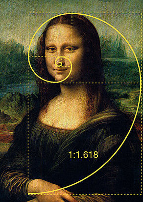

---
tags:
 - 斐波那契查找算法
 - 黄金分割法
---

# 斐波那契查找算法

## 基本介绍

**黄金分割** 点是指把一条 **线段** 分割为两部分，使其中一部分与全长之比等于另一部分与这部分之比。取其前三位数字的近视值是 0.618。由于按此比例设计的造型十分美丽，因此称为 **黄金分割**，也称为 **中外比**。这是一个神奇的数字，会带来意想不到的效果。



简单说，两条线的比例为 `1:1.618`，比如上图的头和身体的比例、鼻子和嘴巴下巴的比例

**斐波那契数列** `{1, 1, 2, 3, 5, 8, 13, 21, 34, 55 }`  发现斐波那契数列的 **两个相邻数的比例**，无限接近 **黄金分割值 0.618**

简单说：

```
3/2=1.5 、5/3=1.667、8/5=1.6、13/8=1.625 这样看来，他们的比例值是无限接近的 1.618 的
1/2=0.5 、3/5=0.6、5/8=0.625、8/13=0.6125 这样看，他们的比例值是无限接近  0.618 的
```


