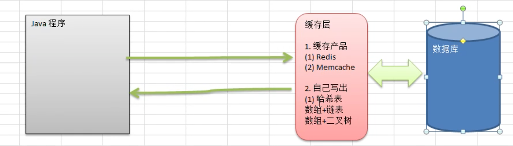
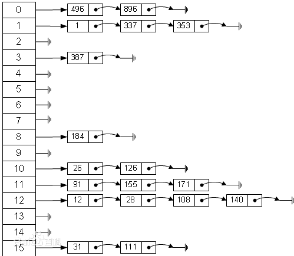

# 哈希表（散列）

哈希表是一种数据结构，不是算法。

## Google 上机题场景

有一个公司，当有新的员工来报道时,要求将该员工的信息加入 (id,性别,年龄,住址..), 当输入该员工的 id 时，要求查

找到该员工的 **所有信息**。

要求：不使用数据库、尽量节省内存、速度越快越好。

那么这道题，就可以使用哈希表

## 基本介绍

散列表（Hash table），也叫哈希表。是根据 **关键码值（key value）** 而直接进行访问的数据结构。

也就是说，它 **通过关键码值映射到表中的一个位置来访问记录**，以加快查找的速度。这个映射函数叫做 **散列函数**，存放记录的数组叫做 **散列表** 。

它的由来如下图所述:



在早些年代，没有缓存产品出现，或则在某些场景中使用缓存产品太重了，就自己写缓存实现：

- 哈希表 + 链表
- 数组 + 二叉树

哈希表在内存中的结构就如下图所示：



如上所述：

1. 左侧有 15 个元素的数组（可以用数组实现），就是一个表

2. 该表中存放的是一个链表

3. 通过 **散列函数**，计算出一个位置，然后在把数据存储到这个链表上

   比如上面有 15 个，可以计算出散列值后，再取模。 `111 % 15` ，就定位在了某一个元素位置上。

## 代码实现

现在来实现上面的 「Google 上机题」，要求：

1. 不使用数据库，速度越快越好

2. 添加时，保证按照 id 从低到高插入

    课外思考：如果 ID 不是从低到高插入，但要求各条链表任是从低到高，怎么解决？

3. 使用 **链表** 来实现哈希表，该链表不带表头

   即：链表的第一个节点就存放雇员信息

4. 思路分析并画出示意图

5. 代码实现：增、删、改、查，显示所有员工，按 ID 查询

思路分析图如下：


- HashTab：哈希表，也就是上图蓝色区块

  要实现 add、list、find、del 函数，至少还需要 **散列函数**，用来决定 id 对应到哪个链表

- EmpLinkedList：链表

  对相关雇员的操作

### add、list 实现

先主要写这两个函数的实现，步骤如下：

1. 先实现 Emp 类

2. 再实现 EmpLinkedList 类，主要实现 add 和 list 方法

3. 最后实现 HashTab 类

   注意：散列函数 + 数组 + 链表的组合，叫做哈希表。是一个数据结构

```java
package cn.mrcode.study.dsalgtutorialdemo.datastructure.hashtab;

import org.junit.Test;

import static java.util.Objects.hash;

/**
 * 数组 + 链表的 哈希表实现
 */
public class HashTabTest {
    /**
     * 测试添加和打印
     */
    @Test
    public void test1() {
        HashTab hashtable = new HashTab(7);
        hashtable.list();
        hashtable.add(new Emp(1, "小明"));
        hashtable.add(new Emp(2, "小红"));
        hashtable.add(new Emp(3, "小蓝"));
        System.out.println("");
        hashtable.list();
        hashtable.add(new Emp(3, "小蓝"));
        hashtable.add(new Emp(4, "小蓝4"));
        hashtable.add(new Emp(5, "小蓝5"));
        hashtable.add(new Emp(6, "小蓝6"));
        hashtable.add(new Emp(7, "小蓝7"));
        hashtable.add(new Emp(8, "小蓝8"));
        hashtable.add(new Emp(9, "小蓝9"));
        System.out.println("");
        hashtable.list();

    }
}
// 为了方便，下面的各种需要获取的属性都用 public

/**
 * 员工信息
 */
class Emp {
    public int id;
    public String name;
    public Emp next;

    public Emp(int id, String name) {
        this.id = id;
        this.name = name;
    }
}

/**
 * 链表类
 */
class EmpLinkedList {
    /**
     * 这里头直接保存元素，和普通完整的链表有一点不一样
     */
    private Emp head;

    /**
     * 添加一个员工
     *
     * @param emp
     */
    public void add(Emp emp) {
        if (head == null) {
            head = emp;
            return;
        }
        Emp temp = head;
        while (true) {
            if (temp.next == null) {
                break;
            }
            temp = temp.next;
        }
        temp.next = emp;
    }

    /**
     * 打印链表元素
     *
     * @param no
     */
    public void list(int no) {
        if (head == null) {
            System.out.println("链表为空");
            return;
        }
        Emp temp = head;
        while (true) {
            System.out.printf("%d : \t id=%d,\t name=%s \n", no, temp.id, temp.name);
            if (temp.next == null) {
                break;
            }
            temp = temp.next;
        }
    }
}

/**
 * 哈希表，对外暴露的也就是奔类了。关于里面的数组怎么算，链表怎么放，都是本类来做包装
 */
class HashTab {
    // 链表数组
    private EmpLinkedList[] linkedArray;
    private int size;

    /**
     * 构造一个哈希表
     *
     * @param size 哈希表大小
     */
    public HashTab(int size) {
        this.size = size;
        this.linkedArray = new EmpLinkedList[size];
        // 初始化哈希表中的链表对象
        for (int i = 0; i < size; i++) {
            linkedArray[i] = new EmpLinkedList();
        }
    }

    /**
     * 往哈希表中添加一个员工
     *
     * @param emp
     */
    public void add(Emp emp) {
        // 首先需要确定：该员工的 id 所在的哈希位置，用散列函数来计算
        int id = emp.id;
        int index = hashFun(id);
        linkedArray[index].add(emp);
    }

    /**
     * 打印哈希表
     */
    public void list() {
        for (int i = 0; i < size; i++) {
            linkedArray[i].list(i);
        }
    }

    /**
     * 散列函数
     *
     * @param id
     * @return
     */
    private int hashFun(int id) {
        // 散列函数的计算法方法有很多种
        // 这里就使用最简单的取模
        return id % size;
    }
}

```

测试信息输出

```
# 刚创建哈希表时的打印
链表为空
链表为空
链表为空
链表为空
链表为空
链表为空
链表为空

# 添加了三个元素后的打印
链表为空
1 : 	 id=1,	 name=小明 
2 : 	 id=2,	 name=小红 
3 : 	 id=3,	 name=小蓝 
链表为空
链表为空
链表为空

# 添加了 n 个元素后的打印
0 : 	 id=7,	 name=小蓝7 
1 : 	 id=1,	 name=小明 
1 : 	 id=8,	 name=小蓝8 
2 : 	 id=2,	 name=小红 
2 : 	 id=9,	 name=小蓝9 
3 : 	 id=3,	 name=小蓝 
3 : 	 id=3,	 name=小蓝 
4 : 	 id=4,	 name=小蓝4 
5 : 	 id=5,	 name=小蓝5 
6 : 	 id=6,	 name=小蓝6 
```

可以看到添加 n 个之后，有的链表中已经存在多个元素了

   