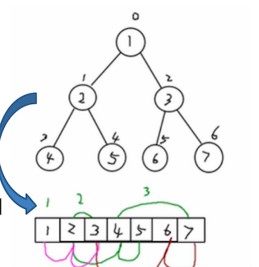

# 顺序存储二叉树

## 基本说明-概念

从数据存储来看，**数组存储** 方式和 **树** 的存储方式可以 **相互转换**。即使数组可以转换成树，树也可以转换成数组。如下示意图



上图阅读说明：

- 圆圈顶部的数字对应了数组中的索引
- 圆圈内部的值对应的数数组元素的值

现在有两个要求：

1. 上图的二叉树的节点，要求以数组的方式来存储 `arr=[1,2,3,4,5,6,7]`
2. 要求在遍历数组 arr 时，仍然可以以 前序、中序、后序的方式遍历

## 特点

想要 实现上面的两个要求，需要知道顺序存储二叉树的特点：

1. 顺序二叉树 通常只考虑 **完全二叉树**
2. 第 n 个元素的 **左子节点** 为 `2*n+1`
3. 第 n 个元素的 **右子节点** 为 `2*n+2`
4. 第 n 个元素的 **父节点** 为 `(n-1)/2`

注：n 表示二叉树中的第几个元素（按  0 开始编号）

比如：

- 元素 2 的左子节点为：`2 * 1 + 1 = 3`，对比上图去查看，的确是 3
- 元素 2 的右子节点为：`2 * 1 + 2 = 4`，也 就是元素 5
- 元素 3 的左子节点为：`2 * 2 + 1 = 5`，也就是元素 6
- 元素 3 的父节点为: `(2-1)/2= 1/2 = 0`，也就是根节点 1

## 前序遍历

使用如上的知识点，进行前序遍历，需求：将数组 `arr=[1,2,3,4,5,6,7]`，以二叉树前序遍历的方式进行遍历，遍历结果为 `1、2、4、5、3、6`

前序遍历概念（前面章节有学习过）：

1. 先输出当前节点（初始节点是 root 节点）
2. 如果左子节点不为空，则递归继续前序遍历
3. 如果右子节点不为空，则递归继续前序遍历

```java
package cn.mrcode.study.dsalgtutorialdemo.datastructure.tree;

import org.junit.Test;

/**
 * 顺序存储二叉树
 */
public class ArrBinaryTreeTest {
    /**
     * 前序遍历测试
     */
    @Test
    public void preOrder() {
        int[] arr = new int[]{1, 2, 3, 4, 5, 6, 7};
        ArrBinaryTree tree = new ArrBinaryTree(arr);
        tree.preOrder(0); // 1,2,4,5,3,6,7
    }
}

class ArrBinaryTree {
    int[] arr;

    public ArrBinaryTree(int[] arr) {
        this.arr = arr;
    }

    /**
     * 前序遍历
     *
     * @param index 就是知识点中的 n,从哪一个节点开始遍历
     */
    public void preOrder(int index) {
        /*
            1. 顺序二叉树 通常只考虑 **完成二叉树**
            2. 第 n 个元素的 **左子节点** 为 `2*n+1`
            3. 第 n 个元素的 **右子节点** 为 `2*n+2`
            4. 第 n 个元素的 **父节点** 为 `(n-1)/2`
         */
        if (arr == null || arr.length == 0) {
            System.out.println("数组为空，不能前序遍历二叉树");
            return;
        }
        // 1. 先输出当前节点（初始节点是 root 节点）
        System.out.println(arr[index]);
        // 2. 如果左子节点不为空，则递归继续前序遍历
        int left = 2 * index + 1;
        if (left < arr.length) {
            preOrder(left);
        }
        // 3. 如果右子节点不为空，则递归继续前序遍历
        int right = 2 * index + 2;
        if (right < arr.length) {
            preOrder(right);
        }
    }
}

```

测试输出

```
1
2
4
5
3
6
7
```

## 应用案例

学回了顺序存储二叉树，那么它可以用来做什么呢？

八大排序算法中的 **堆排序**，就会使用到顺序存储二叉树。这个排序算法在后续章节的 树结构实际应用 章节中再讲解

## 中序、后序遍历

课外作业，请实现另外两种遍历方式

```java
    /**
     * 中序遍历：先遍历左子树，再输出父节点，再遍历右子树
     *
     * @param index
     */
    public void infixOrder(int index) {
        if (arr == null || arr.length == 0) {
            System.out.println("数组为空，不能前序遍历二叉树");
            return;
        }
        int left = 2 * index + 1;
        if (left < arr.length) {
            infixOrder(left);
        }
        System.out.println(arr[index]);
        int right = 2 * index + 2;
        if (right < arr.length) {
            infixOrder(right);
        }
    }

    /**
     * 后序遍历：先遍历左子树，再遍历右子树，最后输出父节点
     *
     * @param index
     */
    public void postOrder(int index) {
        if (arr == null || arr.length == 0) {
            System.out.println("数组为空，不能前序遍历二叉树");
            return;
        }
        int left = 2 * index + 1;
        if (left < arr.length) {
            postOrder(left);
        }
        int right = 2 * index + 2;
        if (right < arr.length) {
            postOrder(right);
        }
        System.out.println(arr[index]);
    }
```

测试代码

```java
    /**
     * 中序遍历测试
     */
    @Test
    public void infixOrder() {
        int[] arr = new int[]{1, 2, 3, 4, 5, 6, 7};
        ArrBinaryTree tree = new ArrBinaryTree(arr);
        tree.infixOrder(0); // 4,2,5,1,6,3,7
    }

    /**
     * 后序遍历测试
     */
    @Test
    public void postOrder() {
        int[] arr = new int[]{1, 2, 3, 4, 5, 6, 7};
        ArrBinaryTree tree = new ArrBinaryTree(arr);
        tree.postOrder(0); // 4,5,2,6,7,3,1
    }
```

