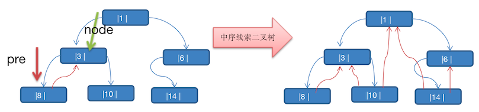

# 线索化二叉树

## 引出线索化二叉树

看如下问题：将数列 `{1,3,6,8,10,14}` 构成一颗二叉树


可以看到上图的二叉树为一颗 **完全二叉树**。对他进行分析，可以发现如下的一些问题：

1. 当对上面的二叉树进行中序遍历时，数列为 `8,3,10,1,14,6`
2. 但是  `6,8,10,14` 这几个节点的左右指针，并没有完全用上

如果希望充分利用各个节点的左右指针，让各个节点可以 **指向自己的前后节点**，这个时候就可以使用 **线索化二叉树** 了

## 介绍

n 个节点的二叉树链表中含有 `n + 1` 个空指针域，他的推导公式为 `2n-(n-1) = n + 1`。

利用二叉链表中的空指针域，存放指向该节点在 **某种遍历次序 **下的 **前驱** 和 **后继** 节点的指针，这种附加的指针称为**「线索」**

- 前驱：一个节点的前一个节点
- 后继：一个节点的后一个节点

如下图，在中序遍历中，下图的中序遍历为 `8,3,10,1,14,6`，那么 8 的后继节点就为 3，3 的后继节点是 10


这种加上了线索的二叉树链表称为 **线索链表**（节点存储了下一个节点，组成了链表，并且一般的二叉树本来就是用链表实现的），相应的二叉树称为 **线索二叉树（Threaded BinaryTree）**。根据线索性质的不同，线索二叉树可分为：前、中、后序线索二叉树。

## 思路分析


将上图的二叉树，进行 **中序线索二叉树**，中序遍历的数列为 `8,3,10,1,14,6`。

那么以上图为例，线索化二叉树后的样子如下图



- 8 的后继节点为 3
- 3 由于 **左右节点都有元素，不能线索化**
- 10 的前驱节点为 3，后继节点为 1
- 1 不能线索化
- 14 的前驱节点为 1，后继节点为 6
- 6 有左节点，不能线索化

注意：当线索化二叉树后，那么一个 Node 节点的 left 和 right 属性，就有如下情况：

1. left 指向的是 **左子树**，也可能是指向 **前驱节点**

   例如：节点 1 left 节点指向的是左子树，节点 10 的 left 指向的就是前驱节点

2. right 指向的是 **右子树**，也可能是指向 **后继节点**

   例如：节点 3 的 right 指向的是右子树，节点 10 的 right 指向的是后继节点

## 代码实现

下面的代码，有几个地方需要注意：

- HeroNode 就是一个 简单的二叉树节点，不同的是多了两个 type 属性：

  - leftType：左节点的类型：0：左子树，1：前驱节点
  - rightType：右节点的类型：0：右子树，1：后继节点

  为什么需要？上面原理讲解了，left 或则 right 会有两种身份，需要一个额外 的属性来指明

- threadeNodes：线索化二叉树

  是将一颗二叉树，进行线索化标记。只是将可以线索化的节点进行赋值。

```java
package cn.mrcode.study.dsalgtutorialdemo.datastructure.tree;

import org.junit.Test;

/**
 * 线索化二叉树
 */
public class ThreadedBinaryTreeTest {
    class HeroNode {
        public int id;
        public String name;
        public HeroNode left;
        public HeroNode right;
        /**
         * 左节点的类型：0：左子树，1：前驱节点
         */
        public int leftType;
        /**
         * 右节点的类型：0：右子树，1：后继节点
         */
        public int rightType;

        public HeroNode(int id, String name) {
            this.id = id;
            this.name = name;
        }

        @Override
        public String toString() {
            return "HeroNode{" +
                    "id=" + id +
                    ", name='" + name + '\'' +
                    '}';
        }
    }

    class ThreadedBinaryTree {
        public HeroNode root;
        public HeroNode pre; // 保留上一个节点

        /**
         * 线索化二叉树：以 中序的方式线索化
         */
        public void threadeNodes() {
            // 从 root 开始遍历，然后 线索化
            this.threadeNodes(root);
        }

        private void threadeNodes(HeroNode node) {
            if (node == null) {
                return;
            }
            // 中序遍历顺序：先左、自己、再右
            threadeNodes(node.left);
            // 难点就是在这里，如何线索化自己
            // 当自己的 left 节点为空，则设置为前驱节点
            if (node.left == null) {
                node.left = pre;
                node.leftType = 1;
            }

            // 因为要设置后继节点，只有回到自己的后继节点的时候，才能把自己设置为前一个的后继节点
            // 当前一个节点的 right 为空时，则需要自己是后继节点
            if (pre != null && pre.right == null) {
                pre.right = node;
                pre.rightType = 1;
            }

            // 数列： 1,3,6,8,10,14
            // 中序： 8,3,10,1,14,6
            // 这里最好结合图示的二叉树来看，容易理解
            // 因为中序遍历，先遍历左边，所以 8 是第一个输出的节点
            // 当 node = 8 时，pre 还没有被赋值过，则为空。这是正确的，因为 8 就是第一个节点
            // 当 8 处理完成之后，处理 3 时
            // 当 node = 3 时，pre 被赋值为 8 了。
            pre = node;
            threadeNodes(node.right);
        }
    }

    @Test
    public void threadeNodesTest() {
        HeroNode n1 = new HeroNode(1, "宋江");
        HeroNode n3 = new HeroNode(3, "无用");
        HeroNode n6 = new HeroNode(6, "卢俊");
        HeroNode n8 = new HeroNode(8, "林冲2");
        HeroNode n10 = new HeroNode(10, "林冲3");
        HeroNode n14 = new HeroNode(14, "林冲4");
        n1.left = n3;
        n1.right = n6;
        n3.left = n8;
        n3.right = n10;
        n6.left= n14;

        ThreadedBinaryTree tree = new ThreadedBinaryTree();
        tree.root = n1;

        tree.threadeNodes();

        // 验证：
        HeroNode left = n10.left;
        HeroNode right = n10.right;
        System.out.println("10 号节点的前驱节点：" + left.id);
        System.out.println("10 号节点的后继节点：" + right.id);
    }
}

```

测试输出

```
10 号节点的前驱节点：3
10 号节点的后继节点：1
```

如果看代码注释看不明白的话 ，现在来解释：

- 线索化的时候，就是要按照 **中序遍历** 的顺序，去找可以线索化的节点

  中序遍历顺序：先左、自己、再右

  我们主要的代码是在 **自己这一块**

- 确定前一个节点 pre

  这个 pre 很难理解，对照下图进行理解

  

  ```java
  // 数列： 1,3,6,8,10,14
  // 中序： 8,3,10,1,14,6
  
  // 因为中序遍历，先遍历左边，所以 8 是第一个输出的节点
  // 当 node = 8 时，pre 还没有被赋值过，则为空。这是正确的，因为 8 就是第一个节点
  // 当 8 处理完成之后，处理 3 时
  // 当 node = 3 时，pre 被赋值为 8 了。
  ```
  
- 设置前驱节点

  难点的讲解在于 pre，这里就简单了

  如果当 node =  8 时，pre 还是 null，因为 8 就是中序的第一个节点。因此 8 没有前驱

  如果当 node = 3 时，pre = 8，那么 3 是不符合线索化要求的，因为 8 是 3 的 left

- 设置后继节点

  接上面的逻辑。

  如果当 node = 8 时，本来 该给 8 设置他的后继节点，但是此时根本就获取不到节点 3，因为节点是单向的。

  如果利用前一个节点 pre。

  当 node=3 时，pre = 8，这时就可以为节点 8 处理它的后继节点了，**因为根据中序的顺序，左、自己、后。那么自己一定是前一个的后继**。只要前一个的 right 为 null，就符合线索化

上述最难的 3 个点说明，请对照上图看，先看一遍代码，再看说明。然后去 debug 你就了解了。

## 遍历线索化二叉树

结合图示来看思路说明最直观


对于原来的中序遍历来说，无法使用了，因为左右节点再也不为空了。这里直接利用线索化节点提供的线索，找到他的后继节点遍历，思路如下：

1. 首先找到它的第一个节点，并打印它

   中序遍历，先左，所以一直往左找，直到 left 为 null 时，则是第一个节点

2. 然后看它的 right节点是否为线索化节点，是的话则打印它

   因为：如果 right 是一个线索化节点，也就是 right 是当前节点的 **后继节点**，可以直接打印。

3. right 如果是一个普通节点，那么就直接处理它的右侧节点

   因为：按照中序遍历顺序，左、自己、右，这里就理所当然是右了

看描述索然无味，结合下面的代码来看，就比较清楚了

```java
/**
         * 遍历线索化二叉树
         */
        public void threadedList() {
            // 前面线索化使用的是中序，这里也同样要用中序的方式
            // 但是不适合使用之前那种递归了
            HeroNode node = root;
            while (node != null) {
                // 中序：左、自己、右
                // 数列： 1,3,6,8,10,14
                // 中序： 8,3,10,1,14,6
                // 那么先找到左边的第一个线索化节点，也就是 8. 对照图示理解，比较容易
                while (node.leftType == 0) {
                    node = node.left;
                }
                // 找到这个线索化节点之后，打印它
                System.out.println(node);

                // 如果该节点右子节点也是线索化节点，则打印它
                while (node.rightType == 1) {
                    node = node.right;
                    System.out.println(node);
                }

                // 到达这里，就说明遇到的不是一个 线索化节点了
                // 而且，按中序的顺序来看：这里应该处理右侧了
                node = node.right;
            }
        }
```

测试

```java
    /**
     * 线索化遍历测试
     */
    @Test
    public void threadedListTest() {
        // 1,3,6,8,10,14
        HeroNode n1 = new HeroNode(1, "宋江");
        HeroNode n3 = new HeroNode(3, "无用");
        HeroNode n6 = new HeroNode(6, "卢俊");
        HeroNode n8 = new HeroNode(8, "林冲2");
        HeroNode n10 = new HeroNode(10, "林冲3");
        HeroNode n14 = new HeroNode(14, "林冲4");
        n1.left = n3;
        n1.right = n6;
        n3.left = n8;
        n3.right = n10;
        n6.left = n14;

        ThreadedBinaryTree tree = new ThreadedBinaryTree();
        tree.root = n1;

        tree.threadeNodes();
        tree.threadedList(); // 8,3,10,1,14,6
    }
```

输出信息

```
HeroNode{id=8, name='林冲2'}
HeroNode{id=3, name='无用'}
HeroNode{id=10, name='林冲3'}
HeroNode{id=1, name='宋江'}
HeroNode{id=14, name='林冲4'}
HeroNode{id=6, name='卢俊'}
```

## 前序线索化

```java
 public void preOrderThreadeNodes() {
            preOrderThreadeNodes(root);
        }

        /**
         * 前序线索化二叉树
         */
        public void preOrderThreadeNodes(HeroNode node) {
            // 前序：自己、左（递归）、右（递归）
            // 数列： 1,3,6,8,10,14
            // 前序： 1,3,8,10,6,14

            if (node == null) {
                return;
            }

            System.out.println(node);
            // 当自己的 left 节点为空，则可以线索化
            if (node.left == null) {
                node.left = pre;
                node.leftType = 1;
            }
            // 当前一个节点 right 为空，则可以把自己设置为前一个节点的后继节点
            if (pre != null && pre.right == null) {
                pre.right = node;
                pre.rightType = 1;
            }

            // 因为是前序，因此 pre 保存的是自己
            // 到下一个节点的时候，下一个节点如果是线索化节点 ，才能将自己作为它的前驱节点
            pre = node;

            // 那么继续往左，查找符合可以线索化的节点
            // 因为先处理的自己，如果 left == null，就已经线索化了
            // 再往左的时候，就不能直接进入了
            // 需要判定，如果不是线索化节点，再进入
            // 比如：当前节点 8，前驱 left 被设置为了 3
            // 这里节点 8 的 left 就为 1 了，就不能继续递归，否则又回到了节点 3 上
            // 导致死循环了。
            if (node.leftType == 0) {
                preOrderThreadeNodes(node.left);
            }
            if (node.rightType == 0) {
                preOrderThreadeNodes(node.right);
            }
        }
```

这里代码相对于中序线索化来说，难点在于：什么时候该继续往左查找，什么时候该继续往右查找。

测试

```java
    /**
     * 前序线索化
     */
    @Test
    public void preOrderThreadedNodesTest() {
        // 1,3,6,8,10,14
        HeroNode n1 = new HeroNode(1, "宋江");
        HeroNode n3 = new HeroNode(3, "无用");
        HeroNode n6 = new HeroNode(6, "卢俊");
        HeroNode n8 = new HeroNode(8, "林冲2");
        HeroNode n10 = new HeroNode(10, "林冲3");
        HeroNode n14 = new HeroNode(14, "林冲4");
        n1.left = n3;
        n1.right = n6;
        n3.left = n8;
        n3.right = n10;
        n6.left = n14;

        ThreadedBinaryTree tree = new ThreadedBinaryTree();
        tree.root = n1;

        tree.preOrderThreadeNodes();

        // 验证： 前序顺序： 1,3,8,10,6,14
        HeroNode left = n10.left;
        HeroNode right = n10.right;
        System.out.println("10 号节点的前驱节点：" + left.id); // 8
        System.out.println("10 号节点的后继节点：" + right.id); // 6

        left = n6.left;
        right = n6.right;
        System.out.println("6 号节点的前驱节点：" + left.id); // 14, 普通节点
        System.out.println("6 号节点的后继节点：" + right.id); // 14,线索化节点
    }
```

输出

```
HeroNode{id=1, name='宋江'}
HeroNode{id=3, name='无用'}
HeroNode{id=8, name='林冲2'}
HeroNode{id=10, name='林冲3'}
HeroNode{id=6, name='卢俊'}
HeroNode{id=14, name='林冲4'}
10 号节点的前驱节点：8
10 号节点的后继节点：6
6 号节点的前驱节点：14
6 号节点的后继节点：14
```

可以看到，我们线索化二叉树的时候，是按照中序的顺序 1,3,8,10,6,14 的顺序遍历查找处理的。处理之后的 6 号节点两个都是一样的，但是 left 是正常的节点 14，right 是线索化节点 14

## 前序线索化遍历

前序线索化遍历，还是要记住它的特点是：**自己、左（递归）、右（递归）**，那么遍历思路如下：

1. 先打印自己
2. 再左递归打印
3. 直到遇到一个节点有 right 且是后继节点，则直接跳转到该后继节点，继续打印
4. 如果遇到的是一个普通节点，则打印该普通节点，完成一轮循环，进入到下一轮，从第 1 步开始

```java
/**
         * 前序线索化二叉树遍历
         */
        public void preOrderThreadeList() {
            HeroNode node = root;
          // 最后一个节点无后继节点，就会退出了
          // 前序：自己、左（递归）、右（递归）
            while (node != null) {
                // 先打印自己
                System.out.println(node);

                while (node.leftType == 0) {
                    node = node.left;
                    System.out.println(node);
                }
                while (node.rightType == 1) {
                    node = node.right;
                    System.out.println(node);
                }
                node = node.right;
            }
        }
```

测试代码

```java
    @Test
    public void preOrderThreadeListTest() {
        ThreadedBinaryTree tree = buildTree();
        tree.preOrderThreadeNodes();
        System.out.println("前序线索化遍历");
        tree.preOrderThreadeList(); // 1,3,8,10,6,14
    }
```

测试输出

```
HeroNode{id=1, name='宋江'}
HeroNode{id=3, name='无用'}
HeroNode{id=8, name='林冲2'}
HeroNode{id=10, name='林冲3'}
HeroNode{id=6, name='卢俊'}
HeroNode{id=14, name='林冲4'}
前序线索化遍历
HeroNode{id=1, name='宋江'}
HeroNode{id=3, name='无用'}
HeroNode{id=8, name='林冲2'}
HeroNode{id=10, name='林冲3'}
HeroNode{id=6, name='卢俊'}
HeroNode{id=14, name='林冲4'}
```

## 总结

还有一个后序线索化，笔者这里不写了，从前序、中序获取到几个重要的点：

- 线索化时：

  1. 根据不同的「序」，如何进行遍历的同时，处理线索化节点

     对于中序来说：

     1. 先递归到最左节点
     2. 开始线索化
     3. 再递归到最右节点

     它的顺序：先左（递归）、自己、再右（递归）

     对于前序来说：

     1. 开始线索化
     2. 一直往左递归
     3. 一直往右递归

     它的顺序：自己、左（递归）、右（递归）

  2. 根据不同的「序」，考虑如何跳过或进入下一个节点，**因为要考虑前驱和后继**

     1. 中序：由于它的顺序，第一个线索化节点，就是他的顺序的第一个节点，不用管接下来遇到的节点是否已经线索化过了，这是由于它天然的顺序，已经线索化过的节点，不会在下一次处理
     2. 前序：由于它的顺序，第一个顺序输出的节点，并不是第一个线索化节点。所以它需要对他的 **左右节点进行类型判定**，是普通节点的话，再按：自己、左、右的顺序进行左、右进行递归，因为下一次出现的节点有可能是已经线索化过的节点，如果不进行判定，就会导致又回到了已经遍历过的节点。就会导致死循环了

- 遍历线索化时：基本上和线索化时的「序」一致去考虑，何时该进行输出？什么时候遇到后继节点时，跳转到后继节点处理。最重要的一点是：**遍历时，不用考虑前驱节点，之用考虑何时通过后继节点进行跳转**。