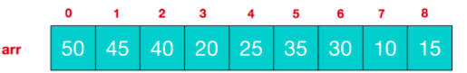
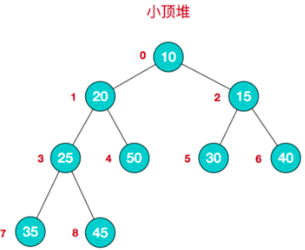
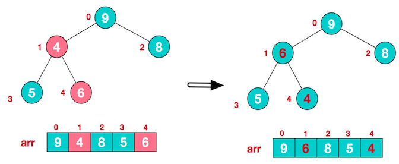
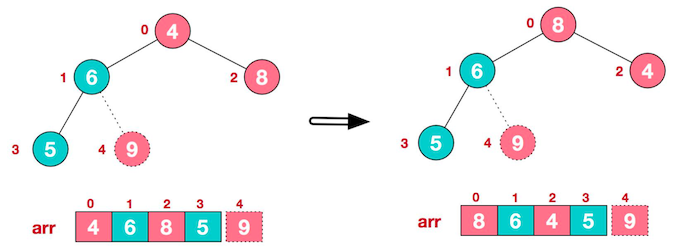
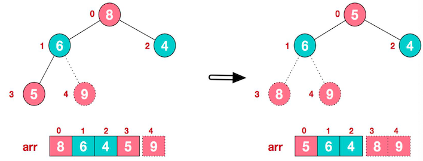

# 堆排序

## 基本介绍

堆排序是利用 **堆** 这种 **数据结构** 而设计的一种排序算法，它是一种选择排序，最坏 、最好、平均时间复杂度均为 `O(nlogn)`，它是不稳定排序。

堆是具有以下性质的完全二叉树：

- 大顶堆：每个节点的值都 **大于或等于** 其左右孩子节点的值

  注：**没有要求左右值的大小关系**

- 小顶堆：每个节点的值都 **小于或等于** 其左右孩子节点的值

举例说明：

### 大顶堆举例

对堆中的节点按层进行编号，映射到数组中如下图

大顶堆特点：`arr[i] >= arr[2*i+1] && arr[i] >= arr[2*i+2]`，i 对应第几个节点，i 从 0 开始编号

### 小顶堆举例

小顶堆特点：`arr[i] <= arr[2*i+1] && arr[i] <= arr[2*i+2]`，i 对应第几个节点，i 从 0 开始

### 排序说明

- 升序：一般采用大顶堆
- 降序：一般采用小顶堆

## 基本思想

1. 将待排序序列构造成一个大顶堆

   注意：这里使用的是数组，而不是一颗二叉树

2. 此时：整个序列的 **最大值就是堆顶的根节点**

3. 将其 **与末尾元素进行交换**，此时末尾就是最大值

4. 然后将剩余 `n-1` 个元素重新构造成一个堆，这样 就会得到 n 个元素的次小值。如此反复，便能的得到一个有序序列。

## 堆排序步骤图解

对数组 `4,6,8,5,9` 进行堆排序，将数组升序排序。

### 步骤一：构造初始堆

1. 给定无序序列结构 如下：注意这里的操作用数组，树结构只是参考理解

  

  将给定无序序列构造成一个大顶堆。 

2. **此时从最后一个非叶子节点开始调整**，从左到右，从上到下进行调整。

  叶节点不用调整，第一个非叶子节点 `arr.length/2-1 = 5/2-1 = 1 `，也就是 元素为 6 的节点。

	比较时：先让 5 与 9 比较，得到最大的那个，再和 6 比较，发现 9 大于 6，则调整他们的位置。
  
  

3. 找到第二个非叶子节点 4，由于 `[4,9,8]` 中，9 元素最大，则 4 和 9 进行交换

   

4. 此时，交换导致了子根 `[4,5,6]` 结构混乱，将其继续调整。`[4,5,6]` 中 6 最大，将 4 与 6 进行调整。

	

此时，就将一个无序序列构造成了一个大顶堆。

### 步骤二：将堆顶元素与末尾元素进行交换

将堆顶元素与末尾元素进行交换，**使其末尾元素最大**。然后继续调整，再将堆顶元素与末尾元素交换，得到第二大元素。如此反复进行交换、重建、交换。

1. 将堆顶元素 9 和末尾元素 4 进行交换

   

2. 重新调整结构，使其继续满足堆定义

   

3. 再将堆顶元素 8 与末尾元素 5 进行交换，得到第二大元素 8

   

4. 后续过程，继续进行调整、交换，如此反复进行，最终使得整个序列有序

   

### 总结思路

1. 将无序序列构建成一个堆，根据升序降序需求选择大顶堆或小顶堆
2. 将堆顶元素与末尾元素交换，将最大元素「沉」到数组末端
3. 重新调整结构，使其满足堆定义，然后继续交换堆顶与当前末尾元素，反复执行调整、交换步骤，直到整个序列有序。