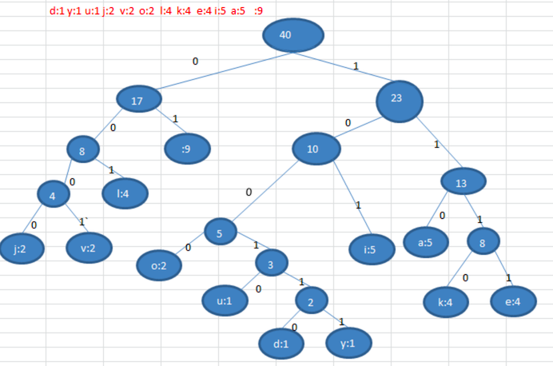

# 赫夫曼编码

## 基本介绍

- 赫夫曼编码也翻译为   **哈夫曼编码(Huffman Coding)**，又称霍夫曼编码，是一种 **编码方式**,，属于一种 **程序算法**
- 赫夫曼编码是 **赫哈夫曼树** 在电讯通信中的经典的应用之一。
- 赫夫曼编码广泛地用于 **数据文件压缩**。其压缩率通常在 20%～90% 之间
- 赫夫曼码是 **可变字长编码(VLC)** 的一种。Huffman 于 1952 年提出一种编码方法，称之为最佳编码

## 原理剖析

以下解释下载通信领域中信息的处理方式。

### 1. 定长编码

```
// 原始字符，共40个字符(包括空格) 
i like like like java do you like a java     
// 对应 Ascii 码
105 32 108 105 107 101 32 108 105 107 101 32 108 105 107 101 32 106 97 118 97 32 100 111 32 121 111 117 32 108 105 107 101 32 97 32 106 97 118 97  
// Ascii 码对应的二进制
01101001 00100000 01101100 01101001 01101011 01100101 00100000 01101100 01101001 01101011 01100101 00100000 01101100 01101001 01101011 01100101 00100000 01101010 01100001 01110110 01100001 00100000 01100100 01101111 00100000 01111001 01101111 01110101 00100000 01101100 01101001 01101011 01100101 00100000 01100001 00100000 01101010 01100001 01110110 01100001
```

按照二进制来传递信息，总的长度是  359   (包括空格)；[在线转码工具](https://www.mokuge.com/tool/asciito16/ )

### 2. 变长编码

```
// 原始字符，共40个字符(包括空格) 
i like like like java do you like a java  
// 各个字符对应的个数
d:1 y:1 u:1 j:2  v:2  o:2  l:4  k:4  e:4 i:5  a:5   :9 
// 按照各个字符出现的次数进行编码，原则是出现次数越多的，则编码越小，比如 空格出现了 9 次， 编码为 0 ,其它依次类推.
// 等号前面的数字就是就是赫夫曼树节点的带权路径，后面讲解为什么
0=  ,  1=a, 10=i, 11=e, 100=k, 101=l, 110=o, 111=v, 1000=j, 1001=u, 1010=y, 1011=d
```

按照上面给各个字符规定的编码，对于原始字符 `i like like like java do you like a java`，进行编码时，对应的编码为：

```
i 空格  l   i   k
10  0   101 10 100 ...
传输的编码就是：10010110100 ...
```

**注意：**  字符的编码都不能是其他字符编码的前缀，符合此要求的编码叫做 **前缀编码**，即不能匹配到重复的编码。（下面会详细讲解）

### 3. 赫夫曼编码

```
// 原始字符，共40个字符(包括空格) 
i like like like java do you like a java  
// 各个字符对应的个数
d:1 y:1 u:1 j:2  v:2  o:2  l:4  k:4  e:4 i:5  a:5   :9 
```

按照上面字符出现的次数构建一颗赫夫曼树，次数作为权值。[赫夫曼树构建步骤回顾](./02.md )

构建好的赫夫曼树如下图：



根据赫夫曼树，给各个字符规定编码（前缀编码）：

- 向左的路径为 0
- 向右的路径为 1

那么编码如下：

```
o: 1000   u: 10010   d: 100110   y: 100111   i: 101
a: 110    k: 1110    e: 1111     j: 0000     v: 0001
l: 001     : 01
```

按照上面给出的各个字符的 **前缀编码（赫夫曼编码）**，`i like like like java do you like a java`   字符串对应的编码为 (注意这里我们使用的 **无损压缩**)

```
1010100110111101111010011011110111101001101111011110100001100001110011001111000011001111000100100100110111101111011100100001100001110
```

此编码总长度为：133，原始的定长编码长度为 359，压缩了 `359-133/359=62.9%`。

此编码满足前缀编码，即字符的编码都不能是其他字符编码的前缀。不会造成匹配的多义性，比如：

```
比如前面的这一串编码：101010011011110
 i 空格  l    i   k
101 01  001 101 1110
```

简单说就是：上面给出的每个字符的编码都是唯一的，

### 注意事项

赫夫曼树 **根据排序方法不同**，也可能不太一样，这样对应的 **赫夫曼编码** 也不完全一样，但是 WPL 是一样的，都是最小的，最后生成的赫夫曼编码的长度是一样。

什么意思呢：比如这个数列 `4,4,4,4,4,4,4,5,6,7`，有很多相同的树节点，每次取最小的两个组成一颗新树：

```
原始：4,4,4,4,4,4,4,5,6,7
第一次：4,4,4,4,4,5,6,7,8    # 处理排序之后，减少了两个 4，多了一个 8 的树
第二次：4,4,4,5,6,7,8,8			 # 处理排序之后，减少了两个 4，多了一个 8 的树
```

那么问题就来了：相同的权值，你怎么排序？这个就是排序不稳定。导致后面每次重新生成树的编码都对应不上同一个字符。

但是他们的 WPL 是一样的，也就是最后用赫夫曼编码之后的数据长度都是一样的（压缩程度是一样的）。

下面对比下规则的不同，生成的树不同：

前面给出的图是：每次生成新的二叉树排在相同权值的前面


下面是每次生成新的二叉树总是排在权值相同的二叉树的最后一个，则生成二叉树为：


最明显的就是右下角的，`2+2=4`，第一张图是放在左下角的的 4 节点下，这里是放在右下角的 4 节点下

## 最佳实践-数据压缩

根据赫夫曼编码压缩数据的原理，创建 `i like like like java do you like a java` 字符串对应的赫夫曼树。

###  创建赫夫曼树

思路：

1. 创建 Node，具有如下属性：

   - data：存放对应的字符
   - weight：该字符出现的总次数
   - left：左节点
   - right：右节点

2. 得到该字符串的 byte 数组

   在 JAVA 中，中英文得到的 byte 是不一样的，比如

   ```
   System.out.println("i".getBytes().length); // 1
   System.out.println("中".getBytes().length); // 3
   ```

   也就是说，我们是对 byte 进行压缩，最后还原成这个 byte 数组。

   比如 UTF-8 编码得到的 bytes，它的英文一个 byte 就对应了 ASCII 码值

3. 构建这个 byte 数组对应的 Node 列表

4. 对这个 Node 列表进行哈夫曼树构建

代码实现如下：

```java
package cn.mrcode.study.dsalgtutorialdemo.datastructure.huffmancode;

import org.junit.Test;

import java.util.*;

/**
 * 赫夫曼编码
 */
public class HuffmanCodeTest {
    /**
     * 英文和中文各自对应的 byte 是几个
     */
    @Test
    public void fun1() {
        System.out.println("i".getBytes().length); // 1
        System.out.println("中".getBytes().length); // 3
    }

    /**
     * 创建赫夫曼树
     */
    @Test
    public void createHuffmanTreeTest() {
        String content = "i like like like java do you like a java";
        byte[] contentBytes = content.getBytes(); // 会使用所在系统的默认字符集构建 bytes，一般是 UTF-8
        System.out.println("原始字符串：" + content);
        System.out.println("原始字符串长度：" + contentBytes.length);

        // 1. 构建 nodes 列表
        List<Node> nodes = buildNodes(contentBytes);
        System.out.println("构建的 Nodes 列表打印：" + nodes);

        // 2. 对列表进行赫夫曼树的构建
        Node node = createHuffmanTree(nodes);
        System.out.println("构建后的赫夫曼树打印：");
        // 验证：构建的赫夫曼树。注意: 每次构建的树可能不一致（由于排序不稳定性）
        node.preOrder();
    }


    /**
     * 将 bytes 构建成 node 列表
     *
     * @param contentBytes
     * @return
     */
    private List<Node> buildNodes(byte[] contentBytes) {
        // 1. 统计每个 byte 出现的次数
        Map<Byte, Integer> counts = new HashMap<>();
        for (byte contentByte : contentBytes) {
            Integer count = counts.get(contentByte);
            if (count == null) {
                count = 0;
                counts.put(contentByte, count);
            }
            counts.put(contentByte, count + 1);
        }

        // 2. 构建 Node list
        List<Node> nodes = new ArrayList<>();
        counts.forEach((key, value) -> {
            nodes.add(new Node(key, value));
        });
        return nodes;
    }


    /**
     * 创建 赫夫曼树
     *
     * @param nodes
     * @return 返回赫夫曼树的根节点；也就是最大的一个节点
     */
    private Node createHuffmanTree(List<Node> nodes) {
        while (nodes.size() > 1) {
            // 1. 先从小到大排序
            Collections.sort(nodes);
            // 2. 取出最小的两个节点组成新的树
            Node left = nodes.get(0);
            Node right = nodes.get(1);
            // 3. 构成父节点：由于赫夫曼树的数据都在叶子节点，父节点只是权值的总和
            Node parent = new Node(null, left.weight + right.weight);
            parent.left = left;
            parent.right = right;
            // 4. 移除处理过的节点
            nodes.remove(left);
            nodes.remove(right);
            nodes.add(parent);
        }
        return nodes.get(0);
    }
}

class Node implements Comparable<Node> {
    Byte value; // 对应的字符；注意：非叶子节点是没有数据的，只有对应叶子节点的权值总和
    int weight; // 权值：字符串出现的总次数
    Node left;
    Node right;

    public Node(Byte value, int weight) {
        this.value = value;
        this.weight = weight;
    }

    /**
     * 前序遍历：方便打印验证
     */
    public void preOrder() {
        System.out.println(this);
        if (left != null) {
            left.preOrder();
        }
        if (right != null) {
            right.preOrder();
        }
    }

    @Override
    public int compareTo(Node o) {
        // 按字符串出现的次数进行：从小到大排序
        return weight - o.weight;
    }

    @Override
    public String toString() {
        return "Node{" +
                "value=" + value +
                ", weight=" + weight +
                '}';
    }
}

```

测试输出

```
原始字符串：i like like like java do you like a java
原始字符串长度：40
构建的 Nodes 列表打印：[Node{value=32, weight=9}, Node{value=97, weight=5}, Node{value=100, weight=1}, Node{value=101, weight=4}, Node{value=117, weight=1}, Node{value=118, weight=2}, Node{value=105, weight=5}, Node{value=121, weight=1}, Node{value=106, weight=2}, Node{value=107, weight=4}, Node{value=108, weight=4}, Node{value=111, weight=2}]
构建后的赫夫曼树打印：
Node{value=null, weight=40}
Node{value=null, weight=17}
Node{value=null, weight=8}
Node{value=108, weight=4}
Node{value=null, weight=4}
Node{value=106, weight=2}
Node{value=111, weight=2}
Node{value=32, weight=9}
Node{value=null, weight=23}
Node{value=null, weight=10}
Node{value=97, weight=5}
Node{value=105, weight=5}
Node{value=null, weight=13}
Node{value=null, weight=5}
Node{value=null, weight=2}
Node{value=100, weight=1}
Node{value=117, weight=1}
Node{value=null, weight=3}
Node{value=121, weight=1}
Node{value=118, weight=2}
Node{value=null, weight=8}
Node{value=101, weight=4}
Node{value=107, weight=4}
```

可以对比前面的赫夫曼树的图例，进行检查校验，看看对不对。

### 赫夫曼编码表

我们要得到 **赫夫曼编码** 前，还要先构建出 **赫夫曼编码表**，如下所示

```
o: 1000   u: 10010   d: 100110   y: 100111   i: 101
a: 110    k: 1110    e: 1111     j: 0000     v: 0001
l: 001     : 01
```

注意：前面已经说过了，根据排序稳定性不同，得到编码表可能也不同，但是最终得到的数据编码长度是一致的。

思路分析：

1. 用 `Map<Byte,String>` 来保存编码表
2. 获取到每个叶子节点的 权路径：如 110

代码实现如下

```java
/**
     * 基于赫夫曼树，构建赫夫曼编码表
     */
    @Test
    public void buildHuffmanCodesTest() {
        String content = "i like like like java do you like a java";
        byte[] contentBytes = content.getBytes(); // 会使用所在系统的默认字符集构建 bytes，一般是 UTF-8

        // 1. 构建 nodes 列表
        List<Node> nodes = buildNodes(contentBytes);

        // 2. 对列表进行赫夫曼树的构建
        Node node = createHuffmanTree(nodes);

        // 3. 基于赫夫曼树生成 赫夫曼编码表
        Map<Byte, String> codes = buildHuffmanCodes(node);
        System.out.println(codes);
    }

    /**
     * 基于赫夫曼树构建赫夫曼编码表
     *
     * @param node
     * @return
     */
    private Map<Byte, String> buildHuffmanCodes(Node node) {
        if (node == null) {
            System.out.println("赫夫曼树为空");
            return null;
        }
        Map<Byte, String> codes = new HashMap<>();
        StringBuilder sb = new StringBuilder();
        // 根节点没有指向性。所以传递空白的路径代码
        buildHuffmanCodes(node, "", codes, sb);
        return codes;
    }

    /**
     * 递归，查找每个叶子节点，得到每个叶子节点的权路径
     *
     * @param node
     * @param code  左节点，则该值为 0，右节点，则该值为 1
     * @param codes 存放赫夫曼编码的容器
     * @param sb    存放节点 权路径 的容器
     */
    private void buildHuffmanCodes(Node node, String code, Map<Byte, String> codes, StringBuilder sb) {
        if (node == null) {
            return;
        }
        // 注意这里：为什么要用一个新的 sb 容器？
        // 如果一直传递第一个 sb 容器，那么该容器中的字符会越来越长
        // 在递归状态下，每次新增一个 sb 容器，当它回溯的时候，它的下一层处理过的路径，就和该容器无关。那么他还可以进行右节点的拼接。
        // 这样才是正确的使用方式
        StringBuilder sbTemp = new StringBuilder(sb);
        sbTemp.append(code);
        // 如果该节点没有数据，则有下一个叶子节点
        if (node.value == null) {
            buildHuffmanCodes(node.left, "0", codes, sbTemp);
            buildHuffmanCodes(node.right, "1", codes, sbTemp);
        } else {
            // 如果是叶子节点，则将
            codes.put(node.value, sbTemp.toString());
        }
    }
```

测试输出

```
{32=01, 97=100, 100=11000, 117=11001, 101=1110, 118=11011, 105=101, 121=11010, 106=0010, 107=1111, 108=000, 111=0011}
```


### 赫夫曼编码

根据 **编码表** 来得到  **数据编码**，如下所示

```
1010100110111101111010011011110111101001101111011110100001100001110011001111000011001111000100100100110111101111011100100001100001110
```

思路：

1. 将原始字符串的 byte 数组，转成 **赫夫曼编码对应的值**

   也就是如上的 `10101001101`

   这一步的实现，直接遍历原始字符串的 byte 数组，从编码表中获取对应的编码拼接起来就可以了

2. 将赫夫曼编码字符串，转成 byte 数组，做法如下：

   一个 byte 是 8 位，所以将赫夫曼编码字符串按 8 位分割，每一个 8 位都可以转成一个 byte

   这里涉及到的是 JAVA 高端基础中的二进制转码：原码、补码、反码知识点。 最简单的使用 Integer 的 API

   ```java
   int parseInt(String s, int radix)
   ```

   转成一个 Byte 。这是因为数据发送也是通过 byte 二进制发送的。

代码实现

```java
 /**
     * 基于赫夫曼编码表，将字符串压缩成 byte[]
     */
    @Test
    public void zipTest() {
        String content = "i like like like java do you like a java";
        byte[] contentBytes = content.getBytes(); // 会使用所在系统的默认字符集构建 bytes，一般是 UTF-8

        // 1. 构建 nodes 列表
        List<Node> nodes = buildNodes(contentBytes);

        // 2. 对列表进行赫夫曼树的构建
        Node node = createHuffmanTree(nodes);

        // 3. 基于赫夫曼树生成 赫夫曼编码表
        Map<Byte, String> huffmanCodes = buildHuffmanCodes(node);

        // 4. 基于赫夫曼编码表，压缩内容
        byte[] huffmanCodeBytes = zip(contentBytes, huffmanCodes);
        System.out.println("将原始字符串压缩成赫夫曼编码的 byte 数组内容为：" + Arrays.toString(huffmanCodeBytes));
        int huffmanCodeBytesLength = huffmanCodeBytes.length;
        System.out.println("将原始字符串压缩成赫夫曼编码的 byte 数组内容长度为：" + huffmanCodeBytesLength);
        int contentBytesLength = contentBytes.length;
        System.out.println("原始字符串的字节数组为 " + contentBytesLength + " ，压缩之后变成了" + huffmanCodeBytesLength +
                "，那么他的压缩比为 " + ((double) (contentBytesLength - huffmanCodeBytesLength) / contentBytesLength) * 100 + "%");
    }

    public byte[] zip(byte[] contentBytes, Map<Byte, String> huffmanCodes) {
        // 1. 将原始字符串 byte 数组，转成以 护赫夫曼编码表 组成的字符串
        StringBuilder contentHuffmanCodeStr = new StringBuilder();
        for (byte contentByte : contentBytes) {
            contentHuffmanCodeStr.append(huffmanCodes.get(contentByte));
        }
        // 1010100010111111110010001011111111001000101111111100100101001101110001110000011011101000111100101000101111111100110001001010011011100
        System.out.println("原始字符串对应的赫夫曼编码字符串为：" + contentHuffmanCodeStr);
        // 这里长度应该是之前分析的 133
        int length = contentHuffmanCodeStr.length();
        System.out.println("原始字符串对应的赫夫曼编码字符串长度为：" + length);

        // 2. 将字符串每 8 个字符转成一个 byte
        // 计算转换后的 byte 数组长度
        // 下面判断分支对应的一行高效代码为：len = contentHuffmanCodeStr.length() + 7 / 8,原理是让它大于等于 8 ，无论是刚好整除还是有余数，都和下面的结果一致
        int len = 0;
        if (length % 8 == 0) {
            len = length / 8;
        } else {
            len = length / 8 + 1;
        }
        byte[] contentHuffmanCodeBytes = new byte[len];
        // 8 位一切分，所以循环步长为 8
        int index = 0;
        for (int i = 0; i < length; i = i + 8) {
            String huffmanCode;
            if (i + 8 < length) {
                huffmanCode = contentHuffmanCodeStr.substring(i, i + 8);
            } else {
                huffmanCode = contentHuffmanCodeStr.substring(i);
            }
            // 10101000 -> 转成 byte，也就是将二进制字符串转成 byte
            contentHuffmanCodeBytes[index++] = (byte) Integer.parseInt(huffmanCode, 2);
        }
        return contentHuffmanCodeBytes;
    }
```

测试输出

```
原始字符串对应的赫夫曼编码字符串为：1010100010111111110010001011111111001000101111111100100101001101110001110000011011101000111100101000101111111100110001001010011011100
原始字符串对应的赫夫曼编码字符串长度为：133
将原始字符串压缩成赫夫曼编码的 byte 数组内容为：[-88, -65, -56, -65, -56, -65, -55, 77, -57, 6, -24, -14, -117, -4, -60, -90, 28]
将原始字符串压缩成赫夫曼编码的 byte 数组内容长度为：17
原始字符串的字节数组为  40 ，压缩之后变成了 17，那么他的压缩比为 57.49999999999999%
```

可以看到将字符串 `i like like like java do you like a java` 经过赫夫曼编码压缩之后，它的压缩比为 57%，如果该文本更大更长的话，并且重复的字节很多的话，这将节省巨大的空间。

下面将中文进行压缩一下：`我是一个中国人，我热爱中国`

```
原始字符串对应的赫夫曼编码字符串为：110111000010110101011011011001111111001001111101001001111101101000000111011000001000101110010100111111011100001000111010110110011110001100100111110110100000011101
原始字符串对应的赫夫曼编码字符串长度为：162
将原始字符串压缩成赫夫曼编码的 byte 数组内容为：[-36, 45, 91, 103, -14, 125, 39, -38, 7, 96, -117, -108, -3, -62, 58, -39, -29, 39, -38, 7, 1]
将原始字符串压缩成赫夫曼编码的 byte 数组内容长度为：21
原始字符串的字节数组为 39 ，压缩之后变成了21，那么他的压缩比为 46.15384615384615%
```

这压缩比也挺不错。

## 最佳实践-数据解压

解压指的是：将上面压缩之后的字节数组，转成原始的字符串，如下所示

```
赫夫曼编码字节数组：[-88, -65, -56, -65, -56, -65, -55, 77, -57, 6, -24, -14, -117, -4, -60, -90, 28]
↓  转换成
原始字符串：i like like like java do you like a java
```

###  byte 转二进制字符串

首先里面有一个知识点是：将 byte 转成二进制的字符串显示

需要注意的是：我们之前生成的赫夫曼编码字符串，转成 byte 时，它是补码（正数的补码就是原码）。所以在数据解压的时候，要按补码的方式进行还原。

```java
    /**
     * byte 转成二进制字符串测试
     */
    @Test
    public void byteToBitStringTest() {
        byte num = -1;
        int temp = num;
        // 注意：这里返回的是补码，并非原码：而正数的补码就是原码
        String s = Integer.toBinaryString(temp);
        // 11111111111111111111111111111111
        System.out.println(s);
        // 我们只需要 8 位的，所以需要进行截取
        s = s.substring(s.length() - 8);
        // 11111111
        System.out.println(s);

        // 但是：如果换成正数
        num = 1;
        temp = num;
        s = Integer.toBinaryString(temp);
        // 1
        System.out.println(s);
        // 由于正数，返回的是整数的本身，需要进行高位补位
        //  s = s.substring(s.length() - 8);

        // 高位补位
        // 256 的二进制是 0000 0001 0000 0000
        // 1   的二进制是 0000 0000 0000 0001
        // 进行与计算后：  0000 0001 0000 0001
        // 再截取最后 8 位，         0000 0001
        temp |= 256;
        s = Integer.toBinaryString(temp);
        s = s.substring(s.length() - 8);
        // 0000 0001
        System.out.println(s);
    }
```

测试输出

```
11111111111111111111111111111111
11111111
1
00000001
```

上面是推导过程，下面将它进行封装成一个函数

```java
 /**
     * 将上面的推导过程封装成函数
     */
    @Test
    public void byteToBitStringTest2() {
        byte num = -1;
        String s = byteToBitString(true, num);
        System.out.println(num + " 的二进制显示：" + s);

        num = 1;
        s = byteToBitString(true, num);
        System.out.println(num + " 的二进制显示：" + s);
    }

    /**
     * <pre>
     *     是否需要补位的场景有：
     *     1. 上面推导过程中的，正数需要补位。而负数不需要补位；
     *        对于负数补位来说，由于是低 8 位， 256 是第 9 位，运行与之后，截取出来的是不变的
     *        那么这里就统一都补位。而末尾的在外部需要判定是否满 8 个字符，没有满的话，则不需要补位
     *     2. 但是在我们将赫夫曼编码字符串转成 bytes 的时候，末尾的 byte 有可能不是 8 位，那么这个就不需要进行补位，补位就无法还原了
     * </pre>
     *
     * @param flag 是否需要补位
     * @param b    将此 byte 转成二进制字符串返回
     * @return
     */
    public String byteToBitString(boolean flag, byte b) {
        int temp = b;
        // 需要补位
        if (flag) {
            // 高位补位
            // 256 的二进制是 0000 0001 0000 0000
            // 1   的二进制是 0000 0000 0000 0001
            // 进行与计算后：  0000 0001 0000 0001
            // 再截取最后 8 位，         0000 0001
            temp |= 256;
            // 对于负数补位来说，由于是低 8 位， 256 是第 9 位，运行与之后，截取出来的是不变的
        }
        String str = Integer.toBinaryString(temp);
        if (flag) {
            // 只截取低 8 位
            return str.substring(str.length() - 8);
        }
        return str;
    }
```

测试输出

```
-1 的二进制显示：11111111
1 的二进制显示：00000001
```

### 赫夫曼编码 bytes 转赫夫曼编码字符串

利用上面的 byte 转 8 位的二进制字符串，实现将 赫夫曼编码 bytes 转成赫夫曼编码字符串

```java
/**
     * 将赫夫曼二进制数组转成 赫夫曼编码字符串
     */
    @Test
    public void unzipBytesToHuffmanCodeStrTest() {
        byte[] huffmanBytes = {-88, -65, -56, -65, -56, -65, -55, 77, -57, 6, -24, -14, -117, -4, -60, -90, 28};
        String contentHuffmanCodeStr = unzipBytesToHuffmanCodeStr(huffmanBytes);
        System.out.println(contentHuffmanCodeStr);

        // 为了方便验证，把转成赫夫曼数组之前的编码字符串拿过来进行对比
        String oldContentHuffmanCodeStr = "1010100010111111110010001011111111001000101111111100100101001101110001110000011011101000111100101000101111111100110001001010011011100";
        System.out.println(oldContentHuffmanCodeStr.equals(contentHuffmanCodeStr));
    }

    /**
     * 将压缩之后的数据，bytes 转成赫夫曼编码字符串
     *
     * @param huffmanBytes
     * @return 返回的是赫夫曼编码字符串，也就是 101010001011....
     */
    private String unzipBytesToHuffmanCodeStr(byte[] huffmanBytes) {
        StringBuilder contentHuffmanCodeStr = new StringBuilder();
        for (int i = 0; i < huffmanBytes.length; i++) {
            byte huffmanByte = huffmanBytes[i];
            // 是最后一个 byte，则不需要补位
            boolean flag = (i == huffmanBytes.length - 1); // 如果是最后一个，不需要补位
            contentHuffmanCodeStr.append(byteToBitString(!flag, huffmanByte));
        }
        return contentHuffmanCodeStr.toString();
    }
```

测试输出信息

```
1010100010111111110010001011111111001000101111111100100101001101110001110000011011101000111100101000101111111100110001001010011011100
true
```

### 赫夫曼编码字符串解码为原始字符串 bytes

将赫夫曼编码字符串，也就是上一个步骤产生的 `1010100010...` 还原成 bytes 字节，从而还原成原始的字符串 `i like like like java do you like a java`.

思路：

1. 获取到压缩时的码表

   课程中，这里并没有说码表如何产生。直接使用的是 **压缩时构建的码表**

2. 由于赫夫曼树的子节点是数据，那么每一个码表都是唯一的。

   一次获取一个字符，然后尝试去码表中查找，如果查找到，就是一个原始字符。

   如果没有获取到，则将上一次的字符拼接起来，再尝试去码表中查找。

    比如：

   ```
   压缩时的码表：{32=01, 97=100, 100=11000, 117=11001, 101=1110, 118=11011, 105=101, 121=11010, 106=0010, 107=1111, 108=000, 111=0011}
   解码出来的编码字符串：10101000..
   第一次：1，码表中没有符合的，则保留该字符串
   第二次：将 0 追加到上一次的字符串后面，组成新的  10，再去尝试码表中查找，还是没有
   第三次：将 1 追加到上一次的字符串后面，组成新的  101，尝试去码表中查找，找到了。
   ```

代码实现：

```java
@Test
    public void unzipTest() {
        // 由于需要使用构建时的码表，这里先构建一次，把码表拿到
        // 至于这个解压的码表 是如何保留的，这个视频中暂时没有说明

        String content = "i like like like java do you like a java";
//        String content = "我是一个中国人，我热爱中国";
        byte[] contentBytes = content.getBytes(); // 会使用所在系统的默认字符集构建 bytes，一般是 UTF-8

        // 1. 构建 nodes 列表
        List<Node> nodes = buildNodes(contentBytes);

        // 2. 对列表进行赫夫曼树的构建
        Node node = createHuffmanTree(nodes);

        // 3. 基于赫夫曼树生成 赫夫曼编码表
        Map<Byte, String> huffmanCodes = buildHuffmanCodes(node);

        // 4. 基于赫夫曼编码表，压缩内容
        byte[] huffmanCodeBytes = zip(contentBytes, huffmanCodes);

        // 5. 将压缩的内容进行解压，得到原始字符的 byte 数组
        byte[] unzipBytes = unzip(huffmanCodeBytes, huffmanCodes);
        String unzipStr = new String(unzipBytes);
        System.out.println("解压之后的字节数组：" + Arrays.toString(unzipBytes));
        System.out.println("解压之后的字节数组长度：" + unzipBytes.length);  // 如果正常的话，则为 40
        System.out.println("解压之后的原始字符串：" + unzipStr);
        System.out.println("压缩前和解压之后的字符串是否一致：" + content.equals(unzipStr));
    }

    /**
     * 解压
     *
     * @param huffmanCodeBytes 压缩之后的直接数组
     * @param huffmanCodeMap   介于构建时的码表 进行解压
     * @return 返回解压之后的字节数组
     */
    private byte[] unzip(byte[] huffmanCodeBytes, Map<Byte, String> huffmanCodeMap) {
        // 1. 获得码表的转换，反查的时候，要通过权值路径，查找字符串
        Map<String, Byte> codeMap = new HashMap<>();
        huffmanCodeMap.forEach((key, value) -> {
            codeMap.put(value, key);
        });
        // 2. 获得赫夫曼编码字符串
        String huffmanCodeStr = unzipBytesToHuffmanCodeStr(huffmanCodeBytes);
        // 3. 挨个解析，然后从码表中获取

        List<Byte> results = new ArrayList<>();
        // 注意这个循环没有步长
        // 由内部的 while 循环找到一个字符串之后，将 i 重置到下一个开始的字符处
        for (int i = 0; i < huffmanCodeStr.length(); ) {
            int count = 1;
            boolean flag = true;
            Byte aByte = null;
            while (flag) {
                // 1010100010111111110
                // i = 0 时：截取的是 1
                // i = 1 时：截取的是 0
                String key = huffmanCodeStr.substring(i, i + count);
                aByte = codeMap.get(key);
                if (aByte != null) {
                    // 匹配到一个，则退出这次匹配
                    flag = false;
                } else {
                    // 如果当次没有匹配到，则将 count+1，让下一次循环可以往后截取一个字符串
                    // 假设第一次：截取了 1 ，没有匹配
                    // 下一次，将截取到的字符串是 10，依次类推
                    count++;
                }
            }
            // 将 i 重置到下一个字符串开始的位置
            i = i + count;
            results.add(aByte);
        }
        byte[] bytes = new byte[results.size()];
        for (int i = 0; i < results.size(); i++) {
            bytes[i] = results.get(i);
        }
        return bytes;
    }
```

测试输出

```
原始字符串对应的赫夫曼编码字符串为：1010100010111111110010001011111111001000101111111100100101001101110001110000011011101000111100101000101111111100110001001010011011100
原始字符串对应的赫夫曼编码字符串长度为：133
解压之后的字节数组：[105, 32, 108, 105, 107, 101, 32, 108, 105, 107, 101, 32, 108, 105, 107, 101, 32, 106, 97, 118, 97, 32, 100, 111, 32, 121, 111, 117, 32, 108, 105, 107, 101, 32, 97, 32, 106, 97, 118, 97]
解压之后的字节数组长度：40
解压之后的原始字符串：i like like like java do you like a java
压缩前和解压之后的字符串是否一致：true
```

### 解压失败说明

下面测试解压下中文

```
原始字符串：我是一个中国人，我热爱中国
原始字符串对应的赫夫曼编码字符串为：110111000010110101011011011001111111001001111101001001111101101000000111011000001000101110010100111111011100001000111010110110011110001100100111110110100000011101
原始字符串对应的赫夫曼编码字符串长度为：162
解压之后的字节数组：[-26, -120, -111, -26, -104, -81, -28, -72, -128, -28, -72, -86, -28, -72, -83, -27, -101, -67, -28, -70, -70, -17, -68, -116, -26, -120, -111, -25, -125, -83, -25, -120, -79, -28, -72, -83, -27, -101, -72]
解压之后的字节数组长度：39
解压之后的原始字符串：我是一个中国人，我热爱中囸
压缩前和解压之后的字符串是否一致：false
```

可以看到这里原来的对应不上了，这里笔者 debug 定位了问题，原因是：

1. 这个 原始字符串对应的赫夫曼编码字符串长度为：162

2. 压缩成 bytes 的时候，8 个一组，最后一组只有 2 个 bit，就是 `01`

3. 而这个 `01`，转成 byte 后变成了 1

4. 在解压的时候，由于最后一 byte 是 1，转成二进制显示的时候，不需要补位，返回的是 `1`

   在这一步 `01 != 1`，导致解压时还原成的赫夫曼字编码字符串与原始的对应 不上。

这里不止有中文是这样的情况。英文也是这种的情况，那为什么示例中是正常的？原因如下：

```
示例中有 133 个字符，每 8 位一组，最后一组是 11100
注意看这个二进制，如果补全的是它是 0001 1100，它是一个正数。对应的 byte 值是 28
Integer.toBinaryString(28); 解析之后，返回的正好是 11100.

但是前面出问题的最后一组是 01,补全的话是 0000 0001，对应的 byte 值是 1
Integer.toBinaryString(1); 解析之后，返回的是 1
看到了吗，问题就处在这里。
```

总结：

1. 当最后一组不是 8 位时，如果是以 1 开头的，则不会出现这个问题
2. 如果是以 0 开头的，那么在解压的时候，由于是正数，不会进行补位，返回的不会包含这个 0

解决方案暂时没有想到，如果以末尾补 0，在原始字符还原后，补位的将有可能撞上码表中的一个值，就会多出来一个或多个字符，导致结果不正确；在解压的时候由于并不知道到底补了几个，也没法进行处理。

::: tip

这里笔者以为是自己的代码实现有问题，特意将老师的代码文件拿来直接执行，也发现了这个 bug。

包括后续的文件压缩，也是一样的，也会出现问题。

但是在视频中演示，是没有出问题的。难道这么凑巧？

看了后续的文件压缩，笔者想到了一个方法，后续学完文件解压缩，再尝试修补这个 bug

:::

## 最佳实践-文件压缩

前面的数据解、压缩是在对 **字节数组进行处理**，所以，处理文件时，只需要加入 IO 把文件读取成 byte 数组，进行压缩。解压就相反。

这里特别的说明下思路：也算解答下前面说 **数据解压时，无码表的疑问**：

1. 这里压缩时，使用对象流，将处理好的字节数组写入
2. 其次是将码表再写入到对象流中

也就是说：

- 压缩：需要将码表也一起打包
- 解压：读取压缩的字节数组，再读取到码表，进行解压

下面是代码实现：

```java
 /**
     * 文件压缩
     */
    @Test
    public void fileZipTest() throws IOException {
        // 要压缩的文件
        Path srcPath = Paths.get("/Users/mrcode/Desktop/1.png");
        // 压缩之后的存放路径
        Path distPath = Paths.get("/Users/mrcode/Desktop/1.png.zip");
        fileZip(srcPath, distPath);

        long srcSize = Files.size(srcPath);
        long distSize = Files.size(distPath);
        System.out.println("原始文件大小：" + srcSize / 1024);
        System.out.println("压缩文件大小：" + distSize / 1024);
        System.out.println("压缩比为 " + ((double) (srcSize - distSize) / srcSize) * 100 + "%");
    }

    /**
     * 压缩文件
     *
     * @param srcPath  源文件
     * @param distPath 压缩之后存放路径
     */
    private void fileZip(Path srcPath, Path distPath) {
        try {
            // 拿到源文件的字节数组
            byte[] scrPytes = Files.readAllBytes(srcPath);

            // 1. 构建 nodes 列表
            List<Node> nodes = buildNodes(scrPytes);

            // 2. 对列表进行赫夫曼树的构建
            Node node = createHuffmanTree(nodes);

            // 3. 基于赫夫曼树生成 赫夫曼编码表
            Map<Byte, String> huffmanCodes = buildHuffmanCodes(node);

            // 4. 基于赫夫曼编码表，压缩内容
            byte[] huffmanCodeBytes = zip(scrPytes, huffmanCodes);

            // 写入目标文件
            try (
                    OutputStream outputStream = Files.newOutputStream(distPath);
                    ObjectOutputStream objectOutputStream = new ObjectOutputStream(outputStream);
            ) {
                // 这里使用对象流来方便的写入我们的数据
                // 1. 先写入文件数据
                objectOutputStream.writeObject(huffmanCodeBytes);
                // 2. 再写入码表数据
                objectOutputStream.writeObject(huffmanCodes);
            }
        } catch (IOException e) {
            e.printStackTrace();
        }
    }
```

测试输出

```
原始文件大小：108
压缩文件大小：99
压缩比为 8.331539482653463%
```

这里的压缩比很小，这个要和你的图片像素有关系，图片很复杂，颜色很丰富的话，基本上就压缩不了多少。空白很多的话，就会压缩很多，像视频中老师演示的那个画图生成的图片，从 500k 压缩成 78k。

## 最佳实践-文件解压

解压就和压缩相反了。

```java

    @Test
    public void fileUnzipTest() throws IOException {
        // 压缩文件地址
        Path zipPath = Paths.get("/Users/mrcode/Desktop/1.png.zip");
        // 解压之后的存放路径
        Path distPath = Paths.get("/Users/mrcode/Desktop/1.unzip.png");
        fileUnzip(zipPath, distPath);

        // 原始文件
        Path srcPath = Paths.get("/Users/mrcode/Desktop/1.png");
        long srcSize = Files.size(srcPath);
        long distSize = Files.size(distPath);
        System.out.println("原始文件大小：" + srcSize / 1024);
        System.out.println("解压文件大小：" + distSize / 1024);
        System.out.println("是否相等：" + (srcSize == distSize));
    }

    /**
     * 将压缩文件解压
     *
     * @param zipPath  压缩文件地址
     * @param distPath 解压后存放地址
     */
    public void fileUnzip(Path zipPath, Path distPath) {
        try (
                InputStream in = Files.newInputStream(zipPath);
                // 包装成对象流，读入之前写入的码表等数据
                ObjectInputStream ois = new ObjectInputStream(in);
        ) {
            // 读取数据
            byte[] huffmanCodeBytes = (byte[]) ois.readObject();
            // 读取码表
            Map<Byte, String> huffmanCodes = (Map<Byte, String>) ois.readObject();
            byte[] bytes = unzip(huffmanCodeBytes, huffmanCodes);

            // 将还原后的数据写出到文件
            Files.write(distPath, bytes);
        } catch (IOException e) {
            e.printStackTrace();
        } catch (ClassNotFoundException e) {
            e.printStackTrace();
        }
    }
```

测试输出

```
原始文件大小：108
解压文件大小：108
是否相等：true
```

随手截图测试了几次，没有发现有问题，当我 `我是中国人，我爱中国`，这个文本存入 txt 文件，再对该文件进行解压时，就运行报错了。事实证明还是那个末尾组有问题。

## 压缩文件注意事项

1. 如果文件本身是经过压缩处理的，使用赫夫曼压缩，压缩效率不会有明显的变化。

   比如：视频、ppt 等文件

2. 赫夫曼编码是按字节来处理的，因此可以处理所有的文件

   如：二进制文件、文本文件

3. 如果一个文件中的内容，重复的数据不多，压缩效果也不会很明显

