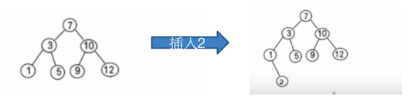
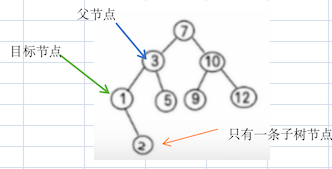
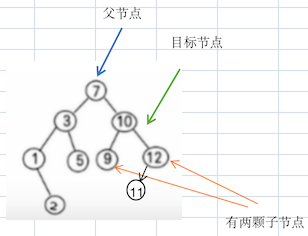

# 二叉排序树

给你一个数列 `7, 3, 10, 12, 5, 1, 9`，要求能够高效的完成对数据的查询和添加。

在 [为什么需要该数据结构](../10/01.md) 中讲解了数组、链表数据结构的优缺点，简单说：

- 数组访问快，增删慢

  新增或移除时，需要整体移动数据

- 链表增删快，访问慢

  只能从头开始遍历查找

那么利用 **二叉排序树（Binary Sort/Search Tree）**，既可以保证数据的检索速度，同时也可以保证数据的**插入**、**删除**、**修改**  的速度

## 二叉排序树介绍

 **二叉排序树（Binary Sort/Search Tree）**，简称 BST。

对于二叉排序树的任何一个 **非叶子节点**，要求如下：

- 左节点，比父节点小
- 右节点，比父节点大

特殊说明：如果有有相同的值，可以将该节点放在左节点或右节点。当然，最理想的是没有重复的值，比如 Mysql 中的 B 树索引，就是以主键 ID 来排序的。

比如对下面这个二叉树增加一个节点：



1. 从根节点开始，发现比 7 小，直接往左子树查找，相当于直接折半了
2. 比 3 小，再次折半
3. 比 1 大：直接挂在 1 的右节点

但是这里有一个疑问，如果添加元素为 4，不是应该挂在 3 的右侧吗？

## 创建与遍历

由于前面讲解了很多的二叉树知识点，添加和遍历相对简单，直接上代码

```java
package cn.mrcode.study.dsalgtutorialdemo.datastructure.binarysorttree;

import org.junit.Test;

/**
 * 二叉排序树
 */
public class BinarySortTreeTest {
    /**
     * 二叉排序树添加和遍历测试
     */
    @Test
    public void addTest() {
        BinarySortTree tree = new BinarySortTree();
        int[] arr = {7, 3, 10, 12, 5, 1, 9};
        for (int i = 0; i < arr.length; i++) {
            tree.add(new Node(arr[i]));
        }
        tree.infixOrder();
        int item = 2;
        tree.add(new Node(item));
        System.out.println("\n添加新节点：" + item + " 到二叉排序树中");
        System.out.println("添加之后的中序顺序：");
        tree.infixOrder();

        item = 4;
        tree.add(new Node(item));
        System.out.println("\n添加新节点：" + item + " 到二叉排序树中");
        System.out.println("添加之后的中序顺序：");
        tree.infixOrder();
    }
}

/**
 * 排序二叉树
 */
class BinarySortTree {
    Node root;

    /**
     * 添加节点
     *
     * @param node
     */
    public void add(Node node) {
        if (root == null) {
            root = node;
            return;
        }
        root.add(node);
    }

    /**
     * 中序遍历
     */
    public void infixOrder() {
        if (root == null) {
            return;
        }
        root.infixOrder();
    }
}

/**
 * 节点
 */
class Node {
    int value;
    Node left;
    Node right;

    public Node(int value) {
        this.value = value;
    }

    /**
     * 添加节点：按照排序二叉树的要求添加
     *
     * @param node
     */
    public void add(Node node) {
        if (node == null) {
            return;
        }
        // 如果添加的值小于当前节点，则往左走
        if (node.value < value) {
            // 左节点为空，则直接挂在上面
            if (left == null) {
                left = node;
            } else {
                // 否则继续往下查找
                left.add(node);
            }
        } else {
            // 往右走
            if (right == null) {
                right = node;
            } else {
                right.add(node);
            }
        }
    }

    /**
     * 中序遍历：刚好是从小到大的顺序
     */
    public void infixOrder() {
        if (left != null) {
            left.infixOrder();
        }
        System.out.println(value);
        if (right != null) {
            right.infixOrder();
        }
    }
}
```

输出测试

```
1
3
5
7
9
10
12

添加新节点：2 到二叉排序树中
添加之后的中序顺序：
1
2
3
5
7
9
10
12

添加新节点：4 到二叉排序树中
添加之后的中序顺序：
1
2
3
4
5
7
9
10
12
```

现在来回答这个疑问，如果添加元素为 4，不是应该挂在 3 的右侧吗？

看输出结果，没有做任何的判定，对于 中序来说就是从小到大的输出，所以这里针对的是 **某一颗子树**，是如下规则：

对于二叉排序树的任何一个 **非叶子节点**，要求如下：

- 左节点，比父节点小
- 右节点，比父节点大

**并不需要针对已经存在的节点进行调整。**

## 删除

由于节点只有 left 和 right，是单向节点，要删除一个节点：

1. 先找到这个要删除 **目标节点**

2. 找到这个目标节点的 **父节点**

   只有一种情况没有父节点，那就是目标节点就是 root 节点

找到父节点之后，我们才可以删掉目标节点，那么就有如下三类情况需要考虑：

1. 目标节点是 **叶子节点**

   

   1. 如果目标节点是 **父节点的 left 节点**，那么 left 置空
   2. 如果目标节点是 **父节点的 right 节点**，那么 rigt 置空

2. 目标节点有 **一颗子节点** left 或则 right，那么就需要将目标节点的子节点提升到目标节点位置上

   

   1. 如果目标节点是 **父节点 的 left 节点**，那么将 left 或 right 节点设置为 父节点的 left 节点
   2. 如果目标节点是 **父节点 的 right 节点**，那么将 left 或 right 节点设置为父节点的 right 节点

   简单说：因为目标节点有一颗子节点，将目标节点删除，将目标节点的子节点放到被删除的位置上。

3. 目标节点有 **两颗子节点**

   

   1. 以目标节点为根节点，**往右子树的**，**左子树**一直 **找到最小的节点**，删除它，并持有它
   2. 把 **目标节点** 从父节点的 left 或  right 中 **删掉**
      1. 删掉的位置：**替换上第 1 步中删掉的最小节点**。
      2. 将 **最小节点的 left 节点** 重置为 **目标节点的 left 节点**

   如上图所示：目标节点是 10

   ```
   1. 先往右侧为起点：12
   2. 再往左侧找，且一直往左侧找：11，这个时候  11 的左已经为空了，那么 11 就是最小节点
   3. 将 10 删掉
   4. 将 11 挂在原来 10 的位置
   5. 将 9 挂在 11 的 left 节点
   ```

以上描述，省略了需要判断目标节点是父的 left 还是 right 节点，因为涉及到你删除的时候，置空的是 父节点的 left 还是 right；这一步算是一个公共的描述步骤吧，重置的时候都需要，记得写代码的时候需要判断下。


