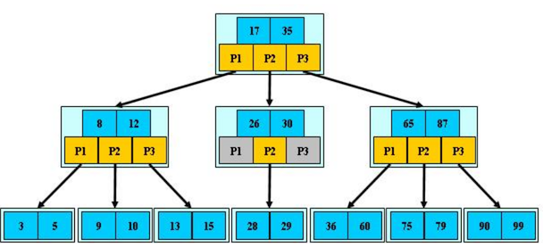
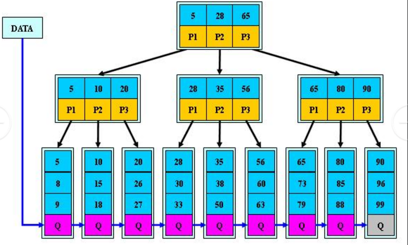
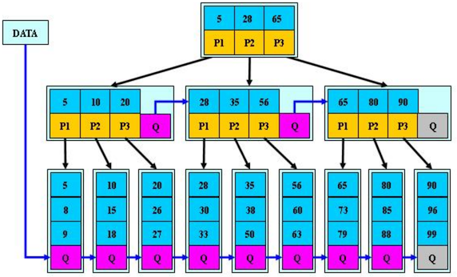

# `B 树`、`B+ 树`、`B*树`

## B 树

`B-tree` 树即 B 树，B 是 `Balanced` 平衡的意思。

::: tip

`B-` 树，这个也是 B 树，只是翻译的文本容易产生误解。

:::

上图就是一个 B 树，说明如下：

- B 树的阶：节点的最多 **子节点** 个数

  如：2-3 树的阶是 3，2-3-4 树的阶是 4

- B 树的搜索

  从 **根节点开始**，对节点内的关键字（有序）序列进行二分查找，如果命中则结束，否则进入查询关键字所属范围的 **儿子节点**。

  然后重复，直到所对应的儿子节点指针为空，或则已经是叶子节点。

- 关键字集合分布在整棵树中

  即：**叶子节点和非叶子节点都存放数据**

- 搜索有可能在非叶子节点结束

- 其搜索性能等价于在关键字全集内做一次二分查找

## B + 树

在 MySQL 中，有些索引就是用 B 树或则 B+ 树实现的。B+ 树是 B 树的变体，也是一种多路搜索树。

B + 树说明：

1. B+ 树的搜索与 B 树基本相同，区别是 **B+ 树只有到达叶子节点才命中**（B 树可以在非叶子节点命中），其性能也等价于在关键字全集做一次二分查找

2. 所有 **关键字都出现在叶子节点的链表中**

   即：数据只能在叶子节点，也叫 **稠密索引**，且链表中的关键字（数据）恰好是有序的。

3. 不可能在非叶子节点命中

4. **非叶子节点相当于是叶子节点的索引**，也叫 **稀疏索引**，叶子节点相当于是存储（关键字）数据的数据层

5. 更适合文件索引系统

6. B 树和 B+ 树有各自的应用场景，不能说 B+ 树完全比 B 树好。

B+ 树的这种设计，应该是类似分段思想，比如：`5,28,65`，下面存放三个节点：

- `5-28` 的段，为一个节点
- `28-65` 的段，为一个节点
- `65` 以上的段，为一个节点

比如查询  30 ，直接找到在第二个节点中，然后往下一个目录索引找，就很快能定位到数据。

## `B*` 树

`B*` 树是 B+ 树的变体，**在 B+ 树的非根和非叶子节点再增加指向兄弟的指针**

说明：

- `B*` 树定义了 **非叶子节点** 关键字个数至少为 `(2/3)*M` ，即块的最低使用率为 `2/3`，而 B+ 树的块的最低使用率为 B+ 树的 `1/2`

  M 是指树的度，也就是层。

- 从第 1 个特点，可以看出 `B*` 树分配新节点的概率比 B+ 树要低，空间使用率更高。

