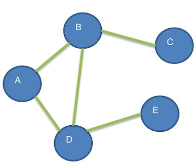
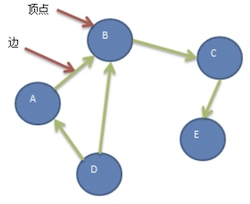

# 图的基本介绍

## 为什么要有图？

前面学过的 **线性表** 和 **树**：

- 线性表：局限于一个 **直接前驱** 和 一个 **直接后继** 的关系
- 树：只能有一个直接前驱（父节点）

当我们需要表示 **多对多** 的关系时，就需要用到图

## 图的举例说明

比如：城市交通图。他就是一个图，对应程序中的图如下所示

图是一种 **数据结构**，其中节点可以具有 **零个或多个相邻元素**，两个节点之间的链接称为 **边**，节点页可以称为 **顶点。**

## 图的常用概念

- 顶点（vertex）

- 边（edge）

- 路径：路径就是一个节点到达另一个节点所经过的节点连线

  `D -> C` 的路径就有两条（针对无向图来说）：

  - `D → B → C`
  - `D → A → B → C`

- 无向图：**顶点之间的连接没有方向**

  比如上图它是一个 **无向图**；比如 `A-B`，可以是 `A->B` 也可以是 `B <- A`
  
- 有向图：顶点之间的连接是有方向的。如下图

  

  那么 `A-B`，就只能是 `A → B`，而不能是 `B → A`

- 带权图：边有权值时，则叫做带权图，同时也叫 **网**

  

  比如上图中，北京 到 上海这一条边上有一个数值 1463，这个可能是他的距离，这种就叫做  边带权值

