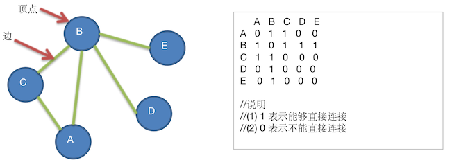

# 图的快速入门案例

要求用代码实现如下图结构



思路分析：

- 每一个顶点需要用一个容器来装，这里使用简单的 String 类型来表示  A、B ... 等节点
- 这些所有的顶点，我们用一个 List 来存储
- 它对应的矩阵使用一个二维数组来表示，节点之间的关系

代码实现：

```java
package cn.mrcode.study.dsalgtutorialdemo.datastructure.graph;

import org.junit.Test;

import java.util.ArrayList;
import java.util.List;

/**
 * 邻接矩阵 图
 */
public class GraphTest {
    @Test
    public void graphTest() {
        int n = 5;
        String vertexValue[] = {"A", "B", "C", "D", "E"};
        Grap grap = new Grap(n);
        for (String value : vertexValue) {
            grap.insertVertex(value);
        }
        // 设置顶点关系

        /*
        // A 与 C、B 直连
        grap.insertEdge(0, 1, 1);
        grap.insertEdge(0, 2, 1);

        // B 与 C、A、E、D 直连
        grap.insertEdge(1, 0, 1);
        grap.insertEdge(1, 2, 1);
        grap.insertEdge(1, 3, 1);
        grap.insertEdge(1, 4, 1);

        // C 与 B、A 直连
        grap.insertEdge(2, 0, 1);
        grap.insertEdge(2, 1, 1);

        // D 与 B 直连
        grap.insertEdge(3, 1, 1);

        // E 与 B 直连
        grap.insertEdge(4, 1, 1);
         */
        // 上面这种写法是双向的，由于内部已经处理过双向边了，所以只需要设置 5 条单向的即可
        // a,b  a,c  b,c  b,d  b,e
        grap.insertEdge(0, 1, 1);
        grap.insertEdge(0, 2, 1);
        grap.insertEdge(1, 2, 1);
        grap.insertEdge(1, 3, 1);
        grap.insertEdge(1, 4, 1);

        grap.showGraph();
        System.out.println("边：" + grap.getNumOfEdges());
        System.out.println("下标 1:" + grap.getValueByIndex(1));
    }

    class Grap {
        /**
         * 存放所有的顶点
         */
        private List<String> vertexs;
        /**
         * 矩阵：存放边的关系（顶点之间的关系）
         */
        private int[][] edges;
        /**
         * 存放有多少条边
         */
        private int numOfEdges = 0;

        /**
         * @param n 有几个顶点
         */
        public Grap(int n) {
            vertexs = new ArrayList<>(n);
            edges = new int[n][n];
        }
        /*
         *=============
         * 有两个核心方法：插入顶点，设置边的关系
         */

        /**
         * 插入顶点
         *
         * @param vertex
         */
        public void insertVertex(String vertex) {
            vertexs.add(vertex);
        }

        /**
         * 添加边的关系
         *
         * @param v1     第一个顶点对应的矩阵下标
         * @param v2     第二个顶点对应的矩阵下标
         * @param weight 他们之间的关系：0|不直连，1|直连
         */
        public void insertEdge(int v1, int v2, int weight) {
            edges[v1][v2] = weight;
            // 由于是无向图，反向也可以连通
            edges[v2][v1] = weight;
            numOfEdges++;  // 边增加 1
        }

        /*
         *=============
         * 下面写几个图的常用方法
         */

        /**
         * 获取顶点的数量
         */
        public int getNumOfVertex() {
            return vertexs.size();
        }

        /**
         * 获取边的数量
         *
         * @return
         */
        public int getNumOfEdges() {
            return numOfEdges;
        }

        /**
         * 根据下标获得顶点的值
         *
         * @param i
         * @return
         */
        public String getValueByIndex(int i) {
            return vertexs.get(i);
        }

        /**
         * 显示图的矩阵
         */
        public void showGraph() {
            System.out.printf("  ");
            for (String vertex : vertexs) {
                System.out.printf(vertex + " ");
            }
            System.out.println();
            for (int i = 0; i < edges.length; i++) {
                System.out.printf(vertexs.get(i) + " ");
                for (int j = 0; j < edges.length; j++) {
                    System.out.printf(edges[i][j] + " ");
                }
                System.out.println();
            }
        }
    }
}

```

首先编写了两个核心方法：插入顶点、设置边关系，其次编写了几个辅助获取信息的方法。

测试输出如下

```
  A B C D E 
A 0 1 1 0 0 
B 1 0 1 1 1 
C 1 1 0 0 0 
D 0 1 0 0 0 
E 0 1 0 0 0 
边：5
```

