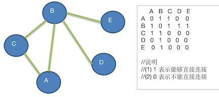

# 图的深度优先遍历介绍

所谓图的遍历，则是 **对节点的访问**。一个图有很多个节点，如何遍历这些节点，需要特定策略，一般有两种访问策略：

1. 深度优先遍历
2. 广度优先遍历

## 深度优先遍历基本思想

图的深度优先搜索（Depth First Search），简称 DFS。

从初始访问节点出发，初始访问节点可能有多个 **邻接节点**（直连），深度优先遍历的策略为：

- 首先访问第一个邻接节点
- 然后以这个 **被访问的邻接节点作为初始节点**
- 然后循环这个操作。

可以这样理解：每次都在访问完 **当前节点** 后，首先 **访问当前节点的第一个邻接节点**。

可以看到：这样的访问策略是 **优先往纵向** 挖掘深入，而 **不是** 对一个节点的所有邻接节点进行 **横向访问**。

那么显然深度优先搜索是一个 **递归过程**

## 深度优先遍历算法步骤

基本思想看完，可能还是不清楚是如何遍历的，看看他的遍历步骤：

1. 访问初始节点 v，并标记节点 v 为已访问
2. 查找节点 v 的第一个邻接（直连）节点 w
3. 如果节点 w 不存在，**则回到第 1 步**，然后从 v 的下一个节点继续
4. 如果节点 w 存在：
   1. 未被访问过，则对 w 进行深度优先遍历递归（即把 w 当做另一个 v，执行步骤 123）
   2. 如果已经被访问过：查找节点 v 的 w 邻接节点的下一个邻接节点，转到步骤 3



以上图作为例子：添加节点的顺序为 A、B、C、D、E。

1. 添加节点的顺序为 A、B、C、D、E。那么第一个初始节点就是 A

2. 访问 A，输出 A，并标记为已访问

3. 查找 A 的下一个邻接节点：

   从 `0，0` 开始找，直到找到 `0,1 = 1` 即 B，

   如果 B 没有被访问过，则以 B 为基础递归 B。

4. 递归：访问 B，输出 B，并标记为已访问

5. 查找 B 的下一个邻接节点：

   从 `1,0` 开始找，直到找到 `1,2 = 1` 即 C，

   如果 C 没有被访问过，则以 C 为基础递归 C

6. 递归：访问 C ，输出 C，并标记为已访问

7. 查找 C 的下一个邻接节点：

   从 `2,0` 开始找，找到 `2,4` 都没有找到有直连的；这里会退出递归 C，从而回到递归 B

8. 由于循环并未结束：会判断找到的 C，已经被访问过。则从 B 为基础查找下一个：

   也就是从 `1,2+1` 即 `1,3 = 1`，即 `B,D` B 直连 D

9. 递归访问 D，输出 D，并标记为已访问

   从 `3,0` 开始找，找到 `3,4` 都没有找到与 D 直连的下一个，则退出 D 递归

10. 回到了递归 B，由于循环未结束，会判断 D ，已经被访问过，则从 B 为基础查找下一个

    也就是从 `1,3+1` 即 `1,4 = 1` ，即 `B,E` B 直连 E

11. 递归访问 E，输出 E，并标记为已访问

12. 查找 E 的下一个节点，由于 E 是最后一个，退出递归 E，回到了递归 B

13. 回到了递归 B，由于循环未结束，会判断 E，已经被访问过，则从 B 为基础查找下一个，也未找到

14. 回到了递归 A，由于循环未结束，会判断 B，已经被访问过，则从 A 为基础查找下一个

    查找到 C，A 与 C 直连，由于 C 已经被访问过，则继续以 A 为基础查找下一个，把 A 可能链接的点查找完成，没有，则退出递归 A

15. 这时，**已经跳出了第一次初始点 A 的深度优先查找** ，按照插入顶点的顺序，下一个节点为 B，从 B 开始深度优先查找

    这里先判定：是否已经访问过，肯定已经访问过了，直接跳过 深度优先查找

16. 由于 B 已经被访问过，那么直接下一个 C，发现 C 也被访问过

17. 后面的都被访问过了，则直接完成。

思路小节：

1. 先从一个初始节点开发深度优先查找
2. 然后找到该节点的第一个邻接节点，找到则继续深度优先
3. 如果找不到，则会 **回溯**：那么尝试该节点的其他路径是否可以连通。
4. 直到回溯到最顶层，然后退出该次 **深度优先查找函数**。挑选下一个初始节点如果没有访问过，则调用深度优先函数

## 代码实现为

```java
        /**
         * 存放顶点是否已经访问过，下标对应顶点插入列表的下标
         */
        private boolean isVisiteds[];
       /**
         * 深度遍历
         */
        public void dfs() {
            for (int i = 0; i < vertexs.size(); i++) {
                // 如果已经访问过，则跳过
                if (isVisiteds[i]) {
                    continue;
                }
                // 没有访问过，则以此节点为基础进行深度遍历
                dfs(i);
            }
        }

        /**
         * 深度优先遍历
         *
         * @param i 当前是以，顶点插入列表中的哪一个顶点进行深度优先查找
         */
        public void dfs(int i) {
            // 输出自己，并标记为已访问过
            System.out.print(vertexs.get(i) + " -> ");
            isVisiteds[i] = true;

            // 查找此节点的第一个邻接节点
            int w = getFirstNeighbor(i);
            // 如果找到了 w ，则对 w 进行深度优先遍历
            while (w != -1) {
                // 已经访问过，
                if (isVisiteds[w]) {
                    w = getNextNeighbor(i, w);
                } else {
                    dfs(w);
                }
            }
        }

        /**
         * 查找第一个邻接节点
         *
         * @param i
         * @return 如果找到，则返回具体的下标
         */
        private int getFirstNeighbor(int i) {
            for (int j = i; j < vertexs.size(); j++) {
                if (edges[i][j] == 1) {
                    return j;
                }
            }
            return -1;
        }

        /**
         * 如果 w 节点被访问过，则查找 i 节点的下一个 邻接节点（就不是第一个节点了）
         *
         * @param i
         * @param w
         * @return
         */
        private int getNextNeighbor(int i, int w) {
            for (int j = w + 1; j < vertexs.size(); j++) {
                if (edges[i][j] == 1) {
                    return j;
                }
            }
            return -1;
        }
```

测试代码

```java

    @Test
    public void dfsTest() {
        int n = 5;
        String vertexValue[] = {"A", "B", "C", "D", "E"};
        Grap grap = new Grap(n);
        for (String value : vertexValue) {
            grap.insertVertex(value);
        }
        // a,b  a,c  b,c  b,d  b,e
        grap.insertEdge(0, 1, 1);
        grap.insertEdge(0, 2, 1);
        grap.insertEdge(1, 2, 1);
        grap.insertEdge(1, 3, 1);
        grap.insertEdge(1, 4, 1);
        grap.showGraph();

        System.out.println();
        grap.dfs();
    }
```


测试输出

```
  A B C D E 
A 0 1 1 0 0 
B 1 0 1 1 1 
C 1 1 0 0 0 
D 0 1 0 0 0 
E 0 1 0 0 0 

A -> B -> C -> D -> E ->
```

这里的难点，一定不要以为直接按照添加的顶点顺序输出就行，虽然这里结果看上去是添加的顶点顺序，实际上它是有查找第一个邻接节点，不存在则回溯到上一层，直到回溯到初始节点。 这里有一个回溯的流程。

简单总结如下：

1. 每次只找第一个邻接节点（纵向）
2. 找不到，则返回到上一层，上一层。然后开始 横向找非第一个邻接节点
3. 然后不断的找第一个，然后回溯（横向找下一个）。的流程

通过上面的例子，你可能会发现：在循环的时候，把 A 作为参数调用 深度优先搜索，整个图就遍历完成了，那为什么还需要外面一层循环呢？

这个问题你想象一下：你看一个地铁图的时候，假设有 2 个地铁站 G、H，没有和其他节点连接，只有 `G→H` 相连了，那么上面的列子，最外层的循环就起作用了。简单说就是：当一个点，不能间接的到达某一个点，那么就需要外层的这个循环来工作。