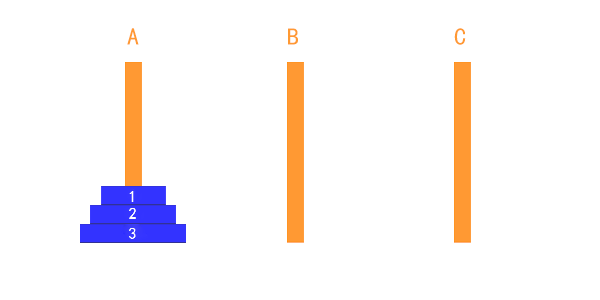

# 分治算法

## 介绍

**分治法** 是一种很重要的算法。字面上的解释是 **分而治之**，把一个复杂的问题 **分成两个或更多的相同或相似的子问题**，再把子问题分成更小的子问题.... **直到最后子问题可以简单的直接求解**，原问题的解即 **子问题的解的合并**。

这个技巧是很多高效算法的基础，比如 排序算法：[快速排序](../07/07.md)、[归并排序](../07/08.md)，傅里叶变换、快速傅里叶变换

分治算法可以 **求解的一些经典问题** 如：

- 二分搜索
- 大整数乘法
- 棋盘覆盖
- [快速排序](../07/07.md)
- [归并排序](../07/08.md)
- 线性时间选择
- 最接近点对问题
- 循环赛日程表
- 汉诺塔

刚刚看了下之前学过的快速排序和归并排序，他们不同也是难点在于如何把一个大问题 **分解** 成一个小问题进行 **解决**，然后再 **合并** 小问题的结果。

## 基本步骤

分治法在每一层递归上都有三个步骤：

- 分解：将原问题分解为若干个规模较小、相互独立、与原问题形式相同的子问题
- 解决：若子问题规模较小而容易被解决则直接解决，否则递归的解各个子问题
- 合并：将各个子问题的解合并为原问题的解

## 分治算法的设计模式

分治（Divide-and-Conquer(P)）的算法设计模式如下：

```java
if |P| ≤ n0
  then return (ADHOC(P))
// 将 P 分解为较小的子问题 P1,P2...Pk
for i ← to k
do yi ← Divide-and-Conquer(Pi) // 递归解决 pi
T ← MERGE(y1,y2,..yk)          // 合并子问题
return(T)
```

- `|P|`：表示问题 P 的规模

- `n0`：为阀值，表示当问题 P 的规模不超过 n0 时，问题已容易直接解出，不必再继续分解

- `ADHOC(P)` ：该分治法中的基本子算法，用于直接解小规模的问题 P

  因此，当 P 的规模不超过 n0 时，直接用 `ADHOC(P)` 求解。

- `MERGE(y1,y2,..yk)`：该分治法中的合并子算法，用于将 P 的子问题 P1、P2...Pk 的相应的解 y1、y2...yk 合并为 P 的解

## 实践-汉诺塔

### 汉诺塔的传说
汉诺塔（又称河内塔）问题是源于印度一个古老传说的益智玩具。大梵天创造世界的时候做了三根金刚石柱子，在一根柱子上从下往上按照大小顺序摞着 64 片黄金圆盘。大梵天命令婆罗门把圆盘从下面开始按大小顺序重新摆放在另一根柱子上。并且规定，在小圆盘上不能放大圆盘，在三根柱子之间一次只能移动一个圆盘。

假如每秒钟一次，共需多长时间呢？移完这些金片需要 5845.54 亿年以上，太阳系的预期寿命据说也就是数百亿年。真的过了 5845.54 亿年，地球上的一切生命，连同梵塔、庙宇等，都早已经灰飞烟灭。




如上图所示：

- 只有一个盘的时候：直接从 A → C
- 有两个盘的时候：
  1. A → B
  2. A → C
  3. B → C
- 有三个盘的时候：
  1. A → C
  2. A → B
  3. C → B
  4. A → C
  5. B → A
  6. B → C
  7. A → C

从以上步骤来看：

1. 当只有一个盘时，需要走 1 步
2. 当有两个盘时，需要走 3 步
3. 当有三个盘时，需要走 7 步

当有 3 个盘的时候，就很复杂了：

1. 我们就将最小问题规模限定为 1，只有一个盘时：A → C

2. 当有 `n ≥ 2` 的情况，我们总是可以看做是两个盘：

   

   1. 最下边的盘
   2. 最上边的盘

   那么执行两个盘的操作步骤：

   1. A → B：最上面的盘移动
   2. A → C：最下面的盘移动
   3. B → C：最上面的盘移动

```java
package cn.mrcode.study.dsalgtutorialdemo.algorithm.dac;

import org.junit.Test;

/**
 * 汉诺塔算法
 */
public class Hanoitower {
    /**
     * 汉诺塔算法
     *
     * @param num 有几个盘子
     * @param a   a 柱子
     * @param b   b 柱子
     * @param c   c 柱子
     */
    public void hanoiTower(int num, char a, char b, char c) {
        // 当只有一个盘时：直接从 a -> c
        if (num == 1) {
//            System.out.printf("第 1 个盘从 %s → %s \n", a, c);
            System.out.printf("第 %d 个盘从 %s → %s \n", num, a, c);
        } else {
            // 否则，始终看成只有两个盘
            // 1. 最上面的盘：a -> b, 中间会用到 c
            // 因为最小规模是只有一个盘的时候，直接移动到 c
            hanoiTower(num - 1, a, c, b);
            // 2. 最下面的盘：a -> c
            System.out.printf("第 %d 个盘从 %s → %s \n", num, a, c);
            // 3. 把 B 塔所有的盘，移动到 c：b -> c, 移动过程中使用到 a
            hanoiTower(num - 1, b, a, c);
        }
    }

    @Test
    public void han1() {
        hanoiTower(1, 'A', 'B', 'C');
    }

    @Test
    public void han2() {
        hanoiTower(2, 'A', 'B', 'C');
    }

    @Test
    public void han3() {
        hanoiTower(3, 'A', 'B', 'C');
    }

    @Test
    public void han4() {
        hanoiTower(4, 'A', 'B', 'C');
    }

    @Test
    public void han5() {
        hanoiTower(5, 'A', 'B', 'C');
    }
}

```

测试输出:

1 个盘

```
第 1 个盘从 A → C 
```

2 个盘

```
第 1 个盘从 A → B 
第 2 个盘从 A → C 
第 1 个盘从 B → C 
```

3 个盘

```
第 1 个盘从 A → C 
第 2 个盘从 A → B 
第 1 个盘从 C → B 
第 3 个盘从 A → C 
第 1 个盘从 B → A 
第 2 个盘从 B → C 
第 1 个盘从 A → C 
```

4 个盘

```
第 1 个盘从 A → B 
第 2 个盘从 A → C 
第 1 个盘从 B → C 
第 3 个盘从 A → B 
第 1 个盘从 C → A 
第 2 个盘从 C → B 
第 1 个盘从 A → B 
第 4 个盘从 A → C 
第 1 个盘从 B → C 
第 2 个盘从 B → A 
第 1 个盘从 C → A 
第 3 个盘从 B → C 
第 1 个盘从 A → B 
第 2 个盘从 A → C 
第 1 个盘从 B → C 
```

5 个盘

```
第 1 个盘从 A → C 
第 2 个盘从 A → B 
第 1 个盘从 C → B 
第 3 个盘从 A → C 
第 1 个盘从 B → A 
第 2 个盘从 B → C 
第 1 个盘从 A → C 
第 4 个盘从 A → B 
第 1 个盘从 C → B 
第 2 个盘从 C → A 
第 1 个盘从 B → A 
第 3 个盘从 C → B 
第 1 个盘从 A → C 
第 2 个盘从 A → B 
第 1 个盘从 C → B 
第 5 个盘从 A → C 
第 1 个盘从 B → A 
第 2 个盘从 B → C 
第 1 个盘从 A → C 
第 3 个盘从 B → A 
第 1 个盘从 C → B 
第 2 个盘从 C → A 
第 1 个盘从 B → A 
第 4 个盘从 B → C 
第 1 个盘从 A → C 
第 2 个盘从 A → B 
第 1 个盘从 C → B 
第 3 个盘从 A → C 
第 1 个盘从 B → A 
第 2 个盘从 B → C 
第 1 个盘从 A → C 
```

盘子越大编号越小，上面的第 n 个盘是和盘子大小对应的。

代码简单，但是这个为什么会实现这种效果，笔者还是看得很懵逼。最主要的是如何分解，学算法是要理解它的思想。

这里主要的难点在于：

1. 分解到只有 1 个盘子时，才会移动第一步
2. 每次分解，那个 a、b、c 代表的柱子，完全不一样

靠脑袋去分析这个流程很难，只能当问题规模足够小的时候，比如只有 1 个盘子，只有 2 个盘子时，你还很容易分清楚，多了递归下去，你就搞不懂了

