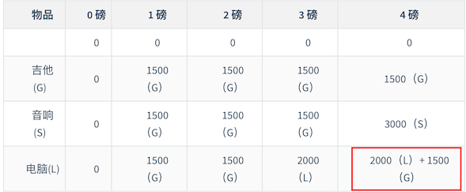

# 动态规划算法

## 应用场景：背包问题

有一个背包，容量为 4 磅，现有物品如下：

| **物品** | **重量** | **价格** |
| :------: | :------: | :------: |
| 吉他(G)  |    1     |   1500   |
| 音响(S)  |    4     |   3000   |
| 电脑(L)  |    3     |   2000   |

要求：

1. 达到的目标为装入的背包的总价值最大，并且重量不超出
2. 装入的物品不能重复

## 介绍

**动态规划（Dynamic Programming）**算法的核心思想是：将大问题划分为小问题进行解决，从而一步步获取最优解的处理算法

动态规划算法 **与分治算法类似**，其基本思想也是将待求解问题分解成若干个子问题，先求解子问题，然后从这些子问题的解得到原问题的解。

**与分治法不同的是**，适合于用动态规划求解的问题，**经分解得到子问题往往不是互相独立的**。 ( 即 **下一个子阶段的求解是建立在上一个子阶段的解的基础上**，进行进一步的求解 )

动态规划可以通过 **填表的方式** 来逐步推进，得到最优解.

## 思路和图解

背包问题主要是指一个给定容量的背包、若干具有一定价值和重量的误判，如何选择误判放入背包使误判的价值最大。其中又分：

- 01 背包：放入物品不能重复

- 无限背包：放入物品可重复

  无限背包可以转化成 01 背包。

想要解决一个问题，你首先得有思想，然后转化成公式或规律，最后转化成你的程序。

算法的主要思想：利用动态规划来解决。每次遍历到的第 i 个物品，根据 `w[i]` 和 `v[i]` 来确定是否需要将该物品放入背包中。即设：

- n ： 给定了 n 个物品

- `w[i]`：第 i 个商品的重量

- `v[i]`：第 i 个商品的价值

- `c`：为背包的容量

- `v[i][j]`：表示在前 i 个物品中能够装入容量为 j 的背包中的最大价值

  假设当前已经放了 i 个物品在背包中，那么当前背包的容量为 j，能够放进去的容量用 `v[i][j]` 表示

则有下面的结果：

1. `v[i][0] = v[0][j]=0`
2. 当 `w[i] > j `时：`v[i][j] = v[i - 1][j]`
3. 当 `j ≥ w[i]` 时：`v[i][j] = max{v[i - 1][j] , v[i - 1][j - w[i]] + v[i]}`

以上思路和公式，现在肯定看不懂，下面使用填表法来逐步推导出这个规律和公式。

给定的商品如下：

| **物品** | **重量** | **价格** |
| :------: | :------: | :------: |
| 吉他(G)  |    1     |   1500   |
| 音响(S)  |    4     |   3000   |
| 电脑(L)  |    3     |   2000   |

初始表格为：

| **物品** | 0 磅 | 1 磅 | 2 磅 | 3 磅 | 4 磅 |
| :------: | :--: | :--: | :--: | :--: | :--: |
| 没有物品 |  0   |  0   |  0   |  0   |  0   |
| 吉他(G)  |  0   |      |      |      |      |
| 音响(S)  |  0   |      |      |      |      |
| 电脑(L)  |  0   |      |      |      |      |

- 第 1 行：是没有任何物品：那么它在任何背包容量下，都是 0 磅
- 第 1 列：是当背包容量为 0 时，那么它是无法装入任何物品的，所以都是 0

1. 现在假如只有吉他可以放：

  | **物品** | 0 磅 |   1 磅    |   2 磅    |   3 磅    |   4 磅    |
  | :------: | :--: | :-------: | :-------: | :-------: | :-------: |
  |          |  0   |     0     |     0     |     0     |     0     |
  | 吉他(G)  |  0   | 1500（G） | 1500（G） | 1500（G） | 1500（G） |
  | 音响(S)  |  0   |           |           |           |           |
  | 电脑(L)  |  0   |           |           |           |           |

  现在只有一把吉他可以放，所以不管背包的容量有多大，它都只能放一把吉他进去（01 背包），所以 4 个容量都为 `1500(G)`

2. 上面已经放了一把吉他，现在开始尝试放音响：

  | **物品** | 0 磅 |   1 磅    |   2 磅    |   3 磅    |   4 磅    |
  | :------: | :--: | :-------: | :-------: | :-------: | :-------: |
  |          |  0   |     0     |     0     |     0     |     0     |
  | 吉他(G)  |  0   | 1500（G） | 1500（G） | 1500（G） | 1500（G） |
  | 音响(S)  |  0   | 1500（G） | 1500（G） | 1500（G） | 3000（S） |
  | 电脑(L)  |  0   |           |           |           |           |

  - 当背包容量只有 1 磅时：音响重 4 磅，放不进去

    那么从上一个单元格复制物品下来，也就是 `1500(G)` 吉他

  - 类似的：当背包只有 2、3 磅时，也是放不下音响的

    那么从上一个单元格复制物品下来，也就是 `1500(G)` 吉他

  - 当背包容量有 4 磅时：可以放下音响了

    需要考虑当前音响放进去的价值，是否大于上一个单元格（子问题的解依赖于上一个子问题的解）
    
    这里是 3000 > 1500，那么此时 4 磅的格子中就放入了 `3000(S)` 音响

3. 现在开始尝试放电脑：

  | **物品** | 0 磅 |   1 磅    |   2 磅    |   3 磅    |         4 磅         |
  | :------: | :--: | :-------: | :-------: | :-------: | :------------------: |
  |          |  0   |     0     |     0     |     0     |          0           |
  | 吉他(G)  |  0   | 1500（G） | 1500（G） | 1500（G） |      1500（G）       |
  | 音响(S)  |  0   | 1500（G） | 1500（G） | 1500（G） |      3000（S）       |
  | 电脑(L)  |  0   | 1500（G） | 1500（G） | 2000（L） | 2000（L）+ 1500（G） |

  - 当背包容量只有 1、2 磅时：电脑重量 3 磅，放不进去

    那么从上一个单元格复制物品下来，也就是 `1500(G)` 吉他

  - 当背包容量只有 3 磅时：可以放下电脑了

    需要考虑当前电脑放进去的价值，是否大于上一个单元格。
    
    2000  > 1500，那么就放入 `2000(L)` 电脑。
    
  - 当背包容量只有 4 磅时：此时如果不考虑程序实现，认为填表的话

    可以放 `2000（L）+ 1500（G）` 的电脑和吉他

   

表填完，下面再来看公式的含义：

1. `v[i][0] = v[0][j]=0`

   表示表中的第一行和第一列是 0；

   i：表示商品

   j：表示当前背包的容量

   那么 `v[i][j]` 表示在前 i 个物品中能够装入容量为 j 的背包中的最大价值

   比如 `v[i][j]` → `v[2][1]` ，也就是下图中红框部分，在 1 磅的背包容量中，可选择放入的商品有吉他和音响，那么此时背包中可放入商品的最大价值为  1500，也就是只能放入一把吉他

   

2. 当 `w[i] > j `时：`v[i][j] = v[i-1][j]`

   `w[i]` 是第 i 个商品的重量，j 是当前背包的容量。

    当要放入的第 i 个商品的重量大于 当前背包的容量时，表示不能把当前的商品放入，则直接使用上一个单元格的装入策略

3. 当 `j ≥ w[i]` 时：`v[i][j] = max{v[i - 1][j],v[i - 1][j - w[i]] + v[i]}`

   

   当当前背包容量可以装入第 i 个商品的时候：

   - `v[i - 1][j]`：**上一个格子** 的商品存放策略 **总价值**

     当前背包重量为 `j=4`，商品下表为 `3`

     上一个格子的商品存放策略总价值 `v[3-1][4] = v[2][4]` 也就是 `3000(S)`

   - `v[i]`：当前商品的价值

     也就是 `v[3]` 电脑的价值为 2000

   - `[j - w[i]`：当前背包的重量 - 第 i 个商品的重量，也就是 **剩余背包容量**

     比如上图红框中：当前背包重量为 4，当前尝试放入的商品重量是电脑的重量为 3，则`4-3 = 1`，当前商品存放之后，还剩余 1 磅的背包可以装东西

   - `v[i - 1][j - w[i]] + v[i]`： **剩余空间商品总价值 + 当前商品总价值**

     `v[3-1][4-3] + v[3]   = v[2][1] + v[3]` 也就是：

     - `v[2][1]`：1500(G)，剩余空间放置的商品价值
     - `v[3]`：2000(L) ，当前商品所占的价值

   - `max{v[i - 1],v[i - 1][j - w[i]] + v[i]}`

     也就是 `max(3000,1500+2000)` 结果为 3500

   上述步骤推导下来，就是上面红框中的结果。即： 

   - `j ≥ w[i]`：当前背包存放地 i 个商品后，还有剩余空间容量
   - `v[i][j] = max{v[i - 1][j],v[i - 1][j - w[i]] + v[i]}`：当前格子价值 = `max(上一个格子存放商品的总价值,剩余空间商品总价值+当前商品总价值)`

好了，那么对于这个公式，由填表法推导出来的，为什么需要 **没有物品** 和 **0 磅** 来占位？

在公式计算中，如 `j - w[i]` → `4-w[3]`

- j 表示当前的背包容量，也是数组中的下标，如上：4 表示第 4 列，是容量为 4 磅的背包
- `w[i]` 中的 i 表示是第几个商品，`w[3]`，表示第 3 行，也就是电脑这个商品，的重量是 3

所以，纯粹只是为了对应。

 ## 代码实现

```java
package cn.mrcode.study.dsalgtutorialdemo.algorithm.dynamic;

import org.junit.Test;

import java.util.Arrays;

/**
 * 动态规划
 */
public class KnapsackProblem {
    /**
     * 填表法：输出填表后的信息
     */
    @Test
    public void table() {
        // 商品价值和重量前面都有一个 0 ，方便后续的公式写法
        int[] val = {0, 1500, 3000, 2000};  // 商品价值
        int[] w = {0, 1, 4, 3}; // 商品对应重量
        int m = 4; // 背包容量
        int n = val.length; // 物品个数
        // 构建初始表格， +1 是因为有一行列和行都是 0
        // v[i][j] 存放的是：前 i 个物品中能够装入容量为 j 的背包中的最大价值
        int[][] v = new int[n][m + 1];

        // 1. 初始化  v[i][0] = v[0][j]=0
        //    本程序中，可以不初始化，默认就是 0
        //    为了体现步骤，进行初始化（有可能在你的场景中有其他的含义）
        // 为了与默认值 0 区分开，看出初始化效果，这里默 0 定义为 -1
        // 验证之后，修改回 0，否则在计算上一个格子的时候，就会导致计算错误
        int zero = 0;
        for (int i = 0; i < v.length; i++) {
            for (int j = 0; j < v[0].length; j++) {
                v[i][0] = zero; // 初始化第一列为 0
                v[0][i] = zero; // 初始化第一行为 0
            }
        }
        print(v);

        // 开始填表：动态规划处理
        for (int i = 1; i < v.length; i++) {  // 第一行 0 不处理，从 1 开始
            // 一个商品一个容量进行尝试
            for (int j = 1; j < v[0].length; j++) { // 第一列 0 不处理，从 1 开始
                // 当当前物品重量大于，背包限定重量时：
                //   当前背包容量，可存放最大的商品价值为：前一格子中的存放策略总价值
                if (w[i] > j) {
                    v[i][j] = v[i - 1][j];
                }
                // 当当前背包容量 大于 当前物品重量时：
                //      说明：还有空余空间存放其他产品
                else {
                    // max{v[i - 1][j],v[i - 1][j - w[i]] + v[i]}`
                    int pre = v[i - 1][j]; // 前一个格子中存放策略总价值
                    int curr = val[i]; // i当前商品总价值
                    int free = v[i - 1][j - w[i]];  // 存放完当前商品后，剩余空间能存放的总价值
                    // 当前格子：只会存放比上一个格子总价值大的策略价值
                    v[i][j] = Math.max(pre, curr + free);
                }
            }
        }
        System.out.println("动态规划后");
        print(v);
    }

    /**
     * 打印填表信息
     *
     * @param table
     */
    private void print(int[][] table) {
        for (int i = 0; i < table.length; i++) {
            System.out.println(Arrays.toString(table[i]));
        }
    }
}

```

测试输出

```
[0, 0, 0, 0, 0]
[0, 0, 0, 0, 0]
[0, 0, 0, 0, 0]
[0, 0, 0, 0, 0]
动态规划后
[0, 0, 0, 0, 0]
[0, 1500, 1500, 1500, 1500]
[0, 1500, 1500, 1500, 3000]
[0, 1500, 1500, 2000, 3500]
```

这里只是把表中最大价值，规划出来了，但是不知道那个格子中，存放的是什么商品。

```java
 /**
     * 填表法：输出填表后的信息,包括最优存放的商品信息
     */
    @Test
    public void tableAndProduct() {
        // 商品价值和重量前面都有一个 0 ，方便后续的公式写法
        int[] val = {0, 1500, 3000, 2000};  // 商品价值
        int[] w = {0, 1, 4, 3}; // 商品对应重量
        int m = 4; // 背包容量
        int n = val.length; // 物品个数
        // 构建初始表格， +1 是因为有一行列和行都是 0
        // v[i][j] 存放的是：前 i 个物品中能够装入容量为 j 的背包中的最大价值
        int[][] v = new int[n][m + 1];

        int zero = 0;
        for (int i = 0; i < v.length; i++) {
            for (int j = 0; j < v[0].length; j++) {
                v[i][0] = zero; // 初始化第一列为 0
                v[0][i] = zero; // 初始化第一行为 0
            }
        }
        print(v);

        // 用于存放每个格子中保存的商品
        int[][] path = new int[n][m + 1];

        // 开始填表：动态规划处理
        for (int i = 1; i < v.length; i++) {  // 第一行 0 不处理，从 1 开始
            // 一个商品一个容量进行尝试
            for (int j = 1; j < v[0].length; j++) { // 第一列 0 不处理，从 1 开始
                // 当当前物品重量大于，背包限定重量时：
                //   当前背包容量，可存放最大的商品价值为：前一格子中的存放策略总价值
                if (w[i] > j) {
                    v[i][j] = v[i - 1][j];
                }
                // 当当前背包容量 大于 当前物品重量时：
                //      说明：还有空余空间存放其他产品
                else {
                    // max{v[i - 1][j],v[i - 1][j - w[i]] + v[i]}`
                    int pre = v[i - 1][j]; // 前一个格子中存放策略总价值
                    int curr = val[i]; // i当前商品总价值
                    int free = v[i - 1][j - w[i]];  // 存放完当前商品后，剩余空间能存放的总价值
                    // 当前格子：只会存放比上一个格子总价值大的策略价值
//                    v[i][j] = Math.max(pre, curr + free);
                    // 当需要存放新的策略时，标记当前路径
                    if (pre < curr + free) {
                        v[i][j] = curr + free;
                        path[i][j] = 1;
                    } else {
                        v[i][j] = pre;
                    }
                }
            }
        }
        System.out.println("动态规划后");
        print(v);

        System.out.println("存放路径");
        print(path);

        System.out.println("提取最优商品存放信息");
        int i = path.length - 1; // 行的最大下标
        int j = path[0].length - 1; // 列的最大下标
        // 从 path 最后开始往前找
        while (i > 0 && j > 0) {
            if (path[i][j] == 1) {
                System.out.printf("第 %d 个商品放入背包，坐标[%d,%d] \n", i, i, j);
                // 当前格子商品组成为：当前商品重量 + 剩余重量
                // 所以：要重置 j 为剩余重量
                j = j - w[i];
            }
            i--; // 找完一行，则减少一行，往前面找
        }
    }
```

测试输出

```
[0, 0, 0, 0, 0]
[0, 0, 0, 0, 0]
[0, 0, 0, 0, 0]
[0, 0, 0, 0, 0]
动态规划后
[0, 0, 0, 0, 0]
[0, 1500, 1500, 1500, 1500]
[0, 1500, 1500, 1500, 3000]
[0, 1500, 1500, 2000, 3500]
存放路径
[0, 0, 0, 0, 0]
[0, 1, 1, 1, 1]
[0, 0, 0, 0, 1]
[0, 0, 0, 1, 1]
# 上面的存放路径为：
#   1 的则表示，在那个格子里面存放了自己的商品进去的
#   0 的则表示，当前的商品无法存入到这个背包中，使用的是前一个格子的商品存放策略

提取最优商品存放信息
第 3 个商品放入背包，坐标[3,4] 
第 1 个商品放入背包，坐标[1,1] 
```

然后看存入商品的信息的坐标，价值是 3500：

- 首先把 电脑 2000 存入进去，剩余重量只有 1 了
- 那么就去找背包重量为 1 的格子，限定在第 1 列上面了，那么就只有 1,1 符合，也就定位了商品

## 封装成函数后，任意测试

```java
 // 封装成方法，测试更多的商品
    @Test
    public void tableAndProduct2() {
        int[] val = {0, 1500, 3000, 2000, 200};  // 商品价值
        int[] w = {0, 1, 4, 3, 1}; // 商品对应重量
        int m = 5; // 背包容量
        knapsackProblem(val, w, m);
    }

    /**
     * 背包问题：动态规划
     *
     * @param val 商品价值，第 0 个为没有商品
     * @param w   商品重量，第 0 个为没有重量
     * @param m   背包容量
     */
    public void knapsackProblem(int[] val, int[] w, int m) {
        // 商品价值和重量前面都有一个 0 ，方便后续的公式写法
        int n = val.length; // 物品个数
        // 构建初始表格， +1 是因为有一行列和行都是 0
        // v[i][j] 存放的是：前 i 个物品中能够装入容量为 j 的背包中的最大价值
        int[][] v = new int[n][m + 1];

        int zero = 0;
        for (int i = 0; i < v.length; i++) {
            for (int j = 0; j < v[0].length; j++) {
                v[i][0] = zero; // 初始化第一列为 0
                v[0][i] = zero; // 初始化第一行为 0
            }
        }
        print(v);

        // 用于存放每个格子中保存的商品
        int[][] path = new int[n][m + 1];

        // 开始填表：动态规划处理
        for (int i = 1; i < v.length; i++) {  // 第一行 0 不处理，从 1 开始
            // 一个商品一个容量进行尝试
            for (int j = 1; j < v[0].length; j++) { // 第一列 0 不处理，从 1 开始
                // 当当前物品重量大于，背包限定重量时：
                //   当前背包容量，可存放最大的商品价值为：前一格子中的存放策略总价值
                if (w[i] > j) {
                    v[i][j] = v[i - 1][j];
                }
                // 当当前背包容量 大于 当前物品重量时：
                //      说明：还有空余空间存放其他产品
                else {
                    // max{v[i - 1][j],v[i - 1][j - w[i]] + v[i]}`
                    int pre = v[i - 1][j]; // 前一个格子中存放策略总价值
                    int curr = val[i]; // i当前商品总价值
                    int free = v[i - 1][j - w[i]];  // 存放完当前商品后，剩余空间能存放的总价值
                    // 当前格子：只会存放比上一个格子总价值大的策略价值
//                    v[i][j] = Math.max(pre, curr + free);
                    // 当需要存放新的策略时，标记当前路径
                    if (pre < curr + free) {
                        v[i][j] = curr + free;
                        path[i][j] = 1;
                    } else {
                        v[i][j] = pre;
                    }
                }
            }
        }
        System.out.println("动态规划后");
        print(v);

        System.out.println("存放路径");
        print(path);

        System.out.println("提取最优商品存放信息");
        int i = path.length - 1; // 行的最大下标
        int j = path[0].length - 1; // 列的最大下标
        // 从 path 最后开始往前找
        while (i > 0 && j > 0) {
            if (path[i][j] == 1) {
                System.out.printf("第 %d 个商品放入背包，坐标[%d,%d] \n", i, i, j);
                // 当前格子商品组成为：当前商品重量 + 剩余重量
                // 所以：要重置 j 为剩余重量
                j = j - w[i];
            }
            i--;
        }
    }
```

输出信息

```
[0, 0, 0, 0, 0, 0]
[0, 0, 0, 0, 0, 0]
[0, 0, 0, 0, 0, 0]
[0, 0, 0, 0, 0, 0]
[0, 0, 0, 0, 0, 0]
动态规划后
[0, 0, 0, 0, 0, 0]
[0, 1500, 1500, 1500, 1500, 1500]
[0, 1500, 1500, 1500, 3000, 4500]
[0, 1500, 1500, 2000, 3500, 4500]
[0, 1500, 1700, 2000, 3500, 4500]
存放路径
[0, 0, 0, 0, 0, 0]
[0, 1, 1, 1, 1, 1]
[0, 0, 0, 0, 1, 1]
[0, 0, 0, 1, 1, 0]
[0, 0, 1, 0, 0, 0]
提取最优商品存放信息
第 2 个商品放入背包，坐标[2,5] 
第 1 个商品放入背包，坐标[1,1] 
```

最终可以看到，需要根据它的存入路径来查找，比如：

```
[0, 0, 0, 0, 0, 0]
[0, 1, 1, 1, 1, 1]
[0, 0, 0, 0, 1, 1]
[0, 0, 0, 1, 1, 0]
[0, 0, 1, 0, 0, 0]
```

1. 先把第一行（有第 0 行）也就是第一个商品，尝试放到不同容量的背包中
2. 然后尝试把剩余的商品挨个放到背包中，最重要的是：**基于前面已经放过的结果，判定是否可以放进去**
3. 基于前面的结果：
   - 可以放进去：表示容量至少能放进当前这个产品，路径中用 1 表示
   - 不可放进去：表示容量不能放进去当前这个产品，路径中用 0 表示
4. 那么再基于最后的价值最高的，找到放进去过产品的路径，就完成了。