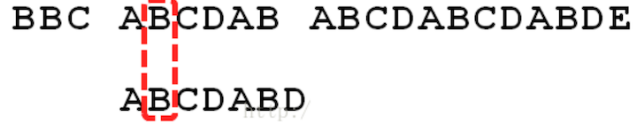
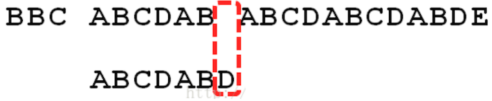
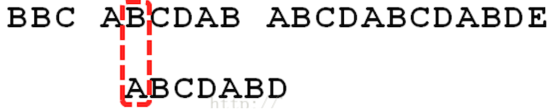
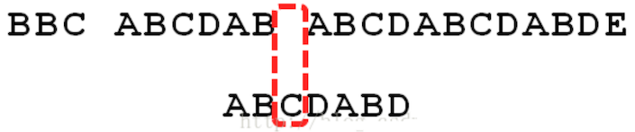
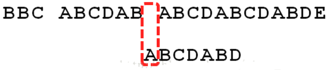
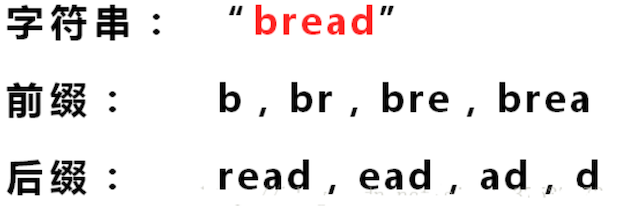

# KMP 算法

## 应用场景-字符串匹配问题

```java
str1 = "硅硅谷 尚硅谷你尚硅 尚硅谷你尚硅谷你尚硅你好"
str2 = "尚硅谷你尚硅你"
```

求：str2 在 str1 中是否存在，如果存在，返回第一次出现的位置，如果没有则返回 -1

## 暴力匹配

### 思路

假设 str1 匹配到 i 位置，子串 str2 匹配到 j 位置，则：

1. 如果当前字符匹配成功（`str1[i] == str2[j]`）

   则 `i++`、`j++` 继续匹配下一个字符

2. 如果失败（`str1[i] != str2[j]`）则：

   ```
   i = i-(j-1)
   j = 0
   ```

   相当于每次匹配失败时， i 回溯，j 被重置为 0，例如

   ```bash
          						↓ i = 10
   str1 = "硅硅谷 尚硅谷你尚硅 尚硅谷你尚硅谷你尚硅你好"
   str2 = "      尚硅谷你尚硅你"
   								↑ j = 6
   发现 空格≠你，则 i 被回溯：i = i - (j-1) : 
   i = 10 - (6-1) = 10 - 5 = 5
   					 ↓ 回溯到这里，i=5		
   str1 = "硅硅谷 尚硅谷你尚硅 尚硅谷你尚硅谷你尚硅你好"
   str2 = "        尚硅谷你尚硅你"
   				    ↑ j = 0
   
   为什么要回溯到 5 的位置？当 i=4 时，直到 i=10，才不匹配
   i 回溯时，相当于匹配失败，只前进 1 个字符串，然后再重新匹配。
   
   ================= 如果不回溯 ========================
   如果失败的时候不回溯到最前面，直接从失败的地方开始匹配
          						            ↓ i = 17
   str1 = "硅硅谷 尚硅谷你尚硅 尚硅谷你尚硅谷你尚硅你好"
   str2 = "                 尚硅谷你尚硅你"
   								            ↑ j = 6
   那么下一次再继续匹配，则从 18 开始了，就永远都匹配不上：
          						             ↓ i = 18
   str1 = "硅硅谷 尚硅谷你尚硅 尚硅谷你尚硅谷你尚硅你好"
   str2 = "                             尚硅谷你尚硅你"
   								            ↑ j = 6
   
   ================= 回溯匹配 - 成功 ========================
          						        ↓ i = 15
   str1 = "硅硅谷 尚硅谷你尚硅 尚硅谷你尚硅谷你尚硅你好"
   str2 = "                        尚硅谷你尚硅你"
   														 ↑ j = 6
   
   ```

可以看到：暴力方法解决会有 **大量的回溯**，每次只移动一位，若是不匹配，移动到下一位接着判断匹配，浪费了大量的时间。

### 代码实现

```java
package cn.mrcode.study.dsalgtutorialdemo.algorithm.kmp;

import org.junit.Test;

/**
 * 暴力匹配
 */
public class ViolenceMatch {
    /**
     * 暴力匹配
     *
     * @param str1 要匹配的文本
     * @param str2 关键词
     * @return
     */
    public int violenceMatch(String str1, String str2) {
        char[] s1 = str1.toCharArray();
        char[] s2 = str2.toCharArray();

        int s1Len = s1.length;
        int s2Len = s2.length;

        int i = 0; // 指向 s1 中正在匹配的位置
        int j = 0; // 执行 s2 中正在匹配的位置
        while (i < s1Len && j < s2Len) {
            // 如果相等，则让两个指针都往前移动
            if (s1[i] == s2[j]) {
                i++;
                j++;
            } else {
                // 当不匹配的时候
                // j 重置为 0，子串要重新匹配
                i = i - (j - 1);
                j = 0;
            }
        }
        // 如果找到，则返回当前索引
        // 因为在匹配过程中，没有匹配上 j 就重置为 0 了
        if (j == s2Len) {
            // 返回匹配开始的字符
            return i - j;
        }
        return -1;
    }

    /**
     * 测试匹配上
     */
    @Test
    public void fun1() {
        String str1 = "硅硅谷 尚硅谷你尚硅 尚硅谷你尚硅谷你尚硅你好";
        String str2 = "尚硅谷你尚硅你";
        System.out.println(violenceMatch(str1, str2));
    }

    /**
     * 测试匹配失败
     */
    @Test
    public void fun2() {
        String str1 = "硅硅谷 尚硅谷你尚硅 尚硅谷你尚硅谷你尚硅你好";
        String str2 = "尚硅谷你尚硅你x";
        System.out.println(violenceMatch(str1, str2));
    }
}

```

测试输出

```
15	 # 测试匹配成功

-1   # 测试匹配失败
```

## KMP 介绍

KMP 是一个解决 **模式串在文本串中是否出现过**，如果出现过，则最早出现的位置的经典算法。

Knuth-Morris-Pratt **字符串查找算法**，简称 KMP 算法：**常用与在一个文本字符串 s 内查找一个模式串 P 的出现位置**。

该算法由 Donald Knuth、Vaughan Pratt、James H. Morris 三人于 1977 年联合发表，故取这 3 人的姓氏命名此算法.

KMP 方法利用 **之前判断过的信息**，通过一个 next 数组，保存模式串中前后最长公共子序列的长度，每次回溯时，通过 next 数组找到前面匹配过的位置，省去了大量的计算时间。

```
					 ↓ 回溯到这里，i=5		
str1 = "硅硅谷 尚硅谷你尚硅 尚硅谷你尚硅谷你尚硅你好"
str2 = "        尚硅谷你尚硅你"
				    ↑ j = 0
```

匹配到了 `i=4 到 i=9` 都是匹配的，失败则 `i+1 = 5`，那么 `i5 == j0` 必然会失败！前面有 5 个都成功了。 KMP 就是为了跳过这种已经匹配过，又必然会失败的操作。

参考资料，[写得很详细](https://www.cnblogs.com/zzuuoo666/p/9028287.html)

### KMP 思路分析

以下面的字符串来举例：

```java
Str1 = "BBC ABCDAB ABCDABCDABDE"
Str2 = "ABCDABD"
```

1. 都用第 1 个字符进行比较，不符合，关键词（文本串）向后移动一位

   

2. 重复第一步，还是不符合，再后移动

   

3. 一直重复，直到 str1 有一个字符与 str2 的第一个字符匹配为止

   

4. 接着比较字符串和搜索词的下一个字符，还是符合

   

5. 遇到 st1 有一个字符与 str2 对应的字符不符合时

   

6. 这时候：想到的是继续遍历 st1 的下一个字符（也就是暴力匹配）

   

   这时，就出现一个问题：

   

   此时回溯时，A 还会去和 `BCD` 进行比较，而在上一步 ABCDAB 与 ABCDABD，前 6 个都相等，其中 BCD 搜索词的第一个字符 A 不相等，那么这个时候还要用 A 去匹配 `BCD`，这肯定会匹配失败。

   KMP 算法的想法是：设法利用这个已知信息，不要把「搜索位置」移回已经比较过的位置，继续把它向后移，这样就提高了效率。

   那么新的问题就来了：你如何知道 A 与 BCD 不相同，并且只有 BCD 不用比较呢？这个就是 KMP 的核心原理了。
   
7. KMP 利用 **部分匹配表**，来省略掉刚刚重复的步骤。

   

    上表是这样看的：

   1. ABCD 匹配值 0
   2. ABCDA 匹配值 1
   3. ABCDAB 匹配值 2

   至于如何产生的这个部分匹配表，下面专门讲解，这里你要知道的是，KMP 利用这个 **部分匹配表** 可以省略掉重复的步骤

8. 已知空格与 D 不匹配时，前面 6 个字符 `ABCDAB` 是匹配的。

   

   查表可知：**部分匹配值是 2**，因此按照下面的公司计算出后移的位数：

   ```
   移动位数 = 已匹配的字符数 - 对应的部分匹配值
    4      =    6		  -   2
   ```
   因此回溯的时候往后移动 4 位，而不是暴力匹配移动的 1 位。
   
9. 因为空格与 C 不匹配

   
   
   搜索词还要继续往后移动，这时，已匹配的字符树数为 2 （`AB`），对应的 **部分匹配值** 为 0，所以 `移动位数 = 2 - 0 = 2`，于是将搜索词（文本串）向后移动两位
   
   
   
10. 因为空格与 A 不匹配，继续往后移动一位

11. 此时：部分匹配表已用完，需要一位一位进行匹配

    

    直到发现 C 与 D 不匹配。于是，`移动位数 = 6-2`，继续将搜索词（文本串）往后移动 4 位。

12. 逐位比较，直到搜索词（文本串）的最后一位，发现完全匹配，搜索完成。

    

    如果还要继续搜索（即找出完全匹配），`移动位数 = 7 - 0`，再将搜索词向后移动 7 位，这里就不再重复了。

### 部分匹配表是如何产生的？

看上上述步骤，你现在的疑惑是：这个部分匹配表是如何产生的？下面就来介绍

需要先知道  **前缀 ** 和 **后缀** 是什么



- 前缀：仔细看，它的前缀就是每个字符串的组合，逐渐变长，**但是不包括最后一个字符**

  如果 `bread` 是字符串 `bread` 的前缀，这个不是完全匹配了吗？

- 后缀：同理，不包含第一个

**部分匹配值** 就是 **前缀** 和  **后缀** 的 **最长的共有元素的长度**，下面以 `ABCDABD` 来解说：

| 字符串  | 前缀                              | 后缀                              | 共有元素 | 共有元素长度 |
| ------- | --------------------------------- | --------------------------------- | -------- | ------------ |
| A       | -                                 | -                                 | -        | 0            |
| AB      | A                                 | B                                 | -        | 0            |
| ABC     | `A、AB`                           | `BC、C`                           | -        | 0            |
| ABCD    | `A、AB、ABC`                      | `BCD、CD、D`                      | -        | 0            |
| ABCDA   | `A、AB、ABC、ABCD`                | `BCDA、CDA、DA、A`                | A        | 1            |
| ABCDAB  | `A、AB、ABC、ABCD、ABCDA`         | `BCDAB、CDAB、DAB、AB、B`         | `AB`     | 2            |
| ABCDABD | `A、AB、ABC、ABCD、ABCDA、ABCDAB` | `BCDABD、CDABD、DABD、ABD、BD、D` | -        | 0            |

**部分匹配** 的实质是：有时候，字符串头部和尾部会有重复。

比如：`ABCDAB` 中有两个 `AB` ，那么它的 **部分匹配值** 就是 2 （AB 的长度），搜索词（文本串）移动的时候，第一个移动 4 位（字符串长度 - 部分匹配值），就可以来到第二个 `AB` 的位置，从而跳过了已经匹配过的 BCD。


如果还是想刨根问底，可以去参考下这篇文章：写得很详细](https://www.cnblogs.com/zzuuoo666/p/9028287.html)，应该需要一些数学知识才能看懂。

## KMP 代码实现

主要的就有两步：

1. 得到子串的部分匹配表
2. 使用部分匹配表完成 KMP 匹配

### 匹配表实现

```java
package cn.mrcode.study.dsalgtutorialdemo.algorithm.kmp;

import org.junit.Test;

import java.util.Arrays;

/**
 * KMP 算法
 */
public class KmpAlgorithm {
    /**
     * KMP 简单推导
     */
    @Test
    public void kmpNextTest1() {
        String dest = "A";
        System.out.println("字符串：" + dest);
        System.out.println("的部分匹配表为：" + Arrays.toString(buildKmpNext1(dest)));
        System.out.println();
        dest = "AA";
        System.out.println("字符串：" + dest);
        System.out.println("的部分匹配表为：" + Arrays.toString(buildKmpNext1(dest)));
        System.out.println();
        dest = "AAA";
        System.out.println("字符串：" + dest);
        System.out.println("的部分匹配表为：" + Arrays.toString(buildKmpNext1(dest)));
        System.out.println();
        dest = "AAAB";
        System.out.println("字符串：" + dest);
        System.out.println("的部分匹配表为：" + Arrays.toString(buildKmpNext1(dest)));
        System.out.println();
        dest = "ABCDABD";
        System.out.println("字符串：" + dest);
        System.out.println("的部分匹配表为：" + Arrays.toString(buildKmpNext1(dest)));
        System.out.println();
    }

    /**
     * 生成此字符串的 部分匹配表
     *
     * @param dest
     */
    public int[] buildKmpNext1(String dest) {
        int[] next = new int[dest.length()];
        // 第一个字符的前缀和后缀都没有，所以不会有公共元素，因此必定为 0
        next[0] = 0;
        for (int i = 1, j = 0; i < dest.length(); i++) {
            /*
              ABCDA
              前缀：`A、AB、ABC、ABCD`
              后缀：`BCDA、CDA、DA、A`
              公共元素 A
              部分匹配值：1
             */
            // 当相等时，表示有一个部分匹配值
            if (dest.charAt(i) == dest.charAt(j)) {
                j++;
            }
            next[i] = j;
        }
        return next;
    }
}

```

测试信息

```
字符串：A
的部分匹配表为：[0]

字符串：AA
的部分匹配表为：[0, 1]

字符串：AAA
的部分匹配表为：[0, 1, 2]

字符串：AAAB
的部分匹配表为：[0, 1, 2, 2]

字符串：ABCDABD
的部分匹配表为：[0, 0, 0, 0, 1, 2, 2]
```

可以看到，只对了一部分。这是由于，只判定了相等的时候，没有判定不相等的时候。

下面补全：

```java
  /**
     * kmp 部分匹配表生成
     */
    @Test
    public void kmpNextTest() {
        String dest = "A";
        System.out.println("字符串：" + dest);
        System.out.println("的部分匹配表为：" + Arrays.toString(buildKmpNext(dest)));
        System.out.println();
        dest = "AA";
        System.out.println("字符串：" + dest);
        System.out.println("的部分匹配表为：" + Arrays.toString(buildKmpNext(dest)));
        System.out.println();
        dest = "AAA";
        System.out.println("字符串：" + dest);
        System.out.println("的部分匹配表为：" + Arrays.toString(buildKmpNext(dest)));
        System.out.println();
        dest = "AAAB";
        System.out.println("字符串：" + dest);
        System.out.println("的部分匹配表为：" + Arrays.toString(buildKmpNext(dest)));
        System.out.println();
        dest = "ABCDABD";
        System.out.println("字符串：" + dest);
        System.out.println("的部分匹配表为：" + Arrays.toString(buildKmpNext(dest)));
        System.out.println();
    }

    /**
     * 生成此字符串的 部分匹配表
     *
     * @param dest
     */
    public int[] buildKmpNext(String dest) {
        int[] next = new int[dest.length()];
        // 第一个字符的前缀和后缀都没有，所以不会有公共元素，因此必定为 0
        next[0] = 0;
        for (int i = 1, j = 0; i < dest.length(); i++) {
            /*
              ABCDA
              前缀：`A、AB、ABC、ABCD`
              后缀：`BCDA、CDA、DA、A`
              公共元素 A
              部分匹配值：1
             */
            // 当  dest.charAt(i) != dest.charAt(j) 时
            // 需要从 next[j-1] 中获取新的 j
            // 这步骤是 部分匹配表的 核心点
            while (j > 0 && dest.charAt(i) != dest.charAt(j)) {
                j = next[j - 1];
            }
            // 当相等时，表示有一个部分匹配值
            if (dest.charAt(i) == dest.charAt(j)) {
                j++;
            }
            next[i] = j;
        }
        return next;
    }
```

测试输出

```
字符串：A
的部分匹配表为：[0]

字符串：AA
的部分匹配表为：[0, 1]

字符串：AAA
的部分匹配表为：[0, 1, 2]

字符串：AAAB
的部分匹配表为：[0, 1, 2, 0]

字符串：ABCDABD
的部分匹配表为：[0, 0, 0, 0, 1, 2, 0]
```

笔者还是不明白为什么 `dest.charAt(i) == dest.charAt(j)` 就可以表示有一个匹配的公共元素

### KMP 查找实现-推导过程

推导过程

```java
 /**
     * kmp 搜索: 推导过程
     */
    @Test
    public void kmpSearchTest1() {
        String str1 = "BBC ABCDAB ABCDABCDABDE";
        String str2 = "BBC";
        // 获得部分匹配表
        int[] next = buildKmpNext(str2);
        int result = kmpSearch1(str1, str2, next);
        System.out.println(result);

        str2 = "ABCDABD";
        // 获得部分匹配表
        next = buildKmpNext(str2);
        result = kmpSearch1(str1, str2, next);
        System.out.println(result);
    }

    /**
     * kmp 搜索算法
     *
     * @param str1 源字符串
     * @param str2 子串
     * @param next 子串的部分匹配表
     * @return
     */
    private int kmpSearch1(String str1, String str2, int[] next) {
        for (int i = 0, j = 0; i < str1.length(); i++) {
            if (str1.charAt(i) == str2.charAt(j)) {
                j++;
            }
            if (j == str2.length()) {
                return i - j + 1;
            }
        }
        return -1;
    }
```

测试输出

```
0
8
```

可以看到，当是最简单情况的时候，是正确的，复杂一点的，由于没有处理不匹配的情况，就会导致搜索结果错误

### KMP 查找实现-完整

```java
 /**
     * kmp 搜索: 推导过程
     */
    @Test
    public void kmpSearchTest() {
        String str1 = "BBC ABCDAB ABCDABCDABDE";
        String str2 = "ABCDABD";
        // 获得部分匹配表
        int[] next = buildKmpNext(str2);
        int result = kmpSearch(str1, str2, next);
        System.out.println(result);
    }

    /**
     * kmp 搜索算法
     *
     * @param str1 源字符串
     * @param str2 子串
     * @param next 子串的部分匹配表
     * @return
     */
    private int kmpSearch(String str1, String str2, int[] next) {
        for (int i = 0, j = 0; i < str1.length(); i++) {
            while (j > 0 && str1.charAt(i) != str2.charAt(j)) {
              /*
              从源字符串中挨个的取出字符与 子串的第一个相比
              直到匹配上时：j++, 如果有一个已经匹配上了比如
                        ↓ i = 10
              BBC ABCDAB ABCDABCDABDE
                  ABCDABD
                        ↑ j = 6
              然后继续下一个，这个时候由于 i 与 j 同步在增加，直到匹配到 空格与 D 时，不匹配
              此时：需要调整子串的匹配其实点：
              j = next[6 - 1] = 2, 调整后

                        ↓ i = 10
              BBC ABCDAB ABCDABCDABDE
                      ABCDABD
                        ↑ j = 2

              会发现不等于，继续调整
              j = next[2 - 1] = 0, 调整后

                        ↓ i = 10
              BBC ABCDAB ABCDABCDABDE
                         ABCDABD
                         ↑ j = 0
              此时：不满足 j > 0 了
             */
                j = next[j - 1];
            }

            /*
              从源字符串中挨个的取出字符与 子串的第一个相比
              直到匹配上时：j++, 如果有一个已经匹配上了比如
                  ↓ i = 4
              BBC ABCDAB ABCDABCDABDE
                  ABCDABD
                  ↑ j = 0
              然后继续下一个，这个时候由于 i 与 j 同步在增加，直到匹配到 空格与 D 时，不匹配
             */
            if (str1.charAt(i) == str2.charAt(j)) {
                j++;
            }
            if (j == str2.length()) {
                return i - j + 1;
            }
        }
        return -1;
    }
```

测试输出

```
15
```

整个 KMP 算法中核心且难理解的是：

1. 部分匹配表代码实现，理解不了。原理理解了，但是代码想不明白
2. 当不匹配的时候，不源字符串不回溯，只根据部分匹配表，移动子串的下标，让子串回溯

