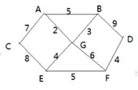

# 普利姆算法

## 应用场景-修路问题



胜利乡有 7 个村庄(`A, B, C, D, E, F, G`) ，现在需要修路把 7 个村庄连通，各个 **村庄的距离用边线表示(权)** ，比如 A – B 距离 5 公里

问：如何修路保证各个村庄都能连通，并且总的修建公路 **总里程最短?**

思路:

-  只满足连通：将 10 条边，连接即可，但是总的里程数不是最小.

- 满足连通，又保证总里程最短：就是尽可能的选择少的路线，并且每条路线最小，保证总里程数最少

## 最小生成树

修路问题本质就是就是 **最小生成树问题**， 最小生成树(Minimum Cost Spanning Tree)，简称 MST。

给定一个 **带权的无向连通图**，如何选取一棵生成树，使树上所有边上权的总和为最小，这叫最小生成树 ，它有如下特点：

- N 个顶点，一定有 `N-1` 条边
- 包含全部顶点
- `N-1` 条边都在图中

比如下图：


 

求最小生成树的算法主要是 **普里姆算法** 和 **克鲁斯卡尔算法**

## 普利姆算法介绍

普利姆（Prim）算法求最小生成树，也就是：在包含 n 个顶点的连通图中，找出只有(`n-1`)条边包含所有 n 个顶点的连通子图，也就是所谓的 **极小连通子图**

它的算法如下：

1. 设

  - `G=(V,E)` 是连通网

  - `T=(U,D)` 是最小生成树
  - V、U 是顶点集合
  - E、D 是边的集合 

2. 若从顶点 u 开始构造最小生成树，则从集合 V 中取出顶点 u 放入集合 U 中，标记顶点 v 的`visited[u]=1`

3. 若集合 U 中顶点 ui 与集合 V-U 中的顶点 vj 之间存在边，则寻找这些边中权值最小的边，但不能构成回路，将顶点 vj 加入集合U中，将边（ui,vj）加入集合 D 中，标记 `visited[vj]=1`

4. 重复步骤 ②，直到 U 与 V 相等，即所有顶点都被标记为访问过，此时 D 中有 n-1 条边

## 普利姆算法图解

以这个为例子：


1. 从 A 点开始处理

   与 A 直连的点有：

   - `A,C [7]`：后面中括号中的是他的权值
   - `A,B [5]`
   - `A,G [2]`

   在这个所有的边中，`A,G [2]` 的权值最小，那么结果是：`A、G`

2. 从 `A、G` 开始，找到他们的直连边，但是不包含已经访选择过的边。

   1. `A,C [7]`
   2. `A,B [5]`
   3. `G,B [3]`
   4. `G,E [4]`
   5. `G,F [6]`

   在以上边中，权值最小的是：`G,B [3]`，那么结果是：`A、G、B`

3. 以 `A、G、B` 开始，找到他们的直连边，但是不包含已经访选择过的边。

   1. `A,C [7]`
   2. `A,B [5]`
   3. `G,E [4]`
   4. `G,F [6]`
   5. `B,D [9]`

   在以上边中，权值最小的是：`G,E [4]`，那么结果是：`A、G、B、E`

4. `A、G、B、E` →   权值最小的边是  `E，F [5]`  →    `A、G、B、E、F`

5. `A、G、B、E、F` →   权值最小的边是  `F，D [4]`  →    `A、G、B、E、F、D`

6. `A、G、B、E、F、D` →   权值最小的边是  `A，C [7]`  →    `A、G、B、E、F、D、C`

那么最终结果则为下图：


总里程数量为：`2+3+4+5+4+7=25`

## 代码实现

### 生成图

```java
package cn.mrcode.study.dsalgtutorialdemo.algorithm.prim;

import org.junit.Test;

/**
 * 普利姆算法
 */
public class PrimAlgorithm {
    /**
     * 图：首先需要有一个带权的连通无向图
     */
    class MGraph {
        int vertex;  // 顶点个数
        int[][] weights;  // 邻接矩阵
        char[] datas; // 村庄数据

        /**
         * @param vertex  村庄数量， 会按照数量，按顺序生成村庄，如 A、B、C...
         * @param weights 需要你自己定义好那些点是连通的，那些不是连通的
         */
        public MGraph(int vertex, int[][] weights) {
            this.vertex = vertex;
            this.weights = weights;

            this.datas = new char[vertex];
            for (int i = 0; i < vertex; i++) {
                // 大写字母 A 从 65 开始
                datas[i] = (char) (65 + i);
            }
        }

        public void show() {
            System.out.printf("%-8s"," ");
            for (char vertex : datas) {
                // 控制字符串输出长度：少于 8 位的，右侧用空格补位
                System.out.printf("%-8s", vertex + " ");
            }
            System.out.println();
            for (int i = 0; i < weights.length; i++) {
                System.out.printf("%-8s", datas[i] + " ");
                for (int j = 0; j < weights.length; j++) {
                    System.out.printf("%-8s", weights[i][j] + " ");
                }
                System.out.println();
            }
        }
    }

    @Test
    public void mGraphTest() {
        // 不连通的默认值：
        // 这里设置为较大的数，是为了后续的计算方便，计算权值的时候，不会选择
        int defaultNo = 100000;
        int[][] weights = new int[][]{
                {defaultNo, 5, 7, defaultNo, defaultNo, defaultNo, 2},    // A
                {5, defaultNo, defaultNo, 9, defaultNo, defaultNo, 3},// B
                {7, defaultNo, defaultNo, defaultNo, 8, defaultNo, defaultNo},// C
                {defaultNo, 9, defaultNo, defaultNo, defaultNo, 4, defaultNo},// D
                {defaultNo, defaultNo, 8, defaultNo, defaultNo, 5, 4},// E
                {defaultNo, defaultNo, defaultNo, 4, 5, defaultNo, 6},// F
                {2, 3, defaultNo, defaultNo, 4, 6, defaultNo}// G
        };
        MGraph mGraph = new MGraph(7, weights);
        mGraph.show();
    }
}

```

测试输出

```
        A       B       C       D       E       F       G       
A       100000  5       7       100000  100000  100000  2       
B       5       100000  100000  9       100000  100000  3       
C       7       100000  100000  100000  8       100000  100000  
D       100000  9       100000  100000  100000  4       100000  
E       100000  100000  8       100000  100000  5       4       
F       100000  100000  100000  4       5       100000  6       
G       2       3       100000  100000  4       6       100000  
```

使用邻接矩阵构建了一个无向图，按照题目中的连通要求进行构建。


### 最小生成树

```java

    /**
     * 最小生成树
     */
    class MinTree {
        /**
         * 普利姆算法
         *
         * @param mGraph 无向图
         * @param v      从哪一个点开始生成
         */
        public void prim(MGraph mGraph, int v) {
            int minTotalWeight = 0; // 记录已选择的边的总权值，仅仅只是为了测试打印验证

            // 记录已经选择过的节点
            boolean[] selects = new boolean[mGraph.vertex];
            // 从哪个节点开始，则标识已经被访问
            selects[v] = true;

            // 一共要生成 n-1 条边
            for (int i = 1; i < mGraph.vertex; i++) {
                // 每次循环：选择一条权值最小的边出来

                // 记录最小值
                int minWeight = 10000;
                int x = -1;
                int y = -1;

                // 每次查找权值最小的边：根据思路，每次都是从已经选择过的点，中去找与该点直连的点的权值
                // 并且该点还没有被选择过：如果两个点都被选择过，要么他们是双向的，要么就是被其他的点选择过了
                // 这里双循环的含义：建议对照笔记中步骤分析理解
                for (int j = 0; j < mGraph.vertex; j++) {
                    for (int k = 0; k < mGraph.vertex; k++) {
                        // 通过 j 来限定已经选择过的点
                        // 通过 k 来遍历匹配，没有选择过的点
                        // 假设第一轮是 A 点：j = 0
                        // 那么在这里将会执行 0,1  0,2, 0,3 也就是与 A 点直连，且没有被选择过的点，的最小权值
                        if (selects[j] && !selects[k]
                                && mGraph.weights[j][k] < minWeight
                        ) {
                            // 记录最小权值，与这条边的信息
                            minWeight = mGraph.weights[j][k];
                            x = j;
                            y = k;
                        }
                    }
                }
                // 当一次循环结束时：就找到了一条权值最小的边
                System.out.printf("%s,%s [%s] \n", mGraph.datas[x], mGraph.datas[y], mGraph.weights[x][y]);
                minTotalWeight += mGraph.weights[x][y]; // 统计已选择边权值

                minWeight = 10000;
                // 记录该点已经被选择
                // 在查找最小权值边的代码中：y=k, k 表示没有被选择过的点，所以，找到之后，这里记录 y 为这条边的另一个点
                selects[y] = true;
            }
            System.out.println("总权值：" + minTotalWeight);
        }
    }

    @Test
    public void primTest() {
        // 不连通的默认值：
        // 这里设置为较大的数，是为了后续的计算方便，计算权值的时候，不会选择
        int defaultNo = 100000;
        int[][] weights = new int[][]{
                {defaultNo, 5, 7, defaultNo, defaultNo, defaultNo, 2},    // A
                {5, defaultNo, defaultNo, 9, defaultNo, defaultNo, 3},// B
                {7, defaultNo, defaultNo, defaultNo, 8, defaultNo, defaultNo},// C
                {defaultNo, 9, defaultNo, defaultNo, defaultNo, 4, defaultNo},// D
                {defaultNo, defaultNo, 8, defaultNo, defaultNo, 5, 4},// E
                {defaultNo, defaultNo, defaultNo, 4, 5, defaultNo, 6},// F
                {2, 3, defaultNo, defaultNo, 4, 6, defaultNo}// G
        };
        MGraph mGraph = new MGraph(7, weights);
        mGraph.show();

        MinTree minTree = new MinTree();
        minTree.prim(mGraph, 0);

    }
```

测试输出

```
        A       B       C       D       E       F       G       
A       100000  5       7       100000  100000  100000  2       
B       5       100000  100000  9       100000  100000  3       
C       7       100000  100000  100000  8       100000  100000  
D       100000  9       100000  100000  100000  4       100000  
E       100000  100000  8       100000  100000  5       4       
F       100000  100000  100000  4       5       100000  6       
G       2       3       100000  100000  4       6       100000  
A,G [2] 
G,B [3] 
G,E [4] 
E,F [5] 
F,D [4] 
A,C [7] 
总权值：25
```

测试结果也就是这个图


下面看看起始点不同的输出信息，从 B 点开始：`minTree.prim(mGraph, 1);`

```
B,G [3] 
G,A [2] 
G,E [4] 
E,F [5] 
F,D [4] 
A,C [7] 
总权值：25
```

可以看到：顺序不同，但是边和总权值是相同的。