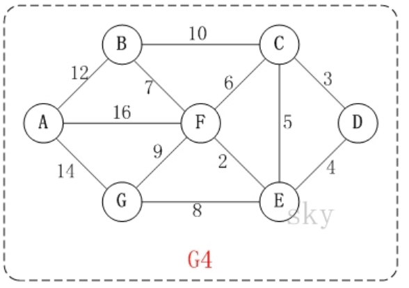
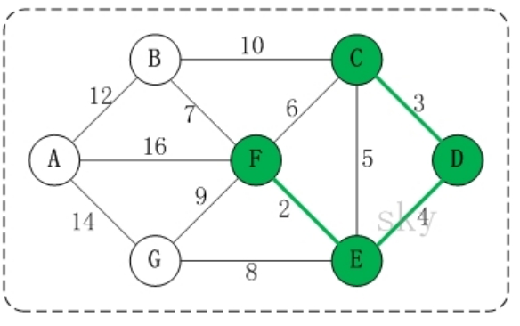
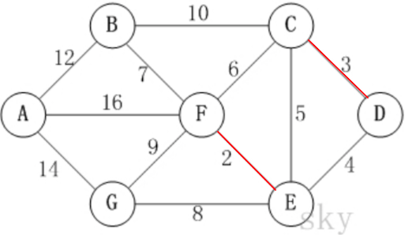

# 克鲁斯卡尔算法

## 应用场景-公交站问题

某城市新增 7 个站点(A, B, C, D, E, F, G) ，现在 **需要修路把 7 个站点连通**，各个站点的距离用边线表示(权) ，比如 A – B 距离 12公里
问：如何修路保证 **各个站点都能连通**，并且 **总的修建公路总里程最短**? 


如上图所示：要求和前面的普利姆算法中的修路问题是一样的要求，只是换了一个背景。

## 克鲁斯卡尔算法介绍

**克鲁斯卡尔(Kruskal)算法**，是用来求加权连通图的最小生成树的算法。

基本思想：按照权值从小到大的顺序选择 `n-1` 条边，并保证这 `n-1` 条边不构成回路

具体做法：

1. 首先构造一个只含 n 个顶点的森林
2. 然后依权值从小到大从连通网中选择边加入到森林中，并使森林中不产生回路，直至森林变成一棵树为止

## 克鲁斯卡尔算法图解

在含有 n 个顶点的连通图中选择 n-1 条边，构成一棵极小连通子图，并使该连通子图中 n-1 条边上权值之和达到最小，则称其为连通网的最小生成树。 



例如，对于如上图 G4 所示的连通网可以有多棵权值总和不相同的生成树。


有多种不同的连通方式，但是哪一种权值才是最优的呢？下面是克鲁斯卡尔算法的图解步骤：

以上图 G4 为例，来对克鲁斯卡尔进行演示(假设，用数组 R 保存最小生成树结果)。


- 第 1 步：将边`E,F [2]`加入 R 中。 

  边 `E,F`  的权值最小，因此将它加入到最小生成树结果 R 中。 

- 第 2 步：将边 `C,D [3]`加入 R 中。 

  上一步操作之后，边 `C,D` 的权值最小，因此将它加入到最小生成树结果 R 中。 

- 第 3 步：将边 `D,E [4]` 加入 R 中。 

  同理，权值最小 

- 第 4 步：将边 `B,F [7]` 加入 R 中。 

  上一步操作之后，边 `C,E [5]` 的权值最小，但 `C,E` 会和已有的边构成回路；因此，跳过边`C,E`。同理，跳过边 `C,F [6]`。将边 `B,F` 加入到最小生成树结果R中。 

- 第 5 步：将边 `E,G [8]` 加入 R 中。 
   同理 

- 第 6 步：将边 `A,B [12]` 加入 R 中。 

  上一步操作之后，边	`F,G [9]` 的权值最小，但 `F,G` 会和已有的边构成回路；因此，跳过边 `F,G` 。同理，跳过边 `B,C [10]`。将边 `A,B` 加入到最小生成树结果R中。
  此时，最小生成树构造完成！它包括的边依次是：`<E,F> <C,D> <D,E> <B,F> <E,G> <A,B>` 总里程为 36。

## 克鲁斯卡尔算法分析

根据前面介绍的克鲁斯卡尔算法的基本思想和做法，我们能够了解到，克鲁斯卡尔算法重点需要解决的以下两个问题： 
1. 对图的所有边按照权值大小进行排序。 

   此问题采用排序算法进行排序即可

2. 将边添加到最小生成树中时，怎么样 **判断是否形成了回路**。

   处理方式是：记录顶点在 **最小生成树** 中的终点，顶点的终点是 **在最小生成树中与它连通的最大顶点**。然后每次需要将一条边添加到最小生存树时，判断该边的两个顶点的终点是否重合，重合的话则会构成回路。

##  如何判断回路？



在将 `E,F`、 `C,D`  `D,E` 加入到最小生成树 R 中之后，这几条边的顶点就都有了终点：

- C 的终点是 F。 
- D 的终点是 F。 
- E 的终点是 F。 
- F 的终点是 F。

终点的说明：（备注：光看这个没有接触过该算法的不明白，在代码后面有详细的解释）

- 就是将所有顶点按照从小到大的顺序排列好之后；某个顶点的终点就是 **与它连通的最大顶点**。 

  难道是说 CD、DE、EF 他们是一条线，从小到大，所以他们的终点都是 F?

- 因此，接下来，虽然 `C,E` 是权值最小的边。但是 C 和 E 的终点都是 F，即它们的终点相同，因此，将 `C,E`  加入最小生成树的话，会形成回路。这就是判断回路的方式。也就是说，我们**加入的边的两个顶点** 不能都指向同一个终点，否则将构成回路。【后面有代码说明】

## 代码实现

### 无向图构建

这里使用上一章的普利姆算法中实现的无向图构建，简单修改下

```java
package cn.mrcode.study.dsalgtutorialdemo.algorithm.kruskal;

import org.junit.Test;

/**
 * 克鲁斯而
 */
public class KruskalCase {
    // 不连通的默认值：0 则代表同一个点
    int INF = 100000;

    /**
     * 图：首先需要有一个带权的连通无向图
     */
    class MGraph {
        int vertex;  // 顶点个数
        int[][] weights;  // 邻接矩阵
        char[] datas; // 村庄数据
        int edgeNum; // 共有多少条边

        /**
         * @param vertex  村庄数量， 会按照数量，按顺序生成村庄，如 A、B、C...
         * @param weights 需要你自己定义好那些点是连通的，那些不是连通的
         */
        public MGraph(int vertex, int[][] weights) {
            this.vertex = vertex;
            this.weights = weights;

            this.datas = new char[vertex];
            for (int i = 0; i < vertex; i++) {
                // 大写字母 A 从 65 开始
                datas[i] = (char) (65 + i);
            }
            // 计算有多少条边
            for (int i = 0; i < weights.length; i++) {
                /*
                        A       B       C       D       E       F       G
                A       0       12      100000  100000  100000  16      14
                B       12      0       10      100000  100000  7       100000
                j = i + 1：比如:
                        i=0,j=1, 那么就是 A,B 从而跳过了 A,A
                        i=1,j=2, 那么就是 B,C 从而跳过了 B,A  B,B
                        那么含义就出来了：跳过双向边的统计，也跳过自己对自己值得为 0 的统计
                 */
                for (int j = i + 1; j < weights.length; j++) {
                    if (weights[i][j] != INF) {
                        edgeNum++;
                    }
                }
            }
        }

        public void show() {
            System.out.printf("%-8s", " ");
            for (char vertex : datas) {
                // 控制字符串输出长度：少于 8 位的，右侧用空格补位
                System.out.printf("%-8s", vertex + " ");
            }
            System.out.println();
            for (int i = 0; i < weights.length; i++) {
                System.out.printf("%-8s", datas[i] + " ");
                for (int j = 0; j < weights.length; j++) {
                    System.out.printf("%-8s", weights[i][j] + " ");
                }
                System.out.println();
            }
        }
    }

    @Test
    public void mGraphTest() {
        int[][] weights = new int[][]{
                //     A    B    C    D    E    F   G
                /*A*/ {0, 12, INF, INF, INF, 16, 14},
                /*B*/ {12, 0, 10, INF, INF, 7, INF},
                /*C*/ {INF, 10, 0, 3, 5, 6, INF},
                /*D*/ {INF, INF, 3, 0, 4, INF, INF},
                /*E*/ {INF, INF, 5, 4, 0, 2, 8},
                /*F*/ {16, 07, INF, INF, 2, 0, 9},
                /*G*/ {14, INF, INF, INF, 8, 9, INF}
        };
        MGraph mGraph = new MGraph(7, weights);
        mGraph.show();
        System.out.printf("共有 %d 条边", mGraph.edgeNum);
    }
}

```

测试输出

```
        A       B       C       D       E       F       G       
A       0       12      100000  100000  100000  16      14      
B       12      0       10      100000  100000  7       100000  
C       100000  10      0       3       5       6       100000  
D       100000  100000  3       0       4       100000  100000  
E       100000  100000  5       4       0       2       8       
F       16      7       100000  100000  2       0       9       
G       14      100000  100000  100000  8       9       100000  
共有 12 条边
```

### 克鲁斯卡尔算法实现

```java
    /**
     * 将无向图中的边 转换成对象数组
     *
     * @param graph
     * @return
     */
    public Edata[] convertEdatas(MGraph graph) {
        Edata[] datas = new Edata[graph.edgeNum];
        int[][] weights = graph.weights;
        char[] vertexs = graph.datas;
        int index = 0;
        for (int i = 0; i < weights.length; i++) {
            for (int j = i + 1; j < weights.length; j++) {
                if (weights[i][j] != INF) {
                    datas[index++] = new Edata(vertexs[i], vertexs[j], weights[i][j]);
                }
            }
        }
        return datas;
    }

    /**
     * 将边按权值从小到大排序
     *
     * @param edata
     */
    public void sort(Edata[] edata) {
        Arrays.sort(edata, Comparator.comparingInt(o -> o.weight));
    }

    public Edata[] kruskal(MGraph mGraph, Edata[] edatas) {
        // 存放结果，数组最大容量为所有边的容量
        Edata[] rets = new Edata[mGraph.edgeNum];
        int retsIndex = 0;

        /*
          按照算法思路：
            记录顶点在 **最小生成树** 中的终点，顶点的终点是 **在最小生成树中与它连通的最大顶点**。
            然后每次需要将一条边添加到最小生存树时，判断该边的两个顶点的终点是否重合，重合的话则会构成回路。
         */
        // 用于存所有的终点：该数组中的内容随着被选择的边增加，终点也会不断的增加
        int[] ends = new int[mGraph.edgeNum];
        // 对所有边进行遍历
        for (Edata edata : edatas) {
            // 获取这两条边的顶点下标:
            //  第一次：E,F  ->  4,5
            int p1 = getPosition(mGraph.datas, edata.start);
            int p2 = getPosition(mGraph.datas, edata.end);

            // 获取对应顶点的 终点
            /*
              第 1 次：E,F  ->  4,5
                ends = [0, 0, 0, 0, 0, 0, 0, 0, 0, 0, 0, 0]
                m: 获取 4 的终点：ends[4] 为 0，说明此点 还没有一个终点，那么就返回它自己 4
                n: 获取 5 的终点：同上
                m != n , 选择这一条边。那么此时 E,F  ->  4,5 已有边的终点就是 5
                ends = [0, 0, 0, 0, 5, 0, 0, 0, 0, 0, 0, 0]
                终点表中读法：         ↑ index=4,value=5 那么表示 4 这个顶点的终点为 5
              第 2 次：C,D  ->  2,3
                ends = [0, 0, 0, 0, 5, 0, 0, 0, 0, 0, 0, 0]
                 m: 获取 2 的终点，ends[2] = 0，说明此点 还没有一个终点，则返回它自己 2
                 n: 获取 3 的终点
                 m != n , 选择这一条边。那么此时 C,D  ->  2,3 已有边的终点就是 3
                 ends = [0, 0, 3, 0, 5, 0, 0, 0, 0, 0, 0, 0]
              第 3 次：D,E  ->  3,4
                ends = [0, 0, 3, 0, 5, 0, 0, 0, 0, 0, 0, 0]
                 m: 获取 3 的终点，ends[3] = 0，说明此点 还没有一个终点，则返回它自己 3
                 n: 获取 4 的终点,!! 前面第一次，已经将 4 的终点 5 放进来了
                    那么将获取到的终点为 5，getEnd() 还会尝试去获取 5 的终点，发现为 0，则 4 的终点是 5
                 m != n -> 3 != 5 , 选择这一条边。那么此时 D,E  ->  3,4 已有边的终点就是 5
                 ends = [0, 0, 3, 5, 5, 0, 0, 0, 0, 0, 0, 0]
             */
            int m = getEnd(ends, p1);
            int n = getEnd(ends, p2);
            if (m != n) {
                ends[m] = n;
                rets[retsIndex++] = edata;
            }
        }
        return rets;
    }

    /**
     * 获取该顶点的：终点
     *
     * @param ends
     * @param vertexIndex
     * @return
     */
    private int getEnd(int[] ends, int vertexIndex) {
        int temp = vertexIndex;
        while (ends[temp] != 0) {
            temp = ends[temp];
        }
        return temp;
    }

    /**
     * 获取此顶点的下标
     *
     * @param vertexs
     * @param vertex
     * @return
     */
    private int getPosition(char[] vertexs, char vertex) {
        for (int i = 0; i < vertexs.length; i++) {
            if (vertexs[i] == vertex) {
                return i;
            }
        }
        return 0;
    }

    /**
     * 描述一条边
     */
    class Edata {
        // 一条边的开始和结束，比如 A,B
        char start;
        char end;
        int weight; // 这条边的权值

        public Edata(char start, char end, int weight) {
            this.start = start;
            this.end = end;
            this.weight = weight;
        }

        @Override
        public String toString() {
            return start + "," + end + " [" + weight + "]";
        }
    }

    @Test
    public void kruskalTest() {
        int[][] weights = new int[][]{
                //     A    B    C    D    E    F   G
                /*A*/ {0, 12, INF, INF, INF, 16, 14},
                /*B*/ {12, 0, 10, INF, INF, 7, INF},
                /*C*/ {INF, 10, 0, 3, 5, 6, INF},
                /*D*/ {INF, INF, 3, 0, 4, INF, INF},
                /*E*/ {INF, INF, 5, 4, 0, 2, 8},
                /*F*/ {16, 07, INF, INF, 2, 0, 9},
                /*G*/ {14, INF, INF, INF, 8, 9, INF}
        };
        MGraph mGraph = new MGraph(7, weights);
        mGraph.show();
        System.out.printf("共有 %d 条边 \n", mGraph.edgeNum);
        System.out.println("边数组为：");
        Edata[] edatas = convertEdatas(mGraph);
        printEdatas(edatas);
        System.out.println("排序后的边数组为：");
        sort(edatas);
        printEdatas(edatas);

        Edata[] kruskal = kruskal(mGraph, edatas);
        System.out.println("克鲁斯卡尔算法计算结果的边为：");
        printEdatas(kruskal);
        int total = Arrays.stream(kruskal).filter(item -> item != null).mapToInt(item -> item.weight).sum();
        System.out.println("总里程数为：" + total);
    }

    private void printEdatas(Edata[] edatas) {
        for (Edata edata : edatas) {
            if (edata == null) {
                continue;
            }
            System.out.println(edata);
        }
    }
```

测试输出

```
       A       B       C       D       E       F       G       
A       0       12      100000  100000  100000  16      14      
B       12      0       10      100000  100000  7       100000  
C       100000  10      0       3       5       6       100000  
D       100000  100000  3       0       4       100000  100000  
E       100000  100000  5       4       0       2       8       
F       16      7       100000  100000  2       0       9       
G       14      100000  100000  100000  8       9       100000  
共有 12 条边 
边数组为：
A,B [12]
A,F [16]
A,G [14]
B,C [10]
B,F [7]
C,D [3]
C,E [5]
C,F [6]
D,E [4]
E,F [2]
E,G [8]
F,G [9]
排序后的边数组为：
E,F [2]
C,D [3]
D,E [4]
C,E [5]
C,F [6]
B,F [7]
E,G [8]
F,G [9]
B,C [10]
A,B [12]
A,G [14]
A,F [16]
克鲁斯卡尔算法计算结果的边为：
E,F [2]
C,D [3]
D,E [4]
B,F [7]
E,G [8]
A,B [12]
总里程数为：36
```

### 获取一个点的终点解释
```java
    /**
     * 获取该顶点的：终点
     *
     * @param ends
     * @param vertexIndex
     * @return
     */
    private int getEnd(int[] ends, int vertexIndex) {
        int temp = vertexIndex;
        while (ends[temp] != 0) {
            temp = ends[temp];
        }
        return temp;
    }
    
    ....
    int p1 = getPosition(mGraph.datas, edata.start);
    int p2 = getPosition(mGraph.datas, edata.end);
    int m = getEnd(ends, p1);
    int n = getEnd(ends, p2);
    if (m != n) {
      ends[m] = n;
      rets[retsIndex++] = edata;
    }
```

```java
            
第 1 次：E,F  ->  4,5
  ends = [0, 0, 0, 0, 0, 0, 0, 0, 0, 0, 0, 0]
  m: 获取 4 的终点：ends[4] 为 0，说明此点 还没有一个终点，那么就返回它自己 4
  n: 获取 5 的终点：同上
  m != n , 选择这一条边。那么此时 E,F  ->  4,5 已有边的终点就是 5
  ends = [0, 0, 0, 0, 5, 0, 0, 0, 0, 0, 0, 0]
  终点表中读法：         ↑ index=4,value=5 那么表示 4 这个顶点的终点为 5
第 2 次：C,D  ->  2,3
  ends = [0, 0, 0, 0, 5, 0, 0, 0, 0, 0, 0, 0]
  m: 获取 2 的终点，ends[2] = 0，说明此点 还没有一个终点，则返回它自己 2
  n: 获取 3 的终点
  m != n , 选择这一条边。那么此时 C,D  ->  2,3 已有边的终点就是 3
  ends = [0, 0, 3, 0, 5, 0, 0, 0, 0, 0, 0, 0]
第 3 次：D,E  ->  3,4
  ends = [0, 0, 3, 0, 5, 0, 0, 0, 0, 0, 0, 0]
  m: 获取 3 的终点，ends[3] = 0，说明此点 还没有一个终点，则返回它自己 3
  n: 获取 4 的终点,!! 前面第一次，已经将 4 的终点 5 放进来了
     那么将获取到的终点为 5，getEnd() 还会尝试去获取 5 的终点，发现为 0，则 4 的终点是 5
  m != n -> 3 != 5 , 选择这一条边。那么此时 D,E  ->  3,4 已有边的终点就是 5
  ends = [0, 0, 3, 5, 5, 0, 0, 0, 0, 0, 0, 0]       
```

从以上的步骤运行来看，这个终点的判定是这样的：

1. `E,F  ->  4,5`  由于 终点列表中没有，那么第一条边的 **起点 E 的终点就是 F**

   记为：

   ```
     ends = [0, 0, 0, 0, 5, 0, 0, 0, 0, 0, 0, 0]
     终点表中读法：         ↑ index=4,value=5 那么表示 4 这个顶点的终点为 5
   ```
   
   
2. `C,D  ->  2,3` 

   

   ```
   [0, 0, 3, 0, 5, 0, 0, 0, 0, 0, 0, 0]
   ```

   选择这一条边后，终点列表中成了上面这样，如何理解？ 看上图：这两条边添加之后，他们并不能连通，所以此时的 ends 列表里面的含义就是这样的：

   - 2：3 ， C 的终点是 D，因为这条边暂时没有和其他边连接
   - 4：5，E 的终点是 F，因为这条吧暂时没有和其他边连接

3. `D,E  ->  3,4`

   

   此时：可以看到，加入我们要选择这条边，那么 DE 就会和 EF 相连，获取边的终点时

   ```
   [0, 0, 3, 0, 5, 0, 0, 0, 0, 0, 0, 0]
   ```

   - 先获取 D 的终点：`ends[3]=0`，返回它自己； 

   - 获取 E 的终点时：`edns[4]=5`，你会发现，其实 E 它已经和 F 连通了

   - 那么此时：往终点列表里面存放的则是  D 的终点是  F，而不是 E 

     ```
       ends = [0, 0, 3, 5, 5, 0, 0, 0, 0, 0, 0, 0]  
     ```

4. 最终选择完后的终点列表中的数据为

   

   ```
   [6, 5, 3, 5, 5, 6, 0, 0, 0, 0, 0, 0]
    A  B  C  D  E  F  G
    0  1  2  3  4  5  6
   ```

   - A 的终点是 G
   - B 的终点是 F  →  G
   - C 的终点是 D →  F  →  G
   - D 的终点是 F →  G
   - E 的终点是 F →  G
   - F 的终点是 G

   选择看明白了吗？它利用这一个数组，对于每次新增的边 和 已经存在的边，计算出，新增加的边的起始点，对应的终点是什么。 当整个最小生成树都完成的时候，他们最终所对应的终点都是一样的。