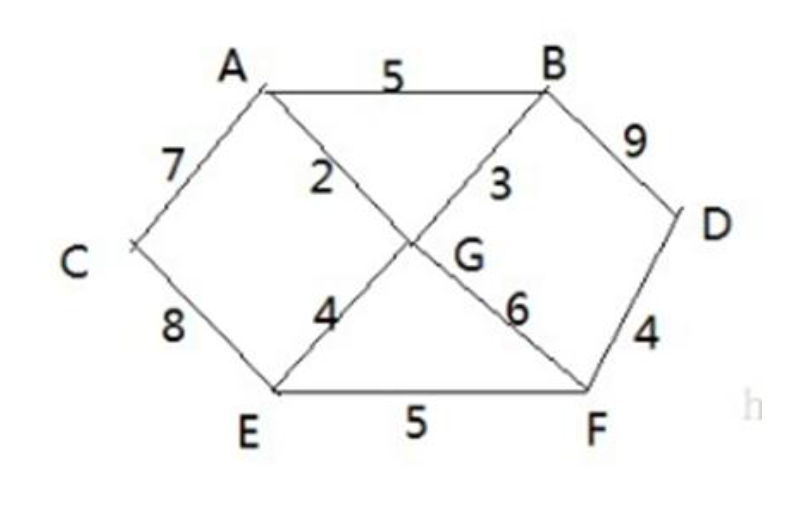
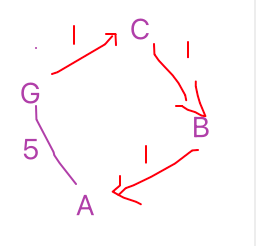

# 迪杰斯特拉算法

## 应用场景-最短路径问题


战争时期，胜利乡有 7 个村庄 `(A, B, C, D, E, F, G)` ，现在有六个邮差，从 G 点出发，需要分别把邮件分别送到 `A, B, C , D, E, F`  六个村庄，各个村庄的距离用边线表示(权) ，比如 A – B 距离 5公里

问：如何计算出 G 村庄到 其它各个村庄的 **最短距离**? 如果从其它点出发到各个点的最短距离又是多少?

## 迪杰斯特拉算法介绍

**迪杰斯特拉（Dijkstra）算法**是 典型 **最短路径算法**，用于 **计算一个节点到其他节点的最短路径**。 它的主要特点是 **以起始点为中心向外层层扩展(广度优先搜索思想)**，直到扩展到终点为止。

## 迪杰斯特拉算法过程

设：

- v：出发顶点

- V：为顶点集合 `V{v1,v2,vi...}`

- vs：已经访问过的顶点

  - 0 ：未访问
  - 1：已访问

- dis：v 到 V 中各个顶点的距离 `dis{d1,d2,di...}`

  到自身（v 到 v）的距离为 0，v 到 Vi 的距离为 di

那么有如下规则：

1. 从 dis 中选择值最小的 di 并移除 dis 集合，同时移除 V 集合中对应的顶点 vi，此时的 v 到 vi 即为最短路径
2. 更新 dis 集合，更新规则为：比较 v 到 V 集合中顶点的距离，与 v 通过 Vi 到 V 集合中顶点的距离值，保留较小的一个（同时也应该更新顶点的 **前驱节点** 为 Vi，表名是通过 Vi 达到的。）
3. 重复执行两步骤，直到最短路径顶点为目标顶点即可结束

上面的算法过程脱离了具体的实现，很抽象，下面通过具体一点的实现步骤过程来看看到底是怎么弄的

## 迪杰斯特拉算法-步骤



需要以下三个重要的数组：

- already_arr：记录各个顶点是否访问过

  1 表示访问过，0 表示未访问过，每搜索一层（广度优先），都会被动态更新。

  比如从 G 点出发，访问过 `G,A` ，此时 A 不算访问过，G 算被访问的节点，因为要计算 G 到 A 的距离，但是 A 不是 **访问节点** 或 **出发节点** 

- pre_visited_arr：每个下标对应的值为前一个顶点下标（前驱节点），统一动态更新

  比如：从 G 点出发，会访问 `G,A`、`G,B`、`G,E`、 `G,F`，那么 A、B、E、F 的前驱节点就是 G

- dis_arr：记录出发点到其他所有顶点的距离

  比如：从 G 出发，到过了 `G,A` ，再从 `A,C` 到 C，则记录的是 G 到 C 的路径距离

过程如下：

1. 以 G 为起点，的各个数组的初始状态

   ```
       对应的村庄		 [A, B, C, D, E, F, G]
   			下标		[0, 1, 2, 3, 4, 5, 6
   already_arr 	 = [0, 0, 0, 0, 0, 0, 1]
   pre_visited_arr = [N, N, N, N, N, N, 0]
   dis_arr 		  = [0, 0, 0, 0, 0, 0, 0]
   ```

   含义：
   
   - `already_arr[n] = 0` ：则表示，该点还没有访问过
   - `already_arr[6] = 1`：该点已经访问过，因为从 G 出发，那么 G 点自己就被访问过了
   - `dis_arr` 中都为 0，因为从 G 点开始，还没有到达过其他点
   - `pre_visited_arr[n] = N`：其中 N 为一个较大的值，表示不能直接连接通的权值
   
2. 计算过从 G 点能到达的点 `A,B,E,F` 之后的情况如下

   ```
       对应的村庄		 [A, B, C, D, E, F, G]
   			下标		[0, 1, 2, 3, 4, 5, 6
   already_arr 	 = [0, 0, 0, 0, 0, 0, 1]
   pre_visited_arr = [6, 6, N, N, 6, 6, 0]
   dis_arr 		  = [2, 3, 0, 0, 4, 6, 0]
   ```

   含义：

   - `already_arr[6] = 1`：表示 G 点被访问过
   - `pre_visited_arr[0]=6`：表示 节点 A 的前驱节点是 6，即 G
   - `dis_arr[0]`：表示 G 到 A 的距离是 2 

3. 根据广度优先原则（并不是以 GA，GB  A 在前面而选择 A，这里的广度优先指的是：以 G 为起点，那么则把与 G 直连的全部计算，这样一层一层的计算），会先判定 A 点是否需要作为 **访问顶点（注意不是出发顶点）**，需要满足以下条件：

   1. A 点没有被访问过

   2. 并且 G 点到 A 点的距离，要小于 dis_arr 中对应 G 到 A 的距离，因为可能出现以下情况：

      

      有可能其他通过其他节点到达 A 点的距离是最短的。

   那么此轮会计算 `A,B ` 、`A,C`，访问之后的情况如下

   ```
       对应的村庄		 [A, B, C, D, E, F, G]
   			下标		[0, 1, 2, 3, 4, 5, 6
   already_arr 	 = [1, 0, 0, 0, 0, 0, 1]
   pre_visited_arr = [6, 0, 0, N, 6, 6, 0]
   dis_arr 		  = [2, 7, 9, 0, 4, 6, 0]
   此次变动的有            ↑  ↑
   ```

   - `dis_arr[0] = 1`： 表示当前访问的是 A
   -  `dis_arr[1] = 7`： 表示 G 到 B （中间经过 A）的距离是 7
   - `dis_arr[2] = 9`： 表示 G 到 C （中间经过 A）的距离是 9

   这里就出现一个问题：

   

   如上图：`GAB = 7`，但是 `GB=3`，并且在访问 G 点的时候，已经计算出了 `GB` 的距离，所以这里  `GAB > GB` 的，它不应该被更新到这里来。最终调节之后的结果为：

   ```
       对应的村庄		 [A, B, C, D, E, F, G]
   			下标		[0, 1, 2, 3, 4, 5, 6
   already_arr 	 = [1, 0, 0, 0, 0, 0, 1]
   pre_visited_arr = [6, 0, 0, N, 6, 6, 0]
   dis_arr 		  = [2, 3, 9, 0, 4, 6, 0]
   ```

   这里还有一个问题：对于 pre_visited_arr 的定义，因为 A 的下标为 0 ，之前规定了 0 为它自己，这里是否有讲错？因为整个流程中，对 pre_visited_arr 只是一个更新，并没有对他进行依赖操作，所以就算是错误的，老师也不可能发现。

## 代码实现

### 构建无向图

老规矩，这种图结构，都需要先构建出它的图结构，这里还是使用之前学过的 邻接矩阵 构建

```java
package cn.mrcode.study.dsalgtutorialdemo.algorithm.dijkstra;

import org.junit.Test;

/**
 * 迪杰斯特拉算法-最短路径问题
 */
public class DijkstraAlgorithm {
    // 不连通的默认值
    int N = 100000;

    /**
     * 图：首先需要有一个带权的连通无向图
     */
    class MGraph {
        int vertex;  // 顶点个数
        int[][] weights;  // 邻接矩阵
        char[] datas; // 村庄数据
        int edgeNum; // 共有多少条边

        /**
         * @param vertex  村庄数量， 会按照数量，按顺序生成村庄，如 A、B、C...
         * @param weights 需要你自己定义好那些点是连通的，那些不是连通的
         */
        public MGraph(int vertex, int[][] weights) {
            this.vertex = vertex;
            this.weights = weights;

            this.datas = new char[vertex];
            for (int i = 0; i < vertex; i++) {
                // 大写字母 A 从 65 开始
                datas[i] = (char) (65 + i);
            }
            // 计算有多少条边
            for (int i = 0; i < weights.length; i++) {
                /*
                        A       B       C       D       E       F       G
                A       0       12      100000  100000  100000  16      14
                B       12      0       10      100000  100000  7       100000
                j = i + 1：比如:
                        i=0,j=1, 那么就是 A,B 从而跳过了 A,A
                        i=1,j=2, 那么就是 B,C 从而跳过了 B,A  B,B
                        那么含义就出来了：跳过双向边的统计，也跳过自己对自己值得为 0 的统计
                 */
                for (int j = i + 1; j < weights.length; j++) {
                    if (weights[i][j] != N) {
                        edgeNum++;
                    }
                }
            }
        }

        public void show() {
            System.out.printf("%-8s", " ");
            for (char vertex : datas) {
                // 控制字符串输出长度：少于 8 位的，右侧用空格补位
                System.out.printf("%-8s", vertex + " ");
            }
            System.out.println();
            for (int i = 0; i < weights.length; i++) {
                System.out.printf("%-8s", datas[i] + " ");
                for (int j = 0; j < weights.length; j++) {
                    System.out.printf("%-8s", weights[i][j] + " ");
                }
                System.out.println();
            }
        }
    }

    @Test
    public void mGraphTest() {
        int[][] weights = new int[][]{
                //     A  B  C  D  E  F  G
                /*A*/ {N, 5, 7, N, N, N, 2},
                /*B*/ {5, N, N, 9, N, N, 3},
                /*C*/ {7, N, N, N, 8, N, N},
                /*D*/ {N, 9, N, N, N, 4, N},
                /*E*/ {N, N, 8, N, N, 5, 4},
                /*F*/ {N, N, N, 4, 5, N, 6},
                /*G*/ {2, 3, N, N, 4, 6, N}
        };
        MGraph mGraph = new MGraph(7, weights);
        mGraph.show();
        System.out.printf("共有 %d 条边\n", mGraph.edgeNum);
    }
}

```

测试输出

```
        A       B       C       D       E       F       G       
A       100000  5       7       100000  100000  100000  2       
B       5       100000  100000  9       100000  100000  3       
C       7       100000  100000  100000  8       100000  100000  
D       100000  9       100000  100000  100000  4       100000  
E       100000  100000  8       100000  100000  5       4       
F       100000  100000  100000  4       5       100000  6       
G       2       3       100000  100000  4       6       100000  
共有 10 条边
```

### 迪杰斯特拉算法求解

```java

    @Test
    public void dijkstraTest() {
        int[][] weights = new int[][]{
                //     A  B  C  D  E  F  G
                /*A*/ {N, 5, 7, N, N, N, 2},
                /*B*/ {5, N, N, 9, N, N, 3},
                /*C*/ {7, N, N, N, 8, N, N},
                /*D*/ {N, 9, N, N, N, 4, N},
                /*E*/ {N, N, 8, N, N, 5, 4},
                /*F*/ {N, N, N, 4, 5, N, 6},
                /*G*/ {2, 3, N, N, 4, 6, N}
        };
        MGraph mGraph = new MGraph(7, weights);
        mGraph.show();
        System.out.printf("共有 %d 条边 \n", mGraph.edgeNum);

        dijkstra(mGraph, 'G');
    }

    // 记录各个顶点是否访问过
    private boolean[] already_arr;
    // 记录每个下标对应的值为前一个顶点下标（前驱节点）
    private int[] pre_visited_arr;
    // 记录出发点到其他所有顶点的距离
    private int[] dis_arr;
    private MGraph mGraph;

    private void dijkstra(MGraph mGraph, char start) {
        this.mGraph = mGraph;
        // 三个数组的长度为 顶点的个数
        already_arr = new boolean[mGraph.vertex];
        pre_visited_arr = new int[mGraph.vertex];
        dis_arr = new int[mGraph.vertex];
        // 找到开始节点的下标
        int v = 0;
        for (int i = 0; i < mGraph.datas.length; i++) {
            if (mGraph.datas[i] == start) {
                v = i;
                break;
            }
        }
        // 初始化所有前驱节点为默认状态，使用不可连通的 N 值表示
        Arrays.fill(pre_visited_arr, N);
        // 标记开始节点为访问状态
        already_arr[v] = true;
        // 标记前驱节点为：笔记中有歧义，我们使用 N 表示没有前驱节点
        // v 是开始节点，那么它就没有前驱节点
        pre_visited_arr[v] = N;
        // 初始化从起点到到所有点的距离为最大值，后续方便通过它来与新路径距离比较
        Arrays.fill(dis_arr, N);
        // 初始化，当前访问节点的距离为 0
        dis_arr[v] = 0;

        // 准备工作完成：开始查找最短路径
        // 广度优先策略：从起始节点计算它能直达的点的所有距离
        update(v);
        // 一共只需要计算 6 层： 7 个站点 -1
        for (char data : mGraph.datas) {
            // 寻找下一个访问节点
            int index = findNext();
            // 标记该节点被访问过，然后再计算与它直连点的路径
            already_arr[index] = true;
            // 并继续计算路径
            update(index);
        }

        // 所有节点都访问过之后：dis_arr 中就保留了从起点 到各个点的最短距离
        System.out.println(Arrays.toString(already_arr));
        System.out.println(Arrays.toString(pre_visited_arr));
        System.out.println(Arrays.toString(dis_arr));

        System.out.println("从 " + start + " 到以下点的最短距离为：");
        // 为了结果好认一点，格式化最后的结果
        for (int i = 0; i < dis_arr.length; i++) {
             System.out.printf("%S(%d) ", mGraph.datas[i], dis_arr[i]);
        }
        System.out.println();
    }

    /**
     * 计算起点到：当前节点所有能直连的节点的距离
     *
     * @param v
     */
    private void update(int v) {
        int[][] weights = mGraph.weights; // 我们的邻接矩阵图

        int len = 0;
        // weights[v]：由于是广度优先，所以每次只计算与该点能直连的点，也就是该点所在的一行
        for (int i = 0; i < weights[v].length; i++) {
            if (weights[v][i] == N) { // 不能直连，跳过
                continue;
            }
            // 计算从起点到当前要连通节点的距离   = 起点到当前访问节点的距离 + 访问节点到直连节点的距离
            len = dis_arr[v] + weights[v][i];

            // 首先：起点G -> A, A 要没有被访问过
            // 其次：如果当前计算新的路径距离 小于 已经存在的 从 起点 G -> 当前计算点的距离
            //      说明之前可能从其他途径到达了 i 点，这个距离是比现在找到的距离远
            // 当前的近，那么就更新数组中的数据
            if (!already_arr[i] && len < dis_arr[i]) {
                dis_arr[i] = len;
                pre_visited_arr[i] = v; // 更改前驱节点，表示 经过了 v 这个点（当前正在访问的点），到达的 i 点
            }
        }
    }

    /**
     * 广度优先策略一层计算完成之后，寻找下一个节点再计算
     *
     * @return
     */
    private int findNext() {
        int min = N, index = 0;
        // 总共需要找 n 此
        for (int i = 0; i < already_arr.length; i++) {
            // 该节点没有被访问过
            // 并且：从起点到达该节点的距离是最小的
            // 如果是第一层执行完成之后：那么有值的则只有：与起点能直连的那几个
            //      这里就类似与：原来广度优先中使用队列来保存搜索路径了
            if (!already_arr[i] && dis_arr[i] < min) {
                min = dis_arr[i];
                index = i;
            }
        }
        return index;
    }
```

测试输出

```
        A       B       C       D       E       F       G       
A       100000  5       7       100000  100000  100000  2       
B       5       100000  100000  9       100000  100000  3       
C       7       100000  100000  100000  8       100000  100000  
D       100000  9       100000  100000  100000  4       100000  
E       100000  100000  8       100000  100000  5       4       
F       100000  100000  100000  4       5       100000  6       
G       2       3       100000  100000  4       6       100000  
共有 10 条边 

[true, true, true, true, true, true, true]
[6, 6, 0, 5, 6, 6, 100000]
[2, 3, 9, 10, 4, 6, 0]
从 G 到以下点的最短距离为：
A(2) B(3) C(9) D(10) E(4) F(6) G(0) 
```

从输出结果可以看到：

- `[true, true, true, true, true, true, true]`

  所有节点都访问过了

- `[6, 6, 0, 5, 6, 6, 100000]`

  从起点到达每个节点的前驱节点如数组上所示

  

  - G 到 A：前驱就是 G，表示从 G 到达的 A
  - G 到 B：前驱也是 G
  - G 到 C：前驱是 A，表示从 G 到 C，至少经过了   A，这里看就是 GAC
  - ...
  - G 到 G：这里用了最大值表示，是他自己

- `[2, 3, 9, 10, 4, 6, 0]` 即 `A(2) B(3) C(9) D(10) E(4) F(6) G(0) `

  - 从 G 到 A 最短路径为 2

  - 从 G 到 B 最短路径为 3

  - 从 G 到 C 最短路径为 9

    从图上人工校验可以知道 G 到 C 有两条：

    - `G → A → C` ：9 里
    - `G → E → C` ：12 里

    证明算法是正确的

  - ... 

  - 最后一个 G 到 G，自己到自己，就是 0 

### 换一个出发点验证

这里换一个触发点 C 来看看执行结果

```java
    /**
     * 从 c 出发
     */
    @Test
    public void dijkstraTest2() {
        int[][] weights = new int[][]{
                //     A  B  C  D  E  F  G
                /*A*/ {N, 5, 7, N, N, N, 2},
                /*B*/ {5, N, N, 9, N, N, 3},
                /*C*/ {7, N, N, N, 8, N, N},
                /*D*/ {N, 9, N, N, N, 4, N},
                /*E*/ {N, N, 8, N, N, 5, 4},
                /*F*/ {N, N, N, 4, 5, N, 6},
                /*G*/ {2, 3, N, N, 4, 6, N}
        };
        MGraph mGraph = new MGraph(7, weights);
        mGraph.show();
        System.out.printf("共有 %d 条边 \n", mGraph.edgeNum);

        dijkstra(mGraph, 'C');
    }
```

测试输出

```
        A       B       C       D       E       F       G       
A       100000  5       7       100000  100000  100000  2       
B       5       100000  100000  9       100000  100000  3       
C       7       100000  100000  100000  8       100000  100000  
D       100000  9       100000  100000  100000  4       100000  
E       100000  100000  8       100000  100000  5       4       
F       100000  100000  100000  4       5       100000  6       
G       2       3       100000  100000  4       6       100000  
共有 10 条边 
[true, true, true, true, true, true, true]
[2, 0, 100000, 5, 2, 4, 0]
[7, 12, 0, 17, 8, 13, 9]
从 C 到以下点的最短距离为：
A(7) B(12) C(0) D(17) E(8) F(13) G(9) 
```

​     验证几个：

- 从 C 到 A 最短路径为 7
- 从 C 到 B 最短路径为 12
  - CAB：12
  - CEGB：15
  - CAGB：12，虽然有相同的，但是还是最短的
  - ....
- 从 C 到 C 最短路径为 0

- ... 
- 最后一个 C 到 G 最短路径为 9

   

   