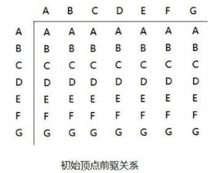
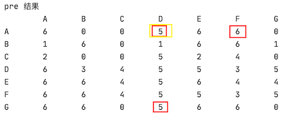

# 弗洛伊德算法

## 介绍

和 Dijkstra 算法一样，**弗洛伊德(Floyd)算法** 也是一种用于寻找给定的加权图中顶点间最短路径的算法。该算法名称以创始人之一、1978 年图灵奖获得者、斯坦福大学计算机科学系教授罗伯特·弗洛伊德命名

弗洛伊德算法(Floyd)计算图中 **各个顶点之间** 的最短路径，比如：先从 A 出发到各个点的最短路径，再从 B 出发，直到所有节点距离各个点的路径都会计算出来。而迪杰斯特拉算法用于计算图中 **某一个顶点到其他顶点的最短路径**。

弗洛伊德算法 VS 迪杰斯特拉算法：

- 迪杰斯特拉算法通过选定的被访问顶点，求出从出发访问顶点到其他顶点的最短路径；
- 弗洛伊德算法中每一个顶点都是出发访问点，所以需要将每一个顶点看做被访问顶点，求出从每一个顶点到其他顶点的最短路径。

## 核心思想

设：

- 顶点 vi 到顶点 vk 的最短路径已知为Lik，
- 顶点 vk 到 vj 的最短路径已知为 Lkj
- 顶点 vi 到 vj 的路径为 Lij

则 vi 到 vj 的最短路径为：`min((Lik+Lkj),Lij)`，vk 的取值为图中所有顶点，则可获得 vi 到 vj 的最短路径（则：假设三个点（不一定是具体的是 3 个点），一个直达，一个间接到达，算哪个路径最短）

至于 vi 到 vk 的最短路径 Lik 或者 vk 到 vj 的最短路径 Lkj，是以同样的方式获得

## 图解

以前面的公交站距离图解


上图中含义：

- 0：表示自己与自己。如 A,A
- N：表示不可直连



初始前驱顶点如上图：每个节点到达其他节点的初始前驱都是它自己。

- 第一轮循环中，以 A (下标为：0) 作为 **中间顶点**，距离表和前驱关系更新为：

  

  1. 找出以 A 为中间顶点的路径：

     - `C-A-G`：距离为 9
     - `C-A-B`：距离为 12
     - `G-A-B`：距离为 7

     因为图是无向的，只需要计算一个方向的即可。

  2. 更新距离表，需要与上一次的距离表作为参照对比

     

     - `C-A-G`：距离为 9，原始  `C,G` 距离为 N，9 < N，则更新 `C,G = 9`  
     - `C-A-B`：距离为 12，原始 `C,B` 距离为 N，12 < N，则更新 `C,B=12`
     - `G-A-B`：距离为 7，原始 `G,B` 距离为 3，则不更新

     另外由于是无向图，更新其中一个，那么另外一个方向的也要同步更新。

     同时：更新对应位置的前驱节点为 A
     
  3. 如何找出以 A 为中间顶点的所有路径？

     ```java
     // 使用 3 个数组来实现，思路如下
     中间顶点：[A,B,C,D,E,F,G] k=0
     出发顶点：[A,B,C,D,E,F,G] i=0,1....
     终点顶点：[A,B,C,D,E,F,G] j=0,1,2...
       
     以 k 为中间顶点时，使用一个双层循环,来遍历出所有的情况
     并在这个寻找路径的循环中，找出最短路径，去更新上述所演示的：距离表、前驱表
     ```

     当把 A 作为中间顶点路径寻找完成之后，表中的数据则为 A 到所有顶点的最短距离。

     当所有顶点都更新之后，最后就是每个顶点到其他顶点的最短距离（注：所有顶点没有更新完成之前，最终结果不一定是最短的，后续可能还会更新）

     看上去很简单，就是一个三层 for 循环，但是它的时间复杂度是 n<sup>3</sup>，比如这里有 7 个节点，那么循环的次数是 `7x7x7=343`

     

## 弗洛伊德算法最佳应用-最短路径


胜利乡有 7 个村庄  `(A, B, C, D, E, F, G)`，各个村庄的距离用边线表示（权），比如 A-B 距离为 5 公里

问：如何计算出 **各村庄到其他各村庄的最短距离**？

下面直接用代码实现，前面图解和思路都说了。

### 准备工作

主要做了 3 件事情：

1. 复用了之前的无向图和打印功能
2. 初始化弗洛伊德算法中用到的 3 个数组和初始化
3. 打印状态和结果

```java
package cn.mrcode.study.dsalgtutorialdemo.algorithm.floyd;

import org.junit.Test;

import java.util.Arrays;

/**
 * 佛洛依德算法-最短路径
 */
public class FloydAlgorithm {
    /**
     * 图：首先需要有一个带权的连通无向图
     */
    class MGraph {
        int vertex;  // 顶点个数
        int[][] weights;  // 邻接矩阵
        char[] datas; // 村庄数据

        /**
         * @param vertex  村庄数量， 会按照数量，按顺序生成村庄，如 A、B、C...
         * @param weights 需要你自己定义好那些点是连通的，那些不是连通的
         */
        public MGraph(int vertex, int[][] weights) {
            this.vertex = vertex;
            this.weights = weights;

            this.datas = new char[vertex];
            for (int i = 0; i < vertex; i++) {
                // 大写字母 A 从 65 开始
                datas[i] = (char) (65 + i);
            }
        }

        public void show() {
            System.out.printf("%-8s", " ");
            for (char vertex : datas) {
                // 控制字符串输出长度：少于 8 位的，右侧用空格补位
                System.out.printf("%-8s", vertex + " ");
            }
            System.out.println();
            for (int i = 0; i < weights.length; i++) {
                System.out.printf("%-8s", datas[i] + " ");
                for (int j = 0; j < weights.length; j++) {
                    System.out.printf("%-8s", weights[i][j] + " ");
                }
                System.out.println();
            }
        }
    }

    @Test
    public void mGraphTest() {
        // 不连通的默认值：
        // 这里设置为较大的数，是为了后续的计算方便，计算权值的时候，不会选择
        int defaultNo = 100000;
        int[][] weights = new int[][]{
                {defaultNo, 5, 7, defaultNo, defaultNo, defaultNo, 2},    // A
                {5, defaultNo, defaultNo, 9, defaultNo, defaultNo, 3},// B
                {7, defaultNo, defaultNo, defaultNo, 8, defaultNo, defaultNo},// C
                {defaultNo, 9, defaultNo, defaultNo, defaultNo, 4, defaultNo},// D
                {defaultNo, defaultNo, 8, defaultNo, defaultNo, 5, 4},// E
                {defaultNo, defaultNo, defaultNo, 4, 5, defaultNo, 6},// F
                {2, 3, defaultNo, defaultNo, 4, 6, defaultNo}// G
        };
        MGraph mGraph = new MGraph(7, weights);
        mGraph.show();
    }

    @Test
    public void floydTest() {
        int defaultNo = 100000;
        int[][] weights = new int[][]{
                {defaultNo, 5, 7, defaultNo, defaultNo, defaultNo, 2},    // A
                {5, defaultNo, defaultNo, 9, defaultNo, defaultNo, 3},// B
                {7, defaultNo, defaultNo, defaultNo, 8, defaultNo, defaultNo},// C
                {defaultNo, 9, defaultNo, defaultNo, defaultNo, 4, defaultNo},// D
                {defaultNo, defaultNo, 8, defaultNo, defaultNo, 5, 4},// E
                {defaultNo, defaultNo, defaultNo, 4, 5, defaultNo, 6},// F
                {2, 3, defaultNo, defaultNo, 4, 6, defaultNo}// G
        };
        MGraph mGraph = new MGraph(7, weights);
        mGraph.show();
        floyd(mGraph);

        showFloydDis();
        showFloydPre();
        showFormat();
    }

    private char[] vertexs; // 存放顶点
    private int[][] dis; // 从各个顶点出发到其他顶点的距离
    private int[][] pre; // 到达目标顶点的前驱顶点

    public void floyd(MGraph mGraph) {
        vertexs = mGraph.datas;
        dis = mGraph.weights;
        pre = new int[mGraph.vertex][mGraph.vertex];
        // 初始化 pre
        for (int i = 0; i < pre.length; i++) {
            Arrays.fill(pre[i], i);
        }
    }

    /**
     * 显示 dis 和 pre，这个数据也是最后的结果数据
     */
    public void showFloydDis() {
        System.out.println("dis 结果");
        show(dis);
    }

    public void showFloydPre() {
        System.out.println("pre 结果");
        show(pre);
    }

    public void show(int[][] weights) {
        System.out.printf("%-8s", " ");
        for (char vertex : vertexs) {
            // 控制字符串输出长度：少于 8 位的，右侧用空格补位
            System.out.printf("%-8s", vertex + " ");
        }
        System.out.println();
        for (int i = 0; i < weights.length; i++) {
            System.out.printf("%-8s", vertexs[i] + " ");
            for (int j = 0; j < weights.length; j++) {
                System.out.printf("%-8s", weights[i][j] + " ");
            }
            System.out.println();
        }
    }

    /**
     * 直接打印出我们的结果
     */
    public void showFormat() {
        System.out.println("最终结果格式化显示：");
        for (int i = 0; i < dis.length; i++) {
            // 先将 pre 数组输出一行
            System.out.println(vertexs[i] + " 到其他顶点的最短距离");
            // 输出 dis 数组的一行数据
            // 每一行数据是，一个顶点，到达其他顶点的最短路径
            for (int k = 0; k < dis.length; k++) {
                System.out.printf("%-16s", vertexs[i] + " → " + vertexs[k] + " = " + dis[i][k] + "");
            }
            System.out.println();
            System.out.println();
        }
    }
}

```

测试输出

```
        A       B       C       D       E       F       G       
A       100000  5       7       100000  100000  100000  2       
B       5       100000  100000  9       100000  100000  3       
C       7       100000  100000  100000  8       100000  100000  
D       100000  9       100000  100000  100000  4       100000  
E       100000  100000  8       100000  100000  5       4       
F       100000  100000  100000  4       5       100000  6       
G       2       3       100000  100000  4       6       100000  
dis 结果
        A       B       C       D       E       F       G       
A       100000  5       7       100000  100000  100000  2       
B       5       100000  100000  9       100000  100000  3       
C       7       100000  100000  100000  8       100000  100000  
D       100000  9       100000  100000  100000  4       100000  
E       100000  100000  8       100000  100000  5       4       
F       100000  100000  100000  4       5       100000  6       
G       2       3       100000  100000  4       6       100000  
pre 结果
        A       B       C       D       E       F       G       
A       0       0       0       0       0       0       0       
B       1       1       1       1       1       1       1       
C       2       2       2       2       2       2       2       
D       3       3       3       3       3       3       3       
E       4       4       4       4       4       4       4       
F       5       5       5       5       5       5       5       
G       6       6       6       6       6       6       6       
最终结果格式化显示：
A 到其他顶点的最短距离
A → A = 100000  A → B = 5       A → C = 7       A → D = 100000  A → E = 100000  A → F = 100000  A → G = 2       

B 到其他顶点的最短距离
B → A = 5       B → B = 100000  B → C = 100000  B → D = 9       B → E = 100000  B → F = 100000  B → G = 3       

C 到其他顶点的最短距离
C → A = 7       C → B = 100000  C → C = 100000  C → D = 100000  C → E = 8       C → F = 100000  C → G = 100000  

D 到其他顶点的最短距离
D → A = 100000  D → B = 9       D → C = 100000  D → D = 100000  D → E = 100000  D → F = 4       D → G = 100000  

E 到其他顶点的最短距离
E → A = 100000  E → B = 100000  E → C = 8       E → D = 100000  E → E = 100000  E → F = 5       E → G = 4       

F 到其他顶点的最短距离
F → A = 100000  F → B = 100000  F → C = 100000  F → D = 4       F → E = 5       F → F = 100000  F → G = 6       

G 到其他顶点的最短距离
G → A = 2       G → B = 3       G → C = 100000  G → D = 100000  G → E = 4       G → F = 6       G → G = 100000  

```

可以看到如上的输出，能方便我们查看状态图。

### 弗洛伊德算法核心代码

就是三层循环处理

```java
   public void floyd(MGraph mGraph) {
        vertexs = mGraph.datas;
        dis = mGraph.weights;
        pre = new int[mGraph.vertex][mGraph.vertex];
        // 初始化 pre
        for (int i = 0; i < pre.length; i++) {
            Arrays.fill(pre[i], i);
        }

        // 从中间顶点的遍历
        for (int i = 0; i < vertexs.length; i++) {
            // 出发顶点
            for (int j = 0; j < vertexs.length; j++) {
                // 终点
                for (int k = 0; k < vertexs.length; k++) {
                    // 中间节点连接: 从 j 到 i 到 k 的距离
                    int lji = dis[j][i];
                    int lik = dis[i][k];
                    int leng = lji + lik;

                    // 直连
                    int ljk = dis[j][k];

                    // 如果间接距离比直连短，则更新
                    if (leng < ljk) {
                        dis[j][k] = leng;
                        /*
                         最难理解的是这里：
                           i 是已知的中间节点，前驱的时候直接设置为 i (pre[j][k] = i;) ，结果是不对的。
                           比如：A-G-F-D ， 中间节点是是 两个节点，那么 A 到 D 的前驱节点是 F，而不是 G
                           如果直接赋值 i，前驱节点就会计算错误。
                           理解步骤为：
                            1. A-G-F：距离 8
                               A-F  : 不能直连
                               那么设置：A,F 的前驱节点是 G; 对应这里的代码是 j,i
                            2. G-F-D: 距离是 10
                               G-D：不能直连
                               那么设置：G,D 的前驱节点是 F; 对应这里的代码是 i,k
                            3. 那么最终 A,D 的前驱节点是是什么呢？
                               其实就应该是 G,D 指向的值; 对应这里的代码是 i,k
                         */
                        pre[j][k] = pre[i][k]; // 前驱节点更新为中间节点
                    }
                }
            }
        }
    }
```

测试输出结果

```
        A       B       C       D       E       F       G       
A       100000  5       7       100000  100000  100000  2       
B       5       100000  100000  9       100000  100000  3       
C       7       100000  100000  100000  8       100000  100000  
D       100000  9       100000  100000  100000  4       100000  
E       100000  100000  8       100000  100000  5       4       
F       100000  100000  100000  4       5       100000  6       
G       2       3       100000  100000  4       6       100000  
dis 结果
        A       B       C       D       E       F       G       
A       4       5       7       12      6       8       2       
B       5       6       12      9       7       9       3       
C       7       12      14      17      8       13      9       
D       12      9       17      8       9       4       10      
E       6       7       8       9       8       5       4       
F       8       9       13      4       5       8       6       
G       2       3       9       10      4       6       4       
pre 结果
        A       B       C       D       E       F       G       
A       6       0       0       6       6       6       0       
B       1       6       0       1       6       6       1       
C       2       0       0       5       2       4       0       
D       6       3       5       5       5       3       5       
E       6       6       4       5       6       4       4       
F       6       6       4       5       5       3       5       
G       6       6       0       5       6       6       0       
最终结果格式化显示：
A 到其他顶点的最短距离
A → A = 4       A → B = 5       A → C = 7       A → D = 12      A → E = 6       A → F = 8       A → G = 2       

B 到其他顶点的最短距离
B → A = 5       B → B = 6       B → C = 12      B → D = 9       B → E = 7       B → F = 9       B → G = 3       

C 到其他顶点的最短距离
C → A = 7       C → B = 12      C → C = 14      C → D = 17      C → E = 8       C → F = 13      C → G = 9       

D 到其他顶点的最短距离
D → A = 12      D → B = 9       D → C = 17      D → D = 8       D → E = 9       D → F = 4       D → G = 10      

E 到其他顶点的最短距离
E → A = 6       E → B = 7       E → C = 8       E → D = 9       E → E = 8       E → F = 5       E → G = 4       

F 到其他顶点的最短距离
F → A = 8       F → B = 9       F → C = 13      F → D = 4       F → E = 5       F → F = 8       F → G = 6       

G 到其他顶点的最短距离
G → A = 2       G → B = 3       G → C = 9       G → D = 10      G → E = 4       G → F = 6       G → G = 4       

```

### 关于前驱节点的计算

核心代码中有下面这样一段注释

```
i 是已知的中间节点，前驱的时候直接设置为 i (pre[j][k] = i;) ，结果是不对的。
比如：A-G-F-D ， 中间节点是是 两个节点，那么 A 到 D 的前驱节点是 F，而不是 G
如果直接赋值 i，前驱节点就会计算错误。
理解步骤为：
	1. A-G-F：距离 8
		 A-F  : 不能直连
     那么设置：A,F 的前驱节点是 G; 对应这里的代码是 j,i
  2. G-F-D: 距离是 10
     G-D：不能直连
     那么设置：G,D 的前驱节点是 F; 对应这里的代码是 i,k
  3. 那么最终 A,D 的前驱节点是是什么呢？
		 其实就应该是 G,D 指向的值; 对应这里的代码是 i,k
```

对于上面的描述，下面用图例解释下



1. A-G-F，设置 A 到达 F 的前驱是 G，`A,F = 6`，上图中的下标 6 就是 G

   这个是正确的

2. G-F-D，设置 G 到达 D 的前驱是 F，`G,D = 5`，上图中的下标 5 就是 F

3. 那么 A-G-F-D，设置 A 到达 D 的前驱是 ?

   这里需要这样来看

   ```
   A - G-F-D
   A - X
   把 A-G-F-D 看成  A-X
   			  而 X=G-F-D
   			     G-F-D, 的前驱节点是 F
   			  则 A-X 的前驱节点是 F
   			  则 A-D 的前驱节点是 F
   ```

   