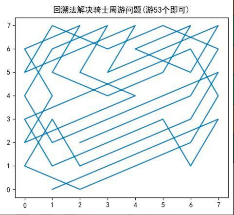

# 马踏棋盘算法

## 马踏棋盘游戏介绍

马踏棋盘算法也被称为 **骑士周游问题**

将马随机放在国际象棋的 8×8 棋盘Board `[0～7][0～7]` 的某个方格中，马按走棋规则(**马走日字**)进行移动。要求每个方格只进入一次，走遍棋盘上全部 64 个方格

[这个是一个在线游戏，可以去体验下](https://u.ali213.net/games/horsesun/index.html?game_code=403)

如下图所示：马可以走的格子为下图有红色数字的格子


## 思路分析

马踏棋盘问题(骑士周游问题)实际上是 **图的深度优先搜索(DFS)的应用**。

如果使用回溯（就是深度优先搜索）来解决，假如马儿踏了 53 个点，如图：走到了第 53 个，坐标 `（1,0）`，发现已经走到尽头，没办法，那就只能回退了，查看其他的路径，就在棋盘上不停的回溯



解决步骤：


1. 创建棋盘 chessBoard ，用一个二维数组表示

2. 将当前位置设置为已访问，且每走一步，通过计数器 step+1

   并且存入棋盘中，表示那一个格子是走的第几步。因为步序不同，能完成的方式也不同

3. 然后根据当前位置计算马儿可以走的位置

   比如上图马儿可以走的位置有 8 个

4. 遍历获取到马儿可以走的位置列表

   如果该位置没有走过，则访问它（递归，从第 2 步开始）

   如果已经走过则放弃该点
   
5. 判断马儿是否完成了任务

   可以通过 setp 与棋盘大小判定，比如 8x8=64，setp >= 64 则完成了任务。 

    如果马儿没有完成任务，则需要进行重置当前访问的这个点为 没有访问过，因为在回缩的时候，有可能其他的走法能走该点

## 代码实现

由于 **根据当前位置计算马儿可以走的位置** 这个方法是个独立且有点代码量的函数，我们先完成它

### 根据当前位置计算马儿可以走的位置

如何计算，看下面的图示，你就明白如何实现了


马儿的坐标为 `4,4`:

- 获取第 0 个点公式为：`4-1,4+2` → `x-1,y+2`
- 获取第 1 个点公式为：`4+1,4+2`→ `x+1,y+2`
- 获取第 2 个点公式为：`4+2,4-1` → `x+2,y-1`
- 获取第 3 个点公式为：`4+2,4+1`→ `x+2,y+1`
- 获取第 4 个点公式为：`4+1,4-2` → `x+1,y-2`
- 获取第 5 个点公式为：`4-1,4-2`→ `x-1,y-2`
- 获取第 6 个点公式为：`4-2,4-1` → `x-2,y-1`
- 获取第 7 个点公式为：`4-2,4+1`→ `x-2,y+1`

```java
package cn.mrcode.study.dsalgtutorialdemo.algorithm.horse;

import org.junit.Test;

import java.awt.*;
import java.util.ArrayList;


/**
 * 骑士周游问题-马踏棋盘算法
 */
public class HorseChessboard {
    @Test
    public void nextTest() {
        // 测试
        Point current = new Point(4, 4);
        System.out.println(current + " 下一步可选位置有：");
        ArrayList<Point> next = next(current);
        System.out.println(next);

        // 测试一个 0,0
        current = new Point(0, 0);
        System.out.println(current + " 下一步可选位置有：");
        next = next(current);
        System.out.println(next);
    }

    int X = 8; // 棋盘的行数
    int Y = 8; // 棋盘的列数

    /**
     * 根据马儿所在的位置，查找它下一步可以走的位置
     *
     * @param current
     * @return
     */
    public ArrayList<Point> next(Point current) {
        ArrayList<Point> result = new ArrayList<>();
        int cx = current.x;
        int cy = current.y;
        // 第 0 个点
        if (cx - 1 >= 0 && cy + 2 < Y) {
            result.add(new Point(cx - 1, cy + 2));
        }
        // 第 1 个点
        if (cx + 1 < X && cy + 2 < Y) {
            result.add(new Point(cx + 1, cy + 2));
        }
        // 第 2 个点
        if (cx + 2 < X && cy - 1 >= 0) {
            result.add(new Point(cx + 2, cy - 1));
        }
        // 第 3 个点
        if (cx + 2 < X && cy + 1 < Y) {
            result.add(new Point(cx + 2, cy + 1));
        }
        // 第 4 个点
        if (cx + 1 < X && cy - 2 >= 0) {
            result.add(new Point(cx + 1, cy - 2));
        }
        // 第 5 个点
        if (cx - 1 >= 0 && cy - 2 >= 0) {
            result.add(new Point(cx - 1, cy - 2));
        }
        // 第 6 个点
        if (cx - 2 >= 0 && cy - 1 >= 0) {
            result.add(new Point(cx - 2, cy - 1));
        }
        // 第 7 个点
        if (cx - 2 >= 0 && cy + 1 < Y) {
            result.add(new Point(cx - 2, cy + 1));
        }
        return result;
    }
}

```

测试输出

```
java.awt.Point[x=4,y=4] 下一步可选位置有：
[java.awt.Point[x=3,y=6], java.awt.Point[x=5,y=6], java.awt.Point[x=6,y=3], java.awt.Point[x=6,y=5], java.awt.Point[x=5,y=2], java.awt.Point[x=3,y=2], java.awt.Point[x=2,y=3], java.awt.Point[x=2,y=5]]
java.awt.Point[x=0,y=0] 下一步可选位置有：
[java.awt.Point[x=1,y=2], java.awt.Point[x=2,y=1]]
```

对照下图的坐标检查下，完全正确


下面来写马踏棋盘算法的深度遍历 + 回溯核心代码

### 马踏棋盘算法核心代码

```java
package cn.mrcode.study.dsalgtutorialdemo.algorithm.horse;

import org.junit.Test;

import java.awt.*;
import java.time.Duration;
import java.time.Instant;
import java.util.ArrayList;
import java.util.Arrays;


/**
 * 骑士周游问题-马踏棋盘算法
 */
public class HorseChessboard {
    @Test
    public void nextTest() {
        // 测试
        Point current = new Point(4, 4);
        System.out.println(current + " 下一步可选位置有：");
        ArrayList<Point> next = next(current);
        System.out.println(next);

        // 测试一个 0,0
        current = new Point(0, 0);
        System.out.println(current + " 下一步可选位置有：");
        next = next(current);
        System.out.println(next);
    }

    int X = 8; // 棋盘的行数
    int Y = 8; // 棋盘的列数

    /**
     * 根据马儿所在的位置，查找它下一步可以走的位置; 从 0 ~ 7 的策略，耗时很长很长，回溯太久了，好几分钟都出不来
     *
     * @param current
     * @return
     */
    public ArrayList<Point> next1(Point current) {
        ArrayList<Point> result = new ArrayList<>();
        int cx = current.x;
        int cy = current.y;
        // 第 0 个点
        if (cx - 1 >= 0 && cy + 2 < Y) {
            result.add(new Point(cx - 1, cy + 2));
        }
        // 第 1 个点
        if (cx + 1 < X && cy + 2 < Y) {
            result.add(new Point(cx + 1, cy + 2));
        }
        // 第 2 个点
        if (cx + 2 < X && cy - 1 >= 0) {
            result.add(new Point(cx + 2, cy - 1));
        }
        // 第 3 个点
        if (cx + 2 < X && cy + 1 < Y) {
            result.add(new Point(cx + 2, cy + 1));
        }
        // 第 4 个点
        if (cx + 1 < X && cy - 2 >= 0) {
            result.add(new Point(cx + 1, cy - 2));
        }
        // 第 5 个点
        if (cx - 1 >= 0 && cy - 2 >= 0) {
            result.add(new Point(cx - 1, cy - 2));
        }
        // 第 6 个点
        if (cx - 2 >= 0 && cy - 1 >= 0) {
            result.add(new Point(cx - 2, cy - 1));
        }
        // 第 7 个点
        if (cx - 2 >= 0 && cy + 1 < Y) {
            result.add(new Point(cx - 2, cy + 1));
        }
        return result;
    }

    /**
     * 从 5 ~ 7，7 ~ 0 ，这个策略大概需要 44 秒
     * @param current
     * @return
     */
    public ArrayList<Point> next(Point current) {
        ArrayList<Point> result = new ArrayList<>();
        int cx = current.x;
        int cy = current.y;
        // 第 5 个点
        if (cx - 1 >= 0 && cy - 2 >= 0) {
            result.add(new Point(cx - 1, cy - 2));
        }
        // 第 6 个点
        if (cx - 2 >= 0 && cy - 1 >= 0) {
            result.add(new Point(cx - 2, cy - 1));
        }
        // 第 7 个点
        if (cx - 2 >= 0 && cy + 1 < Y) {
            result.add(new Point(cx - 2, cy + 1));
        }
        // 第 0 个点
        if (cx - 1 >= 0 && cy + 2 < Y) {
            result.add(new Point(cx - 1, cy + 2));
        }
        // 第 1 个点
        if (cx + 1 < X && cy + 2 < Y) {
            result.add(new Point(cx + 1, cy + 2));
        }
        // 第 2 个点
        if (cx + 2 < X && cy - 1 >= 0) {
            result.add(new Point(cx + 2, cy - 1));
        }
        // 第 3 个点
        if (cx + 2 < X && cy + 1 < Y) {
            result.add(new Point(cx + 2, cy + 1));
        }
        // 第 4 个点
        if (cx + 1 < X && cy - 2 >= 0) {
            result.add(new Point(cx + 1, cy - 2));
        }
        return result;
    }

    private boolean finished; // 是否已经完成，由于是递归，在某一步已经完成，回溯时就可以跳过
    private boolean[] visited = new boolean[X * Y];  // 标记是否访问过，访问过的不再访问

    /**
     * 马踏棋盘算法核心代码
     *
     * @param chessboard 棋盘，用于标识哪一个点是第几步走的
     * @param cx         当前要尝试访问的点 x 坐标（行）
     * @param cy         当前要尝试访问的点 y 坐标（列）
     * @param step       当前是第几步
     */
    public void traversalChessboard(int[][] chessboard, int cx, int cy, int step) {
        // 1. 标识当前点已经访问
        visited[buildVisitedIndex(cx, cy)] = true;
        // 2. 标识当前棋盘上的点是第几步走的
        chessboard[cx][cy] = step;
        // 3. 根据当前节点计算马儿可以走的点
        ArrayList<Point> points = next(new Point(cx, cy));
        //  不为空则可以一直尝试走
        while (!points.isEmpty()) {
            Point point = points.remove(0);
            // 如果该点，没有被访问过，则递归访问：深度优先
            if (!visited[buildVisitedIndex(point.x, point.y)]) {
                traversalChessboard(chessboard, point.x, point.y, step + 1);
            }
        }

        // 所有可走的点都走完了，如果还没有完成，则重置当前访问的点为没有访问过

        if (step < X * Y && !finished) {
            visited[buildVisitedIndex(cx, cy)] = false;
            chessboard[cx][cy] = 0; // 重置为 0 表示没有走过
        } else {
            finished = true;  // 表示已经完成任务
        }
//        System.out.println(step);
//        show(chessboard);
    }

    /**
     * 使用的是一个一维数组来表示某个点是否被访问过
     * <pre>
     *   那么就直接数格子，第 N 个格子对应某一个点，从左到右，上到下数
     *   0,1,2,3,4,5,6,7,
     *   8,9,10,11...
     * </pre>
     *
     * @param cx
     * @param xy
     * @return
     */
    private int buildVisitedIndex(int cx, int xy) {
        //比如 0,1: 0*8 + 1 =  1
        return cx * X + xy;
    }

    @Test
    public void traversalChessboardTest() {
        int[][] chessboard = new int[X][Y];
        Instant start = Instant.now();
        traversalChessboard(chessboard, 0, 0, 1);
        Duration re = Duration.between(start, Instant.now());
        System.out.println("耗时：" + re.toMillis() + "毫秒");
        System.out.println("耗时：" + re.getSeconds() + "秒");
        show(chessboard);
    }

    private void show(int[][] chessboard) {
        for (int[] row : chessboard) {
            System.out.println(Arrays.toString(row));
        }
    }
}

```

测试输出

```
耗时：45119毫秒
耗时：45秒
[1, 16, 13, 8, 3, 20, 33, 10]
[26, 7, 2, 15, 12, 9, 4, 21]
[17, 14, 27, 6, 19, 32, 11, 34]
[58, 25, 18, 31, 28, 5, 22, 49]
[41, 30, 57, 24, 53, 48, 35, 64]
[56, 59, 42, 29, 38, 23, 50, 47]
[43, 40, 61, 54, 45, 52, 63, 36]
[60, 55, 44, 39, 62, 37, 46, 51]
```

::: tip

代码上有一个 next1 函数，就是因为查找的策略不同，从 0~7 这个策略，直接几分钟都没有反应。我以为是我默写实现的代码有 bug，把视频中老师的代码一个一个对比，没有发现有什么不同。

最后发现是查找下一个可以访问位置的策略不同，导致出现回溯太多，耗时太长

:::